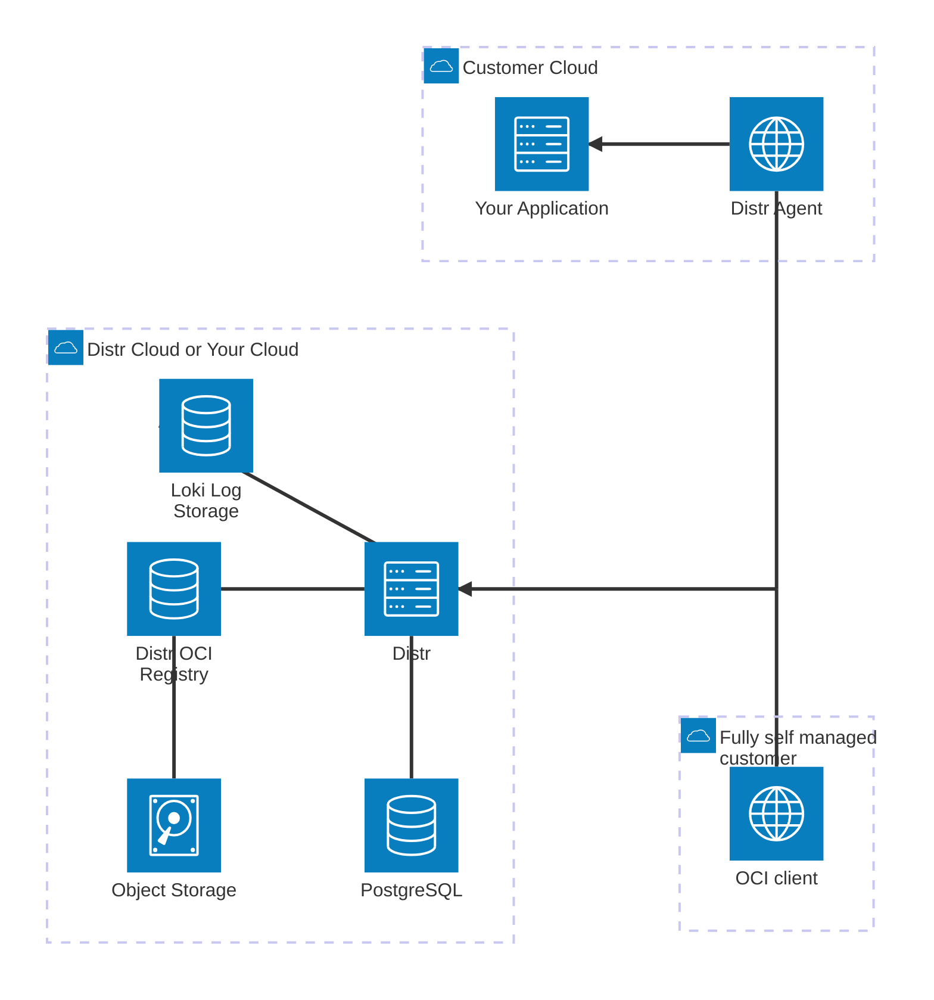

<br>
<div align="center">
  <a href="https://distr.sh?utm_source=github">
    
  </a>
<h1 align="center">Distr</h1>
<br>
<h2>Software Distribution Platform</h2>

Distr is the open-source platform to ship self-hosted software. Start simple, scale as you go. Onboard to Distr and setup Docker Compose POCs in minutes, Helm and air-gapped when the deal needs it. All the tools you need to succeed with offering self-hosted.

### **[Website](https://distr.sh/?utm_source=github)** • **[Quickstart](https://distr.sh/docs/quickstart/?utm_source=github)** • **[Documentation](https://distr.sh/docs/?utm_source=github)** • **[Blog](https://distr.sh/blog/)** • **[Community](https://github.com/distr-sh/distr/discussions)**

<hr>

[](https://github.com/distr-sh/distr)
[](https://opensource.org/licenses/Apache-2.0)
[](https://artifacthub.io/packages/helm/distr/distr)

<picture>
  <source media="(prefers-color-scheme: dark)" srcset="https://github.com/distr-sh/distr/raw/refs/heads/main/.github/assets/readme-deployments-dark.webp">
  
</picture>

<hr>

</div>

## Main features

- **Deployment agents:** Prebuilt Docker Compose, Docker Swarm, and Helm agents install and update your application in customer environments and report status, logs, and metrics back.
- **OCI registry:** Distribute Docker images, Helm charts, Zarf packages, and any OCI artifact, with per-customer tag access control, pull-through caching, and download analytics.
- **Licensing:** Application and artifact entitlements per customer, plus signed JWT license keys your application verifies offline with no call back to Distr.
- **Remote diagnostics:** Container logs, live metrics, deployment status, alerts, and customer-initiated support bundles, without access to their infrastructure.
- **Customer portal:** White-labeled install instructions, artifact downloads, credentials, and version control per customer organization.
- **Air-gapped:** Build a Zarf package in CI, publish it to Distr, transfer it across the gap, deploy offline.
- **Self-hostable:** Apache-2.0. One Go binary plus Postgres, object storage, and Loki. Paid plans run self-hosted too.
- Automate everything through the [REST API](#distr-api) and the [SDK](#distr-sdk).

Community Edition is free and Apache-2.0. Paid plans start at $80/month on Distr Cloud, or fully self-hosted with a license key. See https://distr.sh/pricing/.

Check out the hosted version at https://distr.sh/get-started/.

## Why Distr

Shipping into customer-controlled environments starts with a Helm chart or a Compose file. It ends with license keys, per-customer artifact entitlements, version tracking across every install, update orchestration, and a way to debug a deployment you cannot SSH into. Distr is that layer, running today in GovCloud and defense, regulated banking, health tech, manufacturing, enterprise AI, and developer tools.

**Use cases include:**

- On-premises, VPC and self-hosted software deployments
- Bring Your Own Cloud (BYOC) automation
- Edge & Fleet management

Read more about Distr and its core concepts at https://distr.sh/docs/core-concepts/

## Architecture overview



## Self-hosting

In case you get stuck, have questions, or need help, we're happy to support you,
join our [community forum](https://github.com/distr-sh/distr/discussions).

### Docker

Distr is distributed as a Docker image via ghcr.io.
Check out [`deploy/docker/quickstart`](deploy/docker/quickstart) for our example deployment using Docker Compose.
To get started quickly, do the following:

```shell
mkdir distr && cd distr && curl -fsSL https://github.com/distr-sh/distr/releases/latest/download/deploy-quickstart.tar | tar -x
# make necessary changes to the .env file
docker compose up -d
```

### Kubernetes

Distr is also available as a Helm chart distributed via ghcr.io.
Check out [`deploy/charts/distr`](deploy/charts/distr) for our Helm Chart source code.
To install Distr in Kubernetes, simply run:

```shell
helm upgrade --install --wait --namespace distr --create-namespace \
  distr oci://ghcr.io/distr-sh/charts/distr \
  --set postgresql.enabled=true --set rustfs.enabled=true
```

For a quick testing setup, you don't have to modify the values.
However, if you intend to use distr in production, please revisit all available configuration values and adapt them accordingly.
You can find them in the reference [values.yaml](https://artifacthub.io/packages/helm/distr/distr?modal=values) file.

<hr>

Register your first account at http://localhost:8080/register

The full self-hosting documentation is at https://distr.sh/docs/self-hosting/

Using Distr agents on macOS? Follow the [macOS guide](https://distr.sh/docs/agents/distr-on-macos/) to get started.
Using Distr agents on Windows with WSL2? Follow the [Windows WSL2 guide](https://distr.sh/docs/agents/distr-on-windows-wsl/) to get started.

### Building from source

To build Distr from source we recommend that you use [mise](https://mise.jdx.dev/) to install all required dependencies, but you don't have to.

All dependency versions and build tasks can be found in the [`mise.toml`](./mise.toml) file, for example:

```shell
# Build Distr
mise run build:distr:community
# Build all docker images
mise run "docker-build:**"
```

## Distr Integrations

Distr offers several ways to integrate with your existing tools and workflows.

### Distr API

Distr provides a comprehensive REST API that allows you to manage deployments, artifacts, agents, licenses, and more programmatically.
The full API reference is available at https://app.distr.sh/docs.

For further details on authentication and usage, see https://distr.sh/docs/integrations/api/.

### Distr SDK

Interact with Distr directly from your application code using our first-party SDK.
The Distr SDK is currently available for JavaScript only, but more languages and frameworks are on the roadmap.
Let us know what you would like to see!

You can install the Distr SDK for JavaScript from [npmjs.org](https://npmjs.org/):

```shell
npm install --save @distr-sh/distr-sdk
```

The full SDK documentation is at https://distr.sh/docs/integrations/sdk/

### GitHub Action

Automate artifact version creation in your CI/CD pipeline with the official Distr GitHub Action.
It is available at https://github.com/distr-sh/distr-create-version-action.

For setup and usage instructions, see https://distr.sh/docs/integrations/gh-action/.

## Contributing & Local Development

If you are interested in contributing to Distr or want to modify it for your own needs, check out our [contributing guidelines](./CONTRIBUTING.md).

## License

Distr is licensed under the [Apache License 2.0](./LICENSE). For a hosted version and Enterprise plans, see https://distr.sh/pricing/.
