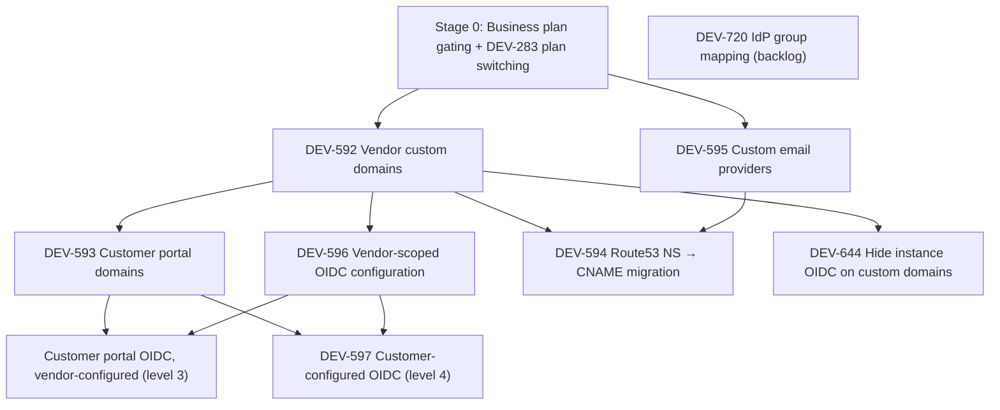

# Distr Enterprise: Full OIDC / SSO Support — Implementation Plan

Plan for the Linear project [Distr Enterprise full OIDC / SSO support](https://linear.app/glasskube/project/distr-enterprise-full-oidc-sso-support-12b063482aa2/issues).

This is a living document (v1, draft). Each issue gets a short summary and a detailed, PR-sized plan. Dependencies between issues follow the "blocks" relations in Linear.

## Current state (codebase)

- OIDC is **instance-scoped only**: providers (Google, GitHub, Microsoft, Generic) are configured via environment variables in `internal/env/env.go` and initialized once at startup in `internal/oidc/oidc.go` (`NewOIDCer`).
- Login flow: `internal/handlers/auth_oidc.go` — state + PKCE verifier stored in DB (`OIDCState` table), user matched **by IdP identity** (`UserAccountOIDCIdentity`, Stage 1) with an email fallback for accounts that predate the linking, auto-signup creates a new org. Note: `verifyOIDCState` rejects states older than **60 seconds** (measured from before the redirect to the IdP).
- Frontend: `oidc-buttons.component.ts` renders provider buttons based on the host-resolved `GET /api/public/v1/portal` endpoint (`internal/handlers/portal.go`), which since DEV-644 also carries the login config (`PortalResponse.LoginConfig`) that used to live in the host-independent `GET /api/v1/auth/login/config`; login/register pages.
- Custom domains exist only as operator-managed columns: `OrganizationBranding.app_domain` / `registry_domain` — no self-service, no automated TLS (existing setups use manually managed Route53 NS zones). `internal/customdomains` resolves org → effective domain; the only host → org resolution is `db.GetOrganizationBrandingByAppDomain`, used by `internal/handlers/portal.go`. The registry resolves organizations from the repository **path** (`internal/registry/name`: `<org>/<artifact>`), not from the Host header — `registry_domain` is a pure DNS alias, only used when rendering agent manifests.
- Plans exist as `types.SubscriptionType` (community, pro, business, enterprise, trial — the starter plan was removed with the business plan introduction) with Stripe billing (`FeatureVendorBilling`), and org feature flags (`types.Feature`, `org.HasFeature(...)`) are granted based on the subscription via `types.FeaturesForSubscriptionType(...)` / `types.PlanManagedFeatures`.
- A **jetski/HyprMCP reference for the custom domain implementation is included as an appendix at the end of this document** (Caddy + on-demand TLS + ask endpoint), together with the Distr-side design (`CustomDomain` data model, static Caddyfile routing, open decisions).

## Dependency graph



## Proposed order of work

| Stage | Issue   | Title                                           | Why now                                                                                  |
| ----- | ------- | ----------------------------------------------- | ---------------------------------------------------------------------------------------- |
| 0     | DEV-283 | Business plan gating + subscription switching   | Prerequisite: defines how all enterprise features below are gated.                       |
| 1     | DEV-641 | Improve handling of IdP-provided UID            | **Implemented** as a standalone stage. Foundation for DEV-596.                           |
| 2     | DEV-592 | Automated custom domain configuration (vendors) | **Implemented** (PRs 1–4 in one change). Root of the dependency tree.                    |
| 3     | DEV-595 | Custom email provider configurations            | **Implemented** (PRs 1–4 in one change, SMTP only). Needed before the Route53 migration. |
| 4     | DEV-596 | Vendor-scoped OIDC configuration                | **Implemented** except role mapping; needed DEV-592 and DEV-641.                         |
| 5     | DEV-593 | Customer portal domain configuration            | Extends DEV-592 to the customer portal.                                                  |
| 6     | DEV-594 | Migrate Route53 NS zones to CNAME setup         | Customer self-service migration; needs DEV-592 + DEV-595.                                |
| 7     | —       | Customer portal OIDC, vendor-configured         | Level 3 below; needs DEV-593 + DEV-596. No Linear issue yet.                             |
| 8     | DEV-597 | Customer-configured OIDC (customer feature)     | Level 4 below; needs DEV-593 + DEV-596.                                                  |
| 9     | DEV-644 | Hide instance-scoped OIDC on custom domains     | **Implemented**, pulled forward: needs only DEV-592, not DEV-596.                        |
| —     | DEV-720 | User group mapping from IdP                     | In backlog. Not planned.                                                                 |

---

## Stage 0 — Business plan gating + DEV-283: Switch subscription type on subscription page

> **Status: implemented** (business plan introduction + starter removal + pro → business upgrade). What shipped and the decisions taken are recorded below; remaining follow-ups are listed at the end of this section.

### Summary

Before shipping any of the enterprise features below, introduce the **business plan** as a first-class `SubscriptionType` with its own feature set, and let org admins switch their subscription type on the subscription page (DEV-283). All later stages then gate on "plan grants feature" instead of ad-hoc flags per org.

### Implemented

**Business plan + feature mapping (with starter plan removal)**

- `SubscriptionTypeBusiness` added to `types.SubscriptionType`; `SubscriptionTypeStarter` **removed** entirely. Migration `113_business_subscription_type` converts existing `starter` orgs to `pro` and recreates the enum as `('community', 'pro', 'business', 'enterprise', 'trial')`. **Pre-deploy check**: there must be no active Starter Stripe subscriptions — the starter price lookup keys were removed, so a webhook for such a subscription would fail with "no subscription type found".
- Per-plan feature sets: `types.FeaturesForSubscriptionType(st)` (community → none; trial/pro/enterprise → `licensing`; business → `licensing`, `partner_management`). Subscription reconciliation (the Stripe webhook) is **additive only** — plan changes grant the new plan's features but never revoke any, so manually granted flags (e.g. `vendor_billing`) and previously granted plan features survive; only community organizations get their features stripped, by `ReconcileEditionFeatures` at startup. Trial → pro is a no-op feature-wise since the sets are identical. The new features from this project (`custom_domains`, `custom_emails`, `custom_oidc_providers`) are added to the business set by the respective later stages.
- Gating generalized: `SubscriptionType.IsPro()` includes business; `NonProSubscriptionTypes` is now just `[community]`; `middleware.ProFeature` includes business; `ReconcileStarterFeaturesForOrganizationID` was deleted.
- Limits (`internal/subscription/global_limits.go`): business = unlimited customers, 25 users/customer, 8 deployments/customer, 10,000 log export rows, **30-day log query window** (Loki retention).
- Stripe wiring: lookup keys `distr_business_customer_monthly|yearly`, `distr_business_user_monthly|yearly` in `internal/billing/price.go` (**ops task**: create the corresponding Stripe products/prices — monthly $39 user / $159 customer; yearly $384 user / $1,536 customer). All shared key slices (`CustomerPriceKeys`, `UserPriceKeys`, `MonthlyPriceKeys`, `YearlyPriceKeys`) include the business keys, so quantity/period parsing works for business-keys-only subscriptions (covered by unit tests in `internal/billing/subscription_test.go`).

**DEV-283: plan switching (pro → business upgrade)**

- `billing.UpdateSubscription` accepts an optional target `SubscriptionType`: it removes the current price items and adds the target plan's prices (same billing period, quantities from the request) in a single `subscription.Update` call; Stripe applies its default proration.
- `UpdateSubscriptionHandler` (`PUT /api/v1/billing/subscription`, request struct `api.UpdateSubscriptionRequest`) accepts an optional `subscriptionType`; **only the pro → business upgrade is allowed** — downgrades keep going through support. Quantities are validated against the target plan. The handler only updates the quantities eagerly; the subscription type and plan-managed features are **applied exclusively by the `customer.subscription.updated` webhook**, which derives the type from the subscription items (all items must belong to a single plan).
- Subscription page UI: trial orgs see a Business card next to the Pro card (checkout); orgs with an active pro subscription see an "Upgrade to Business" section with feature list, estimated cost, and a confirmation modal. After confirming a plan switch the frontend redirects to `/subscription/callback?pendingPlan=business`, which shows a "processing" state and reloads every 5 s until the webhook has flipped the org's subscription type.
- Additional UI: the deployment log viewer shows vendor admins on pro/trial a banner "Instantly unlock your last 30 days of logs with the Distr Business plan" linking to the subscription page.
- New organizations still start on `trial` (the Pro Unlimited Trial) — unchanged.

### Remaining follow-ups

- Downgrade support (business → pro) including consequences for then-unavailable features (custom domains / OIDC configs / email providers once they exist; recommend: keep config stored, mark disabled).
- Related: DEV-270 (cancelled-subscription banner) shares UI surface.
- License Templates are still gated by the manually granted `vendor_billing` feature (which also covers enterprise-only Customer Billing); splitting out a plan-managed `license_templates` feature for business is open.

---

## Stage 1 — DEV-641: Improve handling of IdP-provided UID

> **Status: implemented** as a standalone stage after all (it was planned as PR 0 of Stage 4 for a while). Org-scoped providers build on the schema it introduces; what remains for them is listed under Stage 4.

### Summary

OIDC logins used to be matched by email address only, which created a duplicate account whenever the address changed at the IdP, and re-created the old account when the user changed their address in Distr. Logins are now matched on the identity the IdP reports.

### Implemented

**Schema (migration `115_user_account_oidc_identity`)**

- `OIDC_PROVIDER` enum (`github`, `google`, `microsoft`, `generic`) — the four env-configured instance providers, mapped 1:1 onto `oidc.Provider`, which is now a type alias of `types.OIDCProvider`.
- `UserAccountOIDCIdentity` (`user_account_id` → `UserAccount` with `ON DELETE CASCADE`, `provider`, `issuer`, `subject`, nullable `email` and `last_login_at`). A separate table rather than columns on `UserAccount`, so a user can connect several providers.
- Uniqueness is a **unique index** on `(issuer, subject)`, not a table constraint, so Stage 4 can swap it for a config-scoped one with plain index DDL.

**Login flow (`internal/handlers/auth_oidc.go`, `resolveOIDCUser`)**

1. Look up the identity by `(issuer, subject)` → log that user in and refresh `last_login_at` plus the IdP-reported email on the identity row.
2. Otherwise match by email (accounts predating the linking, and invited users) → create the identity for that account.
3. Otherwise auto-signup as before → create the identity.

- Email-change behavior (**decided, reversing the earlier note**): the Distr account email is **never** overwritten with the one from the IdP. The IdP email is stored on the identity row for display only. Overwriting would silently revert a user's deliberate email change in Distr, which is one of the two bugs this stage fixes; identity matching alone already keeps the login working.
- Email-based fallback matching deliberately keeps its previous semantics (no new `email_verified` requirement), so generic IdPs that omit the claim keep working. Documented as a known limitation in `website/.../self-hosting/oidc.mdx`.

**Identity extraction (`internal/oidc`)**

- `EmailExtractorFunc` → `IdentityExtractorFunc` returning an `oidc.Identity` (provider, issuer, subject, email, verified); `GetEmailForCode` → `GetIdentityForCode` (which also no longer builds the oauth2 config twice).
- Google, Microsoft and generic take issuer and subject from the verified `id_token`. GitHub is plain OAuth2 with no id_token, so it uses an additional `GET https://api.github.com/user` call for the numeric user ID as subject (stable across username and email changes) with the synthetic issuer `https://github.com`.

**Settings UI**

- `GET` / `DELETE /api/v1/settings/user/oidc-identities` and a "Connected Accounts" section on the user settings page: one row per connected provider with the IdP email and connect date, plus a disconnect confirmation dialog. Disconnecting is rejected with `409` when it is the account's last login method (no password and no other identity).
- Connecting a provider from the settings page is deliberately **not** supported — a provider is connected by signing in with it once. A settings-initiated link flow would need a user-scoped `OIDCState` plus conflict handling for identities already owned by another account.

---

## Stage 2 — DEV-592: Automated custom domain configuration for vendors

> **Status: implemented and e2e-validated.** All four PR scopes below landed in a single change: `CustomDomain` table (migration 114) + CRUD API + validation, the internal caddy-ask server (`INTERNAL_SERVER_ADDR`), the Helm chart Caddy deployment with `distr-internal-caddy-ask` Service, and the org settings "Custom Domains" UI with CNAME instructions. Legacy `OrganizationBranding` domain columns remain supported as fallback (migration is the follow-up ticket 0). CNAME pre-verification and the host-context middleware were not included.
>
> **The table is vendor-org scoped only**: the `customer_organization_id` / `partner_organization_id` columns of the appendix §5.3 shape were left out, since nothing sets or reads them yet. DEV-593 adds them (plus the API surface) in its own migration, which also replaces the `UNIQUE (organization_id, domain_type)` constraint with the partial unique indexes per scope.
>
> **Caddy runs as a Deployment with a single replica** and one PVC for `/data` (retained via `helm.sh/resource-policy: keep`). A per-replica-storage StatefulSet was tried first but is not viable: Caddy instances only share certificates and solve each other's ACME challenges when they use the same storage, and the LoadBalancer routes the CA's validation request to an arbitrary replica. `caddy.replicaCount` above 1 therefore requires either a `ReadWriteMany` claim or a `caddy.storage` module with a matching custom image, and the chart fails to render without one.
>
> **E2E validated on minikube** (values in `hack/minikube-custom-domains-values.yaml`, Caddy's internal CA as issuer): feature gating (403 without `custom_domains`), platform-domain/hostname/duplicate rejection (400/409), domain normalization on create and on `ask`, `ask` returning 200/404/400 and being absent from the public app and registry servers, on-demand TLS issuance for a registered domain, TLS handshake failure for an unregistered one, `/v2/` routed to the registry (`Basic realm="Distr"`) and everything else to the app, HTTP→HTTPS redirect, portal branding resolved by custom domain (the default host answered 204 back then; DEV-644 replaced that with an explicit `customDomain` flag in a 200 response), `registryHost` falling back app domain → instance default after deleting the registry domain, the certificate store surviving a pod restart, and Caddyfile changes rolling the pods via the checksum annotation.

### Summary

Vendor organizations should self-service a custom domain for the platform UI/API, and optionally a separate one for the registry (served via a dedicated plain Caddy deployment rather than the AWS ALB). Because Caddy routes `/v2/*` to the registry backend on every custom domain, **a single app domain already serves both — the registry domain is optional**. The full jetski/HyprMCP reference implementation and its mapping onto Distr are documented in the **appendix** at the end of this document — this stage tracks the Distr-side deliverables.

### Detailed plan

Follows the "recommended shape" in appendix §5: a dedicated `CustomDomain` table (owned by the vendor org, optional customer/partner scoping, globally unique domains — appendix §5.3), one **plain Caddy deployment** (no ingress controller) with on-demand TLS + `ask` endpoint and a static Caddyfile for routing (no Ingress resources, no CRD/metacontroller machinery from jetski; see the appendix open questions).

**PR 1 — data model + self-service API + validation (appendix §5.3–§5.5)**

- New `CustomDomain` table (schema in appendix §5.3). **Decided: this stage does _not_ migrate the existing `OrganizationBranding.app_domain` / `registry_domain` values and does _not_ drop those columns** — the legacy columns stay untouched and keep working; migrating their values into `CustomDomain` (normalized to bare lowercase hostnames, **flagged as `legacy = TRUE`** — DEV-644 keeps instance login methods available on exactly these domains, and until that migration runs it recognizes them via the branding column directly) plus the column drop is a **follow-on ticket** (see "Follow-up tickets"). Until then both sources are supported in parallel: `customdomains.AppDomainOrDefault` / `RegistryDomainOrDefault` resolve `CustomDomain` first and fall back to the legacy branding columns, then to the instance defaults.
  - Refactor ripple: these helpers are currently pure functions of `*types.OrganizationBranding` with ~10 call sites (mail templates, agent manifest/connect, support bundles, user handlers) — they additionally get the org's `CustomDomain` rows (context/DB-backed or pre-resolved alongside branding).
  - Extra motivation for `UNIQUE (domain)`: `app_domain` has no unique constraint today, and `GetOrganizationBrandingByAppDomain` uses `CollectExactlyOneRow` — two orgs with the same domain break portal resolution at runtime. The new table enforces uniqueness for self-service domains from day one.
- Org-admin CRUD for app + registry domains: RFC-1123 hostname validation, global uniqueness via the `UNIQUE (domain)` constraint, rejection of platform-owned domains (`*.distr.sh`).
- The registry domain is **optional**: the `/v2/*` path routing (PR 3) means every custom app domain already serves registry traffic, so `RegistryDomainOrDefault` resolves dedicated registry domain → custom app domain → instance default. A dedicated registry domain is only for vendors who want a separate hostname.
- Gated on the new `custom_domains` feature flag (business plan), introduced by this stage (Stage 0 only prepared the gating mechanism, not the flag).
- Optional CNAME pre-verification (resolve domain → expected target) for better UX; the `ask` gate keeps it safe either way.

**PR 2 — Caddy on-demand TLS `ask` endpoint (appendix §3.3/§5.4, security-critical)**

- Internal-only `GET .../ask?domain=...` endpoint returning 200 iff the domain exists in `CustomDomain`; single indexed db lookup (runs during TLS handshakes).
- **A real separate HTTP server**, not a route on the main server: a fourth server next to `server` (`:8080`), `artifactsServer` (`:8585`) and `metricsServer` in `cmd/hub/cmd/serve.go` / `internal/svc`, with its own chi router and port (e.g. `INTERNAL_SERVER_ADDR`, default `:8085`). It is **only started when the custom domain feature is configured** (i.e. the `CUSTOM_DOMAIN_*_CNAME_TARGET` env vars from PR 3 are set) and is intended to never be exposed outside the cluster.
- Helm chart (documented in appendix §6, ships with PR 3): a dedicated Service with a clear internal name — `distr-internal-caddy-ask` — targeting only this port, separate from the public `distr` Service, so it can't accidentally be picked up by an Ingress for the public Service.

**PR 3 — infrastructure (plain Caddy) + CNAME targets (appendix §5.1/§5.2)**

- **No ingress controller** — a plain Caddy deployment shipped by the Distr Helm chart itself (disabled by default): Deployment (official `caddy` image), ConfigMap with a static Caddyfile (`on_demand_tls` + `ask` → the internal ask endpoint, catch-all `https://` site with path routing to the Hub Services), and a Service of type `LoadBalancer` with **configurable annotations** — the chart stays generic, and for our deployment we set the AWS annotations that provision a Network Load Balancer. Exact chart changes prepared in appendix §6; this PR also adds the `distr-internal-caddy-ask` Service for the ask listener (PR 2).
- Two stable CNAME targets pointing at the Caddy LB, e.g. `custom-app.distr.sh` / `custom-registry.distr.sh` (region encoding to be decided, appendix §6); env vars `CUSTOM_DOMAIN_APP_CNAME_TARGET` / `CUSTOM_DOMAIN_REGISTRY_CNAME_TARGET` (+ configuration.mdx), feature off when unset. Both targets point at the same LB — the registry target only matters for vendors who configure a dedicated (optional) registry domain.
- Resolve the app-vs-registry backend split — recommended: **one Caddy installation with path-based routing** (registry traffic is always under the spec-mandated `/v2/` prefix, everything else is app traffic), see appendix §5.2. Verified against the code: the registry server 404s every non-`/v2` path (`internal/registry/registry.go`), and registry **login** also happens under the prefix — `docker login` has no dedicated login URL, it retries the spec-mandated version check `GET /v2/` with credentials after the `401` challenge, and Distr challenges with `Basic realm="Distr"` (`internal/auth/authentication.go`), not with a Docker token-auth `Bearer realm` that would point to a token endpoint outside `/v2/`. Nothing on the app side claims `/v2` (API is under `/api/v1`).
- E2E validation with a staging domain — explicitly including the Caddyfile path routing (`/v2/*` → registry Service `:8585`, everything else → app Service `:8080`), on-demand TLS issuance through the `ask` endpoint, and the NLB annotations on the Caddy Service. **Done on minikube** (see status note above), except for the two parts that need real infrastructure: issuance against a public ACME CA for a domain with real DNS, and the NLB annotations on the Caddy Service.

**PR 4 — frontend (appendix §5.6)**

- Org settings section "Custom domains" with an app domain field and an **optional** registry domain field (with a hint that the app domain already serves the registry under `/v2/`), live validation, and explicit CNAME record instructions per field (targets from the env endpoint); verification status if PR 1 includes pre-verification.

### Open questions

- See the appendix §6 for the full list of open decisions (region-encoded CNAME targets, shared-domain semantics; the ingress-controller/metacontroller question is settled: plain Caddy, no controller).
- Does the Hub host-context middleware (needed by DEV-596) land here or in DEV-596 PR 1? Note: the registry does **not** resolve orgs by host — it resolves them from the repository path prefix (`internal/registry/name`), so the middleware is new for both app and registry. Upside: the registry needs no per-host org dispatch at all; a custom registry domain works as a pure DNS alias.

---

## Stage 3 — DEV-595: Custom email provider configurations

> **Status: implemented**, with the scope reduced to SMTP. All four PR scopes below landed in a single change: the `CustomEmailConfiguration` table (migration 115), the `custom_emails` feature flag on the business plan, the CRUD + test-send API under `/api/v1/custom-email`, per-org mailer resolution in `internal/custommail`, and the org settings "Custom Email" section.
>
> **Deltas from the plan below**, all deliberate:
>
> - **SMTP only.** SES with static credentials was dropped from v1, so the table has **no `provider` column** — nothing would read it, the same reasoning that kept the customer/partner scope columns out of `CustomDomain` in Stage 2. Adding SES is an additive migration: a `provider` enum, nullable `smtp_*` columns and a per-provider `CHECK`.
> - **The feature flag is `custom_emails`**, not `custom_email_provider`.
> - **The from address moved onto the new table** (`from_address`, `NOT NULL`) instead of staying on branding. `OrganizationBranding.email_from_address` was never writable through the API, so it could only be set by support; it stays untouched as a **legacy fallback**, exactly like the legacy branding domain columns, and is not migrated. Resolution order is custom email configuration → branding column → `MAILER_FROM_ADDRESS`, implemented by `custommail.FromAddressOrDefault`, which replaced `customdomains.EmailFromAddressParsedOrDefault`.
> - **The endpoints live under their own router** `/api/v1/custom-email` (`handlers.CustomEmailsRouter`, mounted behind `middleware.CustomEmailsFeatureMiddleware`) rather than under the settings router, mirroring `/api/v1/custom-domains`.
> - **Resolution is threaded explicitly through every sender** (`custommail.MailerForOrganization(ctx, orgID)`): invites, verification, password reset, the e-mail change confirmation, license key revisions (org from `licenseKey.OrganizationID`) and both notification senders (`sendNotificationWithQuota` gained an `orgID` parameter). The `authOrgOverrideFromAddress` hook in `internal/svc/mailer.go` now also consults the new configuration, but only covers authenticated requests — background jobs have no authentication in their context, which is why the explicit threading is required.

### Summary

For **new custom domain configurations** (DEV-592 self-service), no AWS certificates or Route53 NS records are created anymore — so Distr cannot send email from those domains via our SES account (no domain verification/DKIM in our SES). Let organizations configure their own email provider instead. The **currently existing custom mail configurations** (SES sending for domains verified through the legacy NS zone setups) **stay supported for now**; they are only decommissioned via DEV-594 and the follow-up tickets. **Scope decision: exactly one configuration per (vendor) organization** — no per-customer/per-partner configs; customer- and partner-related mails (invites, portal notifications) are sent via the owning vendor's provider. Providers for v1 are what [go-mailx/mailx](https://github.com/go-mailx/mailx) already supports and Distr already uses instance-wide: **SMTP** and **AWS SES with access key / secret key**. Resend/Brevo may come later as new mailx adapters.

### Current state (code)

- One global `*mailx.Mailer` is created at startup in `internal/svc/mailer.go` from `MAILER_TYPE` (`smtp` | `ses` | unset → noop): `smtp.New(smtp.Config{Host, Port, Username, Password, ImplicitTLS, TLSPolicy})` or `ses.NewFromContext(ctx)` (ambient AWS credentials). It is injected into the request context (`internalctx.WithMailer` / `GetMailer`) and used by all senders in `internal/mailsending/`.
- A per-org **from address** override already exists: `OrganizationBranding.email_from_address`, resolved via `customdomains.EmailFromAddressParsedOrDefault` and the `authOrgOverrideFromAddress` hook in the mailer's `FromAddressSrc` chain. DEV-595 only adds per-org **transport**; the from address stays on branding.
- `mailx-ses` also exposes `ses.New(aws.Config)`, so per-org static credentials are straightforward: build an `aws.Config` with `credentials.NewStaticCredentialsProvider(accessKeyID, secretAccessKey, "")` and the configured region.
- There is **no secrets-at-rest encryption today** (the existing `Secret` table for deployment secrets stores plaintext values; only JWT signing uses a key from env). Provider credentials are stored the same way for now — introducing encryption at rest for all secret storage is a follow-up ticket.
- Notification sends go through `sendNotificationWithQuota` (`internal/mailsending/mail_quota.go`), an hourly per-address quota protecting our SES reputation.

### Detailed plan

**PR 1 — data model**

- **No encryption at rest for v1** (decided): credentials are stored as plaintext columns, consistent with the existing `Secret` table. Secrets are still never serialized to JSON / returned by the API. Encryption at rest (for this table, the `Secret` table, and the DEV-596/597 client secrets together) is a follow-up ticket — see "Follow-up tickets".
- New table, one row per org (`UNIQUE (organization_id)` — deliberately _not_ the `CustomDomain` owner/scope pattern, per the scope decision):

```sql
CREATE TABLE OrganizationEmailConfiguration (
  id UUID PRIMARY KEY DEFAULT gen_random_uuid(),
  created_at TIMESTAMP NOT NULL DEFAULT current_timestamp,
  updated_at TIMESTAMP NOT NULL DEFAULT current_timestamp,
  updated_by_user_account_id UUID REFERENCES UserAccount (id) ON DELETE SET NULL,
  organization_id UUID NOT NULL UNIQUE REFERENCES Organization (id) ON DELETE CASCADE,
  provider TEXT NOT NULL CHECK (provider IN ('smtp', 'ses')),
  enabled BOOLEAN NOT NULL DEFAULT TRUE,
  -- smtp
  smtp_host TEXT,
  smtp_port INT,
  smtp_username TEXT,
  smtp_password TEXT,
  smtp_implicit_tls BOOLEAN,
  -- ses (static credentials)
  ses_region TEXT,
  ses_access_key_id TEXT,
  ses_secret_access_key TEXT,
  CONSTRAINT OrganizationEmailConfiguration_provider_fields CHECK (
    (provider = 'smtp' AND smtp_host IS NOT NULL AND smtp_port IS NOT NULL)
    OR (provider = 'ses' AND ses_region IS NOT NULL AND ses_access_key_id IS NOT NULL
        AND ses_secret_access_key IS NOT NULL)
  )
);
```

- `internal/db` CRUD + `internal/types.OrganizationEmailConfiguration` (secrets never serialized to JSON).

**PR 2 — per-org mailer resolution in the sending paths**

- New resolver (in `internal/svc` or a small `internal/mailer` package): `MailerForOrganization(ctx, orgID) *mailx.Mailer` — returns a mailer built from the org's enabled config, else the instance default from context. Adapter construction is cheap (SMTP dials per send; SES client is a struct), so build per call; add a small cache keyed on `(organization_id, updated_at)` only if profiling says so.
- Change `internal/mailsending/*` senders to resolve the mailer via the organization they already receive/resolve (e.g. `SendUserInviteMail` already gets `types.OrganizationWithBranding`; notification senders resolve the org from the deployment target). Customer/partner flows use the **vendor org's** config by definition of the scope decision.
- **No silent fallback**: if an org config is enabled but sending fails, the send fails (logged + Sentry) rather than falling back to instance SES — falling back would send from a domain our SES isn't authorized for (SPF/DKIM/DMARC failures) and mask misconfiguration. The instance default is only used when no org config is enabled.
- **Keep `sendNotificationWithQuota` for all transports, including customer-provided ones** (decided): the hourly per-recipient-address quota does not only protect our SES reputation — it also protects recipients (and the customer's provider reputation) from Distr-side notification storms (flapping deployments, notification loops), which are our bug regardless of whose transport delivers them. The quota is claimed in the DB before the transport is chosen, so this costs nothing. If an org needs more throughput, add a per-org quota override (follow-up) instead of bypassing the guard.

**PR 3 — admin API + test send**

- Org-admin endpoints under the existing settings router (`internal/routing/routing.go` → `handlers.SettingsRouter`), request structs in `api/`:
  - `GET /api/v1/settings/email-configuration` — config without secrets (return `smtpPasswordSet: true`-style flags),
  - `PUT /api/v1/settings/email-configuration` — create/update; omitted secret fields keep the stored value,
  - `DELETE /api/v1/settings/email-configuration`,
  - `POST /api/v1/settings/email-configuration/test` — send a test mail to the current user via the submitted (or stored) config and report the provider error verbatim.
- Config validation (**decided**): the **test send is the only validation** — no provider-side checks like SES `GetIdentityVerificationAttributes` for the from-address domain. Keeps v1 provider-agnostic and simple; a failed test send with the verbatim provider error tells the admin what to fix.
- Feature gating (**decided**): available on the **business plan only** (`custom_emails` feature), consistent with DEV-592.

**PR 4 — frontend + docs**

- Org settings page "Email": provider select (SMTP / Amazon SES), provider-specific reactive form (secrets as write-only password fields with a "value is set" indicator), enable/disable toggle, "Send test email" button surfacing the provider response.
- Point out the interplay with the from address (`OrganizationBranding.email_from_address`, edited in branding settings): the configured provider must be authorized to send for that domain.
- Docs page for vendors: SMTP and SES IAM setup (minimal `ses:SendEmail` policy), SPF/DKIM/DMARC guidance for the from-domain.

### Open questions

- SES: static keys only for v1, or also assume-role (external ID) for enterprise setups?
- Should disabling/downgrading the feature (Stage 0 downgrade policy) hard-delete the config or keep it stored but disabled (recommended: keep, disabled)?

---

## Stage 4 — DEV-596: Vendor-scoped OIDC configuration

> **Status: implemented**, except for role mapping (PR 3), which stays deferred — only `default_user_role` ships. The sections below are the as-built description; where the implementation departed from the plan, the reason is stated inline.

### Summary

An organization admin configures **one or more** (generic) OIDC providers, tied to the custom domain they configured in DEV-592. Users visiting the vendor's domain log in via one of the vendor's IdPs; a user can be linked to multiple of them.

The IdP identity handling this builds on shipped with **Stage 1 (DEV-641)**: identities live on the user account in `UserAccountOIDCIdentity`, keyed by `(issuer, subject)`. Storage level (**decided there**): on the user account, not on the `Organization_UserAccount` membership row — `(issuer, subject)` identifies the person at the IdP independent of org membership, user accounts are global and belong to many orgs, instance providers have no org context at all, and storing per membership would duplicate the same identity N times. Which org an org-IdP login lands in is determined by resolving the OIDC config from the Host, not by the identity row.

The feature flag is **`custom_oidc_providers`** (business plan, in `types.FeaturesForSubscriptionType` and therefore in `PlanManagedFeatures`). It is named after the feature rather than the earlier working title `custom_authentication`, which would also have covered the SMTP work of Stage 3.

### What shipped

**Schema** (migrations `117_custom_oidc_enum` and `118_custom_oidc_configuration`)

- `ALTER TYPE FEATURE ADD VALUE 'custom_oidc_providers'` and `ALTER TYPE OIDC_PROVIDER ADD VALUE 'custom'`, in their own migration because `ALTER TYPE ADD VALUE` may not be used in the same transaction as a statement that references the new value. `generic` stays reserved for the env-configured instance provider.
- `CustomOIDCConfiguration` (`organization_id`, `custom_domain_id`, `name`, `enabled`, `issuer`, `client_id`, `client_secret`, `scopes`, `pkce_enabled` (nullable — null means "from the discovery document"), `sp_initiated`, `create_unknown_users`, `default_user_role`, `allowed_email_domains`, timestamps). Named `CustomOIDCConfiguration`, not `OrganizationOIDCConfiguration`, to match the `CustomDomain` and `CustomEmailConfiguration` it sits next to.
- The `custom_domain_id` FK is what ties a configuration to a domain, and it is the reason levels 3 and 4 need no schema change: the domain decides who sees the provider and who may edit it. `ON DELETE RESTRICT` from the domain, **revised** from the `ON DELETE CASCADE` this plan first called for: deleting a configuration cascades to the identities linked to it, so cascading from the domain as well would mean that removing a domain silently takes away the sign-in of everyone who used it, and leaves users without a password locked out. Deleting the domain answers `409` and points at the Identity Provider tab instead, so the destructive step has to be taken deliberately.
- **Multiple configurations per org**: `UNIQUE (organization_id, name)` and `UNIQUE (organization_id, slug)`. At most one may be `sp_initiated`, enforced by a partial unique index on `(organization_id) WHERE sp_initiated`.
- The `slug`, together with the organization slug, addresses a provider in its login and callback URL. An id would have worked, but the callback URL has to be registered as a redirect URI at the IdP, read and typed by an administrator, and known before the provider is saved — the URL is now shown in the form while it is being filled in. Configuring a provider therefore requires the organization to have a slug.
- Every URL this feature builds for a host other than the one of the current request takes its scheme from `env.HostScheme()`, the scheme of `DISTR_HOST` (https unless it explicitly says http) — the callback URL shown in the settings (`oidc.CustomCallbackURL`), the login forwarding target, and `customdomains.withScheme`. `handlerutil.GetRequestSchemeAndHost`, which builds the `redirect_uri` the login actually sends, uses the same scheme with the request's host, so what an administrator registers at the IdP and what the login sends can no longer disagree. The settings form previews the URL with the protocol of the page it runs on for the same reason.
- `allowed_email_domains` was added during implementation and is **mandatory whenever `create_unknown_users` is set**, enforced by the API and by `CustomOIDCConfiguration_provisioning_domains_check`. Without it, provisioning means "everyone this IdP can assert an address for", which for a misconfigured multi-tenant IdP is the whole internet — and since a provisioned account joins the vendor's own team, the customer users who reach the same domain through the customer portal are the first ones it would hand a team membership to.
- On `UserAccountOIDCIdentity`, a nullable `custom_oidc_configuration_id` with `CHECK ((provider = 'custom') = (custom_oidc_configuration_id IS NOT NULL))`, so `provider` stays a single-column discriminator and deleting a configuration unlinks its identities. Uniqueness moved to `(custom_oidc_configuration_id, issuer, subject) NULLS NOT DISTINCT`, because an org configuration may point at an issuer that is also reachable through an instance provider (Google Workspace) and the second login has to create a second identity instead of colliding.
- On `OIDCState`, `custom_oidc_configuration_id` (so the callback knows which configuration to use without trusting the URL) and `nonce`. The state TTL is now the shared `db.OIDCStateMaxAge` = 10 minutes; the previous 60 seconds were measured from before the redirect and could not survive an IdP that asks for MFA or first-time consent.

**Provider construction** (`internal/oidc/discovery.go`, `internal/oidc/custom.go`)

- **No provider cache** (revised decision): a provider is constructed per request from the configuration row. The lazily-initialized per-org registry the plan called for would have needed invalidation on every edit, and constructing one costs a single discovery request: `oidc.Discover` parses the document itself and builds the provider from `oidc.ProviderConfig`, rather than reading the issuer and then letting `go-oidc` fetch the same document again. This also means a configuration change takes effect immediately rather than on cache expiry.
- The issuer is **canonicalized from the discovery document** and stored as the provider states it, which absorbs the differences that would otherwise be support tickets: Auth0's trailing slash, Entra ID's tenant GUID for a domain name. The document has to come from the host that was entered, otherwise a provider could claim somebody else's issuer and collide with their identities on `(issuer, subject)`.
- Multi-tenant Entra ID endpoints (`common`, `organizations`, `consumers`) are rejected with an error that names the single-tenant issuer, because their document states the literal template `https://login.microsoftonline.com/{tenantid}/v2.0`, which can never be verified.
- The issuer is administrator-controlled input that this server fetches, so it is validated as SSRF-relevant: https only, no credentials, no query or fragment, and a dialer that rejects loopback, private, link-local and multicast targets after DNS resolution (which also covers redirects and DNS rebinding). A redirect may change neither the host nor the scheme of the discovery request, otherwise the anti-collision check above and the https requirement could be redirected away. The endpoints named by the document are administrator-controlled too, so `oidc.RestrictedClientContext` puts the same guarded client on the token exchange, JWKS and userinfo requests. Both restrictions are lifted on an instance whose own `DISTR_HOST` is an `http` URL, i.e. a local or internal installation — the `CUSTOM_OIDC_ALLOW_PRIVATE_ISSUERS` env var this plan first introduced was **removed** in favor of that signal, since an instance which is not served over https itself has nothing to protect here, and an operator with an internal identity provider configures it as the instance-wide generic provider.
- PKCE defaults to what the provider announces (`code_challenge_methods_supported`), overridable per configuration. A nonce is generated, stored with the state and verified on the ID token — for the instance providers as well, which is `identityFromIDToken`, the one function every flow with an ID token goes through. When the ID token carries no email, the userinfo endpoint is used as a fallback.

**Login flow** (`internal/handlers/auth_oidc.go`)

- `/api/v1/auth/oidc/custom/{organizationSlug}/{providerSlug}` and its callback; `/api/v1/auth/oidc/{provider}` stays for the instance providers. Both are rejected unless the request Host is the custom domain the configuration hangs off, so a provider is only usable where it is offered.
- Providers are listed per host in `api.PortalResponse.LoginConfig` next to the instance flags, which DEV-644 had already prepared. The portal response is cached per Host (`Vary: Host`, `max-age=60`), so a configuration change can take up to a minute to show up on the login page.
- **SP-initiated auto-redirect** in the frontend, with `/login?manual=1` as the escape hatch that reveals the form (and the provider list) — the way back in for an administrator when the provider is broken, and the reason a failed login always carries a `reason` param and is never redirected again.
- A user signing in through a custom provider lands **in that organization**, never in a fresh personal one: `userauth.GenerateLoginTokenForOrganization` is used instead of the primary-organization fallback, which would otherwise have created one.
- **Auto-provisioning** per configuration (`create_unknown_users`), restricted to `allowed_email_domains` (which is why an empty list allows nothing rather than everything), with the configuration's `default_user_role`. Beyond the billable seats (`subscription.IsBillableUserAccountLimitReached`) the login fails with `oidc-user-limit`; seats are never raised automatically. Without auto-provisioning, an unknown user gets `oidc-no-account`.

**Account exclusivity** (`internal/handlers/account_exclusivity.go`)

The mechanism that replaced the planned org-scoped token, in response to the PAT attack described in the cross-cutting notes: a custom provider may only authenticate an account whose memberships are exclusively in that provider's organization.

- Login is refused (`oidc-account-not-exclusive`) when the account is a member of another organization or is a super admin. Existing multi-org members keep their password login, and the settings page reports how many there are so a vendor sees it before switching anyone over.
- Organization creation is refused for an account that holds a custom identity, and an invite is refused when it would create a membership that breaks exclusivity in either direction (the invitee holds a custom identity of **another** organization, or the target org has a custom provider and the invitee belongs to another org). An identity of the inviting organization itself does not block the invite: a removed member keeps their identity, and requiring an administrator to delete it before re-inviting them would be a dead end with no UI.
- Exclusivity and membership are checked on every login, not only when an identity is created, so an identity that outlives its membership grants nothing and the user is told so (`oidc-no-account`) instead of running into a generic failure.
- Removing a member deletes their identities of that organization's providers (`db.DeleteCustomOIDCIdentitiesOfUserInOrg`), in the same transaction as the access tokens and tutorial progress that removal already cleans up. An identity nobody can use is not only dead data: while it exists, the account is refused an organization of its own, which is a restriction on somebody the organization no longer has any relationship with. It is an explicit delete and not a cascade from the membership row, which would need a denormalized `organization_id` on the identity to hang a foreign key on and would then fire invisibly for anything that rewrites an assignment row rather than updating it.
- `GET /context` reports `canCreateOrganization` so the nav bar hides the action. It is a server-side answer rather than a token claim, so it cannot assert a state that has changed since login.
- Identity resolution is strictly same-organization: an email match only counts for a member of the provider's organization. Matching across organizations is what the whole attack needed.

**Registration and forwarding**

- Self-registration is off on self-service custom domains, in `portalLoginConfig` and enforced in `authRegisterHandler`: on a domain that belongs to one organization, a stranger signing themselves up would land in a fresh personal organization on somebody else's branded host.
- A login on the default host is forwarded to the organization's **self-service** app domain with the token as a parameter, the same handover the OIDC callback already used (`internal/handlers/login_forwarding.go`). A legacy branding app domain is never a forwarding target: it is a hostname the organization configured for links, hosted in a way this instance knows nothing about, unlike a `CustomDomain` row it serves and terminates TLS for itself. Only a user who belongs to **exactly one** organization is forwarded, and a super admin never is: an app domain brands the whole product for its one organization, so forwarding a member of several would move them into one of them without having asked. This **reverses the earlier "no redirect" decision**: the objection was that the organization is unknown before the user is identified, but the redirect happens _after_ authentication, so it is neither an enumeration oracle nor a lockout — `?stay=1` keeps the session on the default host when the custom domain is broken.

**Admin API and UI**

- `/api/v1/custom-oidc` CRUD behind `middleware.CustomOidcProvidersFeatureMiddleware`, plus a `POST /{id}/test` that runs discovery.
- Settings → Organization → Custom Identity Provider: the provider list with the per-configuration callback URL to register at the IdP, and a single form with no provider selection at all — the issuer decides everything, so choosing a vendor first would only be a step that changes nothing. The per-IdP issuer formats live in the docs instead. The section is only offered once an app domain and an organization slug exist, which it states instead of failing later.
- User Settings → Connected Identity Providers labels a custom identity with its configuration name and the organization that controls it, so it is visible that this login is not the user's own.

**Deferred to a follow-up: PR 3 — role / privilege mapping**

- An optional claim name (e.g. `groups`) plus mapping rules claim-value → Distr role, evaluated on every login so demotions at the IdP take effect. Only `default_user_role` shipped: it is applied on first login and the role is never touched afterwards.
- Designed so DEV-720 (full IdP group sync) can build on it later.

### Open questions

- ~~**Consolidate `GET /api/v1/auth/login/config` into the portal request**~~ — **done, pulled forward into DEV-644** (Stage 9).
- ~~**Redirect logins to the org's custom domain? Decided: no.**~~ — **reversed and implemented**, see "Registration and forwarding" above: the redirect happens after authentication, which answers the enumeration and lockout objections.
- ~~Vendor OIDC config as the inherited **default** for customer/partner organizations~~ — **answered** by "The four levels of OIDC for a customer user": a configuration belongs to the domain it hangs off, so customer users on the vendor's domain use the vendor's providers, and nothing is inherited or overridden per customer.
- ~~Only "generic" per-org OIDC at first, or also branded Google/Microsoft per org?~~ — **answered during implementation**: one generic form covers every IdP that supports OIDC discovery, including Entra ID (single-tenant issuer) and Google, and nothing provider-specific is persisted or even asked for — the form has no provider selection. GitHub is the exception — it implements no OIDC at all, so it cannot be a variant of this form and stays instance-only.
- ~~Should vendor-scoped OIDC also work on app.distr.sh (e.g. via email-domain discovery)?~~ — **answered: strictly domain-scoped**, and the login forwarding above is what makes that acceptable: a user who starts on app.distr.sh with a password ends up on their organization's domain, where their provider is offered.
- Role mapping: is claim-value → role sufficient for v1, or do we need expression-based rules? (Still open, with the mapping itself deferred.)
- Observability: metrics or log fields for "matched by identity" vs "matched by email" vs "provisioned", to see whether email matching is still load-bearing. Small, not done.

---

## The four levels of OIDC for a customer user

> **Decided** — this supersedes the "vendor OIDC config as the inherited default for customer orgs" idea recorded in the appendix. Stages 5, 7 and 8 implement levels 3 and 4.

A customer user ends up with one of four sets of login methods, decided **by the host they log in on**. Every `CustomDomain` row carries its own OIDC configurations, so there is no inheritance and no fallback between levels:

1. **`app.distr.sh`** — the instance-scoped providers from the `OIDC_*` env vars (plus password login).
2. **The vendor's own custom domain** (DEV-592) — the vendor's configurations from DEV-596; these apply to customer users who log in there too.
3. **The vendor's customer portal domain** (DEV-593) — configurations the **vendor** attaches to that domain, applying to all of its customers including newly created ones, with no per-customer setup.
4. **A customer's own domain** — configurations the **customer** attaches to it themselves, unlocked by a per-customer feature.

Two rules that follow from this and are easy to get wrong:

- **Vendors never configure a provider for one specific customer.** Level 3 is a single shared set for the whole customer portal; anything customer-specific belongs to the customer at level 4. This is the deliberate difference from the earlier draft of this document, which had the vendor's configuration inherited per customer org with opt-outs.
- **Precedence is about link generation, not about login.** Each host has exactly one set of providers, so the login flow never chooses between levels. What does need an order is "which URL do we send this customer user to" (notification mails, portal links, agent manifests): customer's own domain → vendor's customer portal domain → vendor's app domain → instance default, resolved the way `customdomains.AppDomainOrDefault` already resolves the vendor case.

Levels 2 to 4 are the same table, the same login flow and the same settings components from DEV-596, differing only in which `CustomDomain` row a configuration hangs off and who may edit it. The `CustomOIDCConfiguration.custom_domain_id` FK from DEV-596 is what makes that work without a schema change per level.

---

## Stage 5 — DEV-593: Customer portal domain configuration

> **Status: implemented**, together with stages 7 and 8, in one change. `CustomDomain` gained a
> `customer_organization_id` column instead of a separate scope table: a `customer_portal` row with it
> NULL is the vendor's shared portal, with it set is one customer's own domain (that decision was pulled
> forward from stage 8, since the two needed the same migration). `customdomains.CustomerPortalDomainOrDefault`
> resolves customer-facing links: the customer's own domain, then the vendor's shared portal domain, then
> the vendor's app domain (via `AppDomainOrDefault`, so the legacy branding fallback still applies).

### Summary

A vendor admin configures **one customer portal domain** for all of their customers, e.g. the vendor UI on `distribution.vendor.com` and the customer portal on `portal.vendor.com`. Per-customer domains are deliberately **not** part of this stage: a customer that wants its own hostname gets it at level 4, together with its own OIDC configuration.

### Detailed plan

**PR 1 — data model + API**

- Add a `customer_portal` value to `CUSTOM_DOMAIN_TYPE` instead of the per-customer scope columns of appendix §5.3 — `customer_organization_id` is only needed once level 4 exists, and level 4 owns that migration.
- Vendor-admin CRUD reusing everything from DEV-592: hostname validation, global uniqueness, platform-domain rejection, and the `ask` endpoint unchanged (it only answers whether a domain is registered at all).
- Host resolution: a request on the customer portal domain resolves to the vendor organization plus a "customer portal" marker, so the login page shows customer branding and the app renders the portal for whichever customer the authenticated user belongs to. `resolvePortalHost` (DEV-644) is where this slots in.

**PR 2 — frontend**

- Organization settings: the customer portal domain next to the app and registry domains in the existing Custom Domains section, same CNAME instructions.

### Open questions

- May vendor users log in on the customer portal domain, or is it customer-only? Customer-only keeps the domain unambiguous, but vendor admins will want to see what their customers see.
- Wildcards (`*.portal.vendor.com`) as a shortcut for level-4 domains later, or strictly explicit CNAMEs?
- **Do customers get custom registry domains at all, or only custom portal URLs?** Registry access for customers works through the vendor's (custom or default) registry domain either way — org resolution is path-based, and the portal/login experience is the thing a customer-facing domain is actually for. And since even for vendors the registry domain is optional (any custom domain serves `/v2/` traffic, Stage 2), a customer portal domain already covers registry access too. **Decided: app/portal only** — `customer_portal` is the only domain type a customer or a customer portal row can take; `registry` stays vendor-only.

---

## Stage 6 — DEV-594: Migrate existing Route53 NS zone setups to the new CNAME setup

### Summary

**Self-service migration, not an ops project**: we do not migrate customers ourselves. Existing Route53 NS zone customers migrate on their own via the DEV-592 self-service UI — they (on the business plan) add their domain in the custom domain settings, set the CNAME records at their registrar, and remove the old NS delegation. Our side is limited to enablement (docs, comms, plan gating) and eventual decommissioning of the legacy setup. Blocked by DEV-595 because email sending must no longer depend on SES + NS delegation.

### Detailed plan

**Preparation (enablement)**

- Inventory all existing Route53 NS zone customers; confirm each is (or gets moved) on the **business plan** so the `custom_domains` feature is available to them, and has an email provider configured (DEV-595) if they send email from their domain.
- Written self-service migration guide: add domain in the UI → create CNAMEs to the new targets → remove NS records; the DEV-592 CNAME pre-verification gives them immediate feedback.
- The old and new setup can coexist per domain during the transition (ALB serves the domain until the customer flips their DNS to the Caddy CNAME target; the `ask` endpoint authorizes the cert as soon as the domain exists in `CustomDomain`).

**Comms + monitoring**

- Direct communication with affected customers, with a migration deadline.
- Monitor which domains still resolve to the legacy setup (NS zones / ALB) vs. the Caddy LB; remind stragglers.

**Decommission (the only ops work)**

- After the deadline: remove the migrated/expired domains from the ALB ingress list and decommission the Route53 zones.

### Open questions

- Timeline + deadline policy for customers who never migrate (grace period, then domain stops working?).
- Are all existing NS zone customers on (or willing to move to) the business plan — or do they get the feature grandfathered?
- Any customers with non-CNAME-able apex domains (need ALIAS/ANAME guidance)?

---

## Stage 7 — Customer portal OIDC, vendor-configured (level 3)

> **Status: implemented** together with stages 5 and 8. `validateCustomOIDCConfigurationRequest` refuses
> `create_unknown_users` on a `customer_portal` domain with a NULL `customer_organization_id` (the shared
> portal), and `provisionCustomOIDCUser` refuses it again at login time as a second guard against the
> domain being re-pointed after a provider was configured. Everything else answered below as planned.

No Linear issue yet. Needs DEV-593 (the customer portal domain) and DEV-596 (the configuration machinery).

### Summary

The vendor attaches OIDC configurations to its customer portal domain. They apply to **every** customer of that vendor, including customers created afterwards, without any per-customer setup — and the vendor cannot single out one customer, which is what keeps this simple. A customer that needs its own IdP goes to level 4.

### Detailed plan

- Allow `CustomOIDCConfiguration.custom_domain_id` to reference a `customer_portal` domain. Nothing else in the data model changes.
- Vendor-admin CRUD is the same surface as DEV-596, just listing the configurations of the portal domain next to those of the app domain, so the settings UI grows a domain column rather than a second component.
- Auto-provisioning (`create_unknown_users`) is the interesting part: a user created here is a **customer** user, i.e. an `Organization_UserAccount` row on the vendor org with `customer_organization_id` set (the model from migrations 52/104). Which customer? Nothing in the OIDC response says, so either the configuration names a default customer organization, or provisioning stays off for level 3 and customers are invited as today. Decide before building.
- Seat limits: customer users are counted by `IsCustomerUserAccountLimitReached`, not the billable vendor seat check from DEV-596 — different limit, same "login fails, seats are never raised automatically" behaviour.

### Open questions

- Auto-provisioning without a customer to provision into (above) — **decided: provisioning stays off for
  the shared portal domain**, refused at both configuration time and login time. A customer that needs
  provisioning gets its own domain (stage 8).
- Do partner organizations get the same treatment, or their own domain type? Not addressed by this change;
  partner organizations do not get a portal domain or providers of their own yet.

---

## Stage 8 — DEV-597: Customer-configured OIDC (level 4)

> **Status: implemented** together with stages 5 and 7, as a single change (not the three separate PRs
> below). The account-exclusivity decision landed as **account-wide, unchanged from DEV-596**, not the
> customer-scoped guard the summary below leans towards — see the consequences called out under Open
> questions. A per-customer nested router (`/customer/{id}/...`) shipped first, then was folded into the
> vendor's own `/api/v1/custom-domains` and `/api/v1/custom-oidc` endpoints to match the existing
> `SecretsRouter` convention: one flat endpoint per resource, scope taken from the caller's own auth for
> everything except create, which accepts an explicit `customerOrganizationId` for a vendor or partner
> naming a target (see `internal/handlers/customer_scope.go`). Vendor admins can fully edit a customer's
> domain and providers this way, reachable both from the customer's own settings and from a button in the
> customer list.

### Summary

A customer configures **its own** IdP for **its own** domain, unlocked by a per-customer feature the vendor grants. Per-customer features already exist as `CustomerOrganization.features` (`CUSTOMER_ORGANIZATION_FEATURE`, migration 70), so this is a new enum value there — the vendor decides _whether_ a customer may bring its own IdP, the customer decides _which_. The vendor never configures the provider itself.

### Detailed plan

**PR 1 — customer domains**

- Add the `customer_organization_id` scope column to `CustomDomain` (appendix §5.3) with the per-scope partial unique indexes, so a domain can belong to one customer of a vendor.
- Who registers the domain, and who proves ownership? The customer owns the DNS record, so customer self-service in the portal is the coherent answer, with the vendor able to see the state. To be settled together with whether the feature alone is enough or the vendor has to approve each domain.

**PR 2 — customer-configured OIDC**

- `CustomOIDCConfiguration` rows referencing a customer domain, editable by admins of that customer organization when the feature is granted, read-only for the vendor.
- Auto-provisioned users land in that customer organization with the configuration's `default_user_role` — unambiguous here, unlike level 3.
- **The account-exclusivity invariant from DEV-596 needs a decision at customer granularity, and it is the hard part of this stage.** DEV-596 refuses a custom-provider login for any account that is a member of another organization, which is what stops a poisoned provider from bridging into someone else's data. Customer memberships live on the _vendor_ org, so a person who is a customer user of two Distr vendors is a member of two organizations and would be refused by both — plausibly common. Loosening it to "all memberships within this customer scope" reopens the bridge (`switch-context` into the other vendor's customer portal), so the guard has to move down a level with it: reject the login when the account holds any membership outside the scope the provider belongs to, and reject invites that would create one. Whichever way it goes, it has to be decided before implementation, not during.
  **Decided: kept account-wide**, unchanged from `internal/handlers/account_exclusivity.go`, rather than
  narrowed to customer scope. Two consequences follow and are documented on the customer-facing docs page:
  a person who is a customer user of two Distr vendors can use SSO at neither, and
  `db.ExistsCustomOIDCConfigurationForOrganization` is vendor-org-wide, so a single customer enabling SSO
  makes the whole vendor organization refuse invites for anyone already a member of another Distr
  organization, not just invites into that one customer. `isOrganizationMember` was still narrowed to the
  customer's membership scope (via `db.GetUserAccountWithRole`'s existing `customerOrgID` parameter) so
  that one customer's provider cannot authenticate another customer's users — that is a different guard
  from account exclusivity and had to change regardless.

**PR 3 — frontend + docs**

- Customer portal settings page reusing the DEV-596 list and form components, plus the vendor-side read-only view of a customer's SSO state.
- Docs for customer admins, and for vendors on granting the feature.

### Open questions

- May vendors configure/override customer OIDC, or strictly customer-managed? **Decided: vendors may
  fully edit**, from the same page a customer admin sees, reached via a button in the customer list.
- Does the customer portal currently have a settings area where this fits naturally? **Decided: a new
  `settings/identity-provider` route**, sibling to `settings/profile`, gated on the `requireCustomer` guard
  and the customer's `oidc_providers` feature; the customer sidebar gained an Identity Provider
  entry next to Users.

---

## Stage 9 — DEV-644: Hide instance-scoped OIDC config on custom domains

> **Status: PR 1 implemented, pulled forward ahead of DEV-596.** It turned out not to depend on DEV-596 at all: the only thing DEV-644 needs is a host → "is this a self-service custom domain" decision, which `internal/handlers/portal.go` already made for branding. The org-scoped providers that DEV-596 will add simply slot into the same response. It also does not need the `legacy` column yet — see the scoping decision below.
>
> It is also far less breaking than assumed: `getRedirectURL` derives the callback from the request Host, so an instance-OIDC login initiated on a custom domain already sends a `redirect_uri` that is not registered at Google/GitHub/Microsoft and fails at the IdP. The buttons were effectively dead on custom domains before this change.

### Summary

On custom domains, only the domain-scoped (vendor/customer) OIDC providers should be offered — not the instance-scoped Google/GitHub/Microsoft/Generic ones. **Breaking change**: users who currently sign in via instance OIDC on a custom domain could be locked out, so it needs advance communication.

**Scoping decision**: instance login methods are available **only** on the default hostname (`env.Host()`) **and** on the hostnames that were configured in the organization settings before this project (the legacy `OrganizationBranding.app_domain` values). Since the branding-domain migration has not run yet, those values still live exclusively in `OrganizationBranding`, so the distinction is simply _which of the two host lookups matched_ — no `legacy` column is needed. When that migration folds the branding domains into `CustomDomain`, it must add the `legacy BOOLEAN NOT NULL DEFAULT FALSE` flag, and `portalHostLegacyBranding` becomes "matched a `CustomDomain` row with `legacy = TRUE`". All domains created through the new self-service flow are strictly domain-scoped from day one. Removing the legacy exception is a further follow-up ticket.

### Implemented (PR 1 — behavior switch)

**Consolidation into the portal request** (the DEV-596 open question, pulled forward because DEV-644 needs a host-resolved login config anyway):

- `api.PortalResponse` gained an explicit `customDomain` flag and a nested `loginConfig` object (`api.PortalLoginConfig`: `registrationEnabled` plus the four instance provider flags). `GET /api/public/v1/portal` therefore **always answers 200** — the old `204` was what signalled "not a custom domain", which the new flag now does. `Vary: Host` and `Cache-Control: public, max-age=60` are unchanged; the login config is env-derived and host-independent apart from the suppression below, so it caches identically.
- `authLoginConfigHandler` and `GET /api/v1/auth/login/config` are **deleted**. The route was under `option.GroupHidden(true)`, so it was never part of the published OpenAPI contract.
- Frontend: a new `PortalService` owns the single `/api/public/v1/portal` request (`HttpBackend`, `shareReplay(1)`) and exposes the `loginConfig` signal; `PortalBrandingService` consumes it instead of doing its own HTTP; `OidcButtonsComponent` and `LoginComponent` read from it; `LoginConfig` / `loginConfig$` are gone from `AuthService`. The client maps an empty body to "no login methods", so a `204` still sitting in a browser cache from before the rollout degrades gracefully for at most the 60 s TTL.

**The behavior switch itself:**

- `resolvePortalHost` (was `resolvePortalBranding`) returns a `portalHost` carrying a `portalHostSource` — `portalHostDefault` / `portalHostCustomDomain` / `portalHostLegacyBranding` — instead of collapsing both custom domain kinds into one boolean. `customDomain()` (branding suppression) is true for both sources, `instanceLoginAllowed()` is false **only** for `portalHostCustomDomain`. On a partial failure the resolver returns the source it already established, so a failing branding lookup cannot downgrade a custom domain back to the default host and re-offer the instance providers.
- Backend enforcement, not just hiding: `authLoginOidcHandler` calls the same `resolvePortalHost` and redirects to `/login?reason=oidc-unavailable` when `instanceLoginAllowed()` is false, failing closed on an unresolvable host. Sharing the resolver is deliberate — the buttons and the gate cannot disagree, and the legacy exception only has to be changed in one place during the branding-domain migration. Only the initiation is gated — the IdP binds the `redirect_uri` to the initiating host, so the callback cannot be reached from a different one.
- Adding the DEV-596 org-scoped provider list is now purely additive: it goes next to the instance flags in `PortalResponse.LoginConfig`.

**Pre-rollout tasks (before the legacy exception is removed, follow-up ticket)**

- Identify affected users (instance-OIDC logins with Host ≠ default from logs/metrics — add measurement early, ideally in DEV-596). Caveat: `getRedirectURL` already derives the callback from the request Host, so an instance-OIDC login _initiated_ on a custom domain sends a `redirect_uri` on that domain — normally not registered at Google/GitHub/Microsoft, so it already fails at the IdP. Measure auth **initiations** per Host, not successful logins; the affected population may already be near zero.
- Notify affected vendors: set up org-scoped OIDC or ensure users have passwords/use the default domain.
- Grace period with a warning banner on legacy-domain logins using instance OIDC.

### Open questions

- Timeline for dropping the `legacy` exception (global cutoff date with comms vs. per-org sign-off).

---

## DEV-720: User group mapping from IdP side (backlog)

### Summary

Mapping IdP groups to Distr users/roles. Currently not possible — users must be imported/synced via automation. In the backlog, not scheduled. No plan yet, but the identity table (DEV-641) and the DEV-596 per-org OIDC config are the natural foundation (group claims → role mapping rules per org).

---

## Cross-cutting notes

- **Feature gating** (decided): plan-based via Stage 0 — the business plan (and above) grants the new `Feature` flags (`custom_domains`, `custom_emails`, `custom_oidc_providers`); DEV-283 plan switching is the prerequisite deliverable. Each flag is introduced by the stage that develops the feature (`custom_domains` by DEV-592, `custom_emails` by DEV-595, `custom_oidc_providers` by DEV-596) — flags are never pre-created.
- **Secret storage** (decided): OIDC client secrets (DEV-596/597) and SMTP/SES credentials (DEV-595) are stored as plaintext for v1, consistent with the existing `Secret` table — never serialized to JSON or returned by the API. Encryption at rest for all of them together is a follow-up ticket.
- ~~**Host-context middleware** is the shared backbone for DEV-593, DEV-596, DEV-597 and DEV-644~~ — **no middleware was needed**. DEV-644 and DEV-596 both resolve the host in the handful of handlers that care (`resolvePortalHost` in `internal/handlers/portal.go`, reused by the auth and registration handlers), and the registry resolves organizations from the repository path rather than the Host header. A middleware would have put a database lookup on every request for the benefit of a few. Levels 3 and 4 should reuse `resolvePortalHost` rather than revive the idea.
- **Ownership of an OIDC configuration follows the domain it hangs off**, never a customer relationship: the vendor owns what sits on its app and customer portal domains, a customer owns what sits on its own domain. See "The four levels of OIDC for a customer user" above; vendors never configure a provider for one specific customer.
- **Account exclusivity instead of org-scoped tokens** (implemented in DEV-596, replaces the earlier "org-scoped session token" idea): a custom provider may only authenticate an account whose memberships are exclusively in the scope the provider belongs to, and the guards that keep that true are refusing organization creation and refusing invites that would break it. This removes the need for a token claim entirely, and it is what stops a configured IdP from becoming a bridge into another organization's data. The generalization to customer scope is the hard open question of Stage 8.
- **Role/privilege mapping**: deferred out of the DEV-596 implementation (only `default_user_role` ships), then reused by levels 3 and 4, and the foundation for DEV-720 if it gets picked up.
- **Docs**: every stage updates `website/src/content/docs/` (self-hosting configuration reference for new env vars, plus product docs for the new org settings).

---

## Follow-up tickets (create in Linear, not part of the stages above)

Cleanup and nice-to-have work that intentionally stays out of the delivery stages:

0. **Migrate legacy `OrganizationBranding` domains into `CustomDomain` + drop the columns** (after DEV-592): copy the existing `app_domain` / `registry_domain` values into `CustomDomain` (normalized to bare lowercase hostnames, `legacy = TRUE`, duplicate domains keep the oldest row), drop the two branding columns, remove the legacy fallback from the `internal/customdomains` resolution and `GetOrganizationBrandingByAppDomain`, and remove the read-only domain rows from the branding settings page. **DEV-644 shipped before this**, so the migration must keep its legacy exception intact: `resolvePortalHost` currently derives `portalHostLegacyBranding` from `GetOrganizationBrandingByAppDomain` matching, and has to switch to the `legacy` flag in the same change — otherwise the migrated domains silently lose the instance login methods. It is the only place that makes this distinction, for both the portal response and the OIDC gate.
1. **Remove the `legacy` custom-domain exception** (after DEV-644 + comms/grace period): instance login methods stop working on the migrated legacy domains too; drop the `CustomDomain.legacy` flag/rows semantics.
2. **Decommission Route53 + ALB legacy setup** (after the DEV-594 migration deadline): delete the Route53 NS zones, remove the migrated/expired domains from the ALB ingress list, revoke the associated ACM certificates.
3. **Remove SES entries for customer domains** (after DEV-595 adoption): delete the customer-domain identities (domain verification, DKIM records) from our SES account; customer-domain email then only works via their own provider.
4. **Introduce secrets-at-rest encryption** for all secret storage in one go: the existing `Secret` table, the DEV-595 email provider credentials, and the DEV-596/597 OIDC client secrets (all plaintext for now). Sketch: `internal/crypto` helper, AES-256-GCM, key from a new `SECRETS_ENCRYPTION_KEY` env var (base64, 32 bytes), ciphertexts prefixed with a key-ID/version byte so the key can become a keyring (rotation) without another migration; update `configuration.mdx`.
5. **Connect an OIDC provider from the user settings page** (DEV-641 left this out): the settings page lists and disconnects connected accounts, but connecting one requires signing in with it. A settings-initiated link flow needs a user-scoped `OIDCState` and conflict handling for identities already owned by another account. An org-admin view of the identities of other users is a separate question.
6. **Require a provider-verified email for the email fallback match** (DEV-641 kept the previous semantics): the fallback that links an identity to an account found by email does not check `email_verified`, because generic IdPs may omit the claim. Tightening this would harden linking against IdPs that report unverified addresses.
7. **Additional mail providers** for the custom email configuration: **SES with static credentials** (dropped from the DEV-595 v1 scope — needs a `provider` enum column, nullable `smtp_*` columns and a per-provider `CHECK`, plus `ses.New(aws.Config)` with `credentials.NewStaticCredentialsProvider`), and Resend/Brevo as new mailx adapters (DEV-595 summary).
8. **Per-org notification quota override** for organizations with their own email provider that need more than the instance-wide `NOTIFICATION_EMAIL_HOURLY_QUOTA` (DEV-595 PR 2 keeps the quota for all transports).
9. **DEV-720 IdP group mapping** — in backlog; builds on the DEV-641 identity table + DEV-596 role mapping.
10. **Remove this plan document** (`hack/oidc-plan.md`) from the repository once all stages have shipped and the remaining follow-ups are tracked in Linear.

---

## Appendix — Automated custom domain (CNAME) configuration: jetski/HyprMCP reference & Distr design

Reference document for [DEV-592: Automated custom domain configuration for vendors](https://linear.app/glasskube/issue/DEV-592/automated-custom-domain-configuration-for-vendors).

We already built self-service custom domains for HyprMCP in [hyprmcp/jetski](https://github.com/hyprmcp/jetski) (discontinued, we are the authors). This appendix (originally the standalone `cname.md`) extracts **all** relevant code and logic from that implementation, and maps it onto what Distr needs for DEV-592.

---

### 1. The issue (DEV-592)

> Organizations are currently not able to set up a custom domain themselves.
>
> An organization should be able to setup a customer domain for the platform and registry. (We provide different CNAME targets for the app and registry)
>
> These CNAME targets are different from app.distr.sh and registry.distr.sh as we want these to still be served directly via the AWS LoadBalancer.
>
> We actually already built this for HyprMCP utilizing caddy ingress.

Key requirements:

1. Self-service: an org admin enters a custom domain in the UI (one for the app, one for the registry).
2. Not only vendor organizations: custom domains must also serve **customer organizations** and **partner organizations** — and a single vendor-owned domain can be shared by many of them, since a user's org membership makes login unambiguous. Hence a dedicated `CustomDomain` table owned by the vendor organization with optional customer/partner scoping and global domain uniqueness (see section 5).
3. Automated TLS: no manual cert provisioning; the customer only creates a CNAME record.
4. Dedicated CNAME targets (e.g. `custom-app.distr.sh`, `custom-registry.distr.sh`) served by a Caddy ingress, while `app.distr.sh` / `registry.distr.sh` keep going through the AWS LoadBalancer.

---

### 2. How jetski solved it — architecture overview

```
Customer browser/client
        │  (DNS CNAME: mcp.customer.com → <org>.hyprmcp.cloud)
        ▼
Caddy ingress controller (caddyserver/ingress helm chart)
  - onDemandTLS: true
  - onDemandAsk: http://jetski-webhook:8085/ask   ← "may I issue a cert for this domain?"
        │
        ▼
Per-org gateway Ingress (host = custom domain OR <org>.hyprmcp.cloud)
        │
        ▼
Per-org gateway Service/Deployment (reconciled by metacontroller + jetski sync webhook)
```

The moving parts:

| Part                  | jetski location                                                                              | Purpose                                                     |
| --------------------- | -------------------------------------------------------------------------------------------- | ----------------------------------------------------------- |
| DB column             | `internal/migrations/sql/4_organization_custom_domain.up.sql`                                | store custom domain per org                                 |
| Settings API          | `internal/handlers/organizations.go` (`putOrganizationHandler`)                              | self-service update + validation                            |
| TLS "ask" endpoint    | `internal/handlers/webhook/tlsask/handler.go`                                                | Caddy on-demand TLS authorization                           |
| CRD (`MCPGateway`)    | `internal/kubernetes/api/v1alpha1/mcp_gateway.go`                                            | desired state per org, incl. `customDomain`                 |
| CRD applier           | `internal/kubernetes/apply/mcp-gateway.go`                                                   | Hub writes CRD on settings change                           |
| Metacontroller config | `internal/kubernetes/controller/install.go`                                                  | CompositeController wiring sync webhook                     |
| Sync webhook          | `internal/handlers/webhook/kubernetes/types.go`                                              | generates ConfigMap/Deployment/Service/**Ingress** children |
| Env config            | `internal/env/env.go`                                                                        | ingress class, annotations, host format, webhook URL        |
| Frontend              | `projects/ui/src/app/pages/organization-settings/organization-settings-general.component.ts` | form + CNAME instructions                                   |

Important nuance: jetski needed **per-organization gateway deployments**, hence the CRD + metacontroller machinery. For Distr, the Hub itself already serves all organizations on any Host header, so the Kubernetes part shrinks dramatically (see section 5). The universally reusable parts are the **Caddy on-demand TLS setup**, the **ask endpoint**, the **DB/API/UI**, and the **DNS/CNAME model**.

---

### 3. All relevant jetski code

#### 3.1 Database: custom domain column

`internal/migrations/sql/4_organization_custom_domain.up.sql`:

```sql
ALTER TABLE Organization
  ADD COLUMN settings_custom_domain TEXT;

CREATE INDEX Organization_settings_custom_domain ON Organization (settings_custom_domain);
```

The index is load-bearing: the Caddy `ask` endpoint queries by domain on every first TLS handshake for an unknown SNI, so the lookup must be indexed.

Type (`internal/types/types.go`):

```go
type Organization struct {
	ID        uuid.UUID            `db:"id" json:"id"`
	CreatedAt time.Time            `db:"created_at" json:"createdAt"`
	Name      string               `db:"name" json:"name"`
	Settings  OrganizationSettings `json:"settings"`
}

type OrganizationSettings struct {
	CustomDomain  *string                           `json:"customDomain"`
	Authorization OrganizationAuthorizationSettings `json:"authorization"`
}
```

DB queries (`internal/db/organizations.go`):

```go
func UpdateOrganization(ctx context.Context, org *types.Organization) error {
	db := internalctx.GetDb(ctx)
	rows, err := db.Query(
		ctx,
		`UPDATE Organization AS o
			SET settings_custom_domain = @settings_custom_domain,
				settings_authorization_dcr_public_client = @settings_authorization_dcr_public_client
		WHERE id = @id
		RETURNING `+organizationOutputExpr,
		pgx.NamedArgs{
			"id":                     org.ID,
			"settings_custom_domain": org.Settings.CustomDomain,
			"settings_authorization_dcr_public_client": org.Settings.Authorization.DCRPublicClient,
		},
	)
	// ... CollectExactlyOneRow ...
}

func ExistsOrganizationWithName(ctx context.Context, name string) (bool, error) {
	db := internalctx.GetDb(ctx)
	rows, err := db.Query(ctx, "SELECT true FROM Organization WHERE name = @name", pgx.NamedArgs{"name": name})
	if err != nil {
		return false, err
	}
	exists, err := pgx.CollectExactlyOneRow(rows, pgx.RowTo[bool])
	if errors.Is(err, pgx.ErrNoRows) {
		err = nil
	}
	return exists, err
}

func ExistsOrganizationWithCustomDomain(ctx context.Context, domain string) (bool, error) {
	db := internalctx.GetDb(ctx)
	rows, err := db.Query(
		ctx,
		"SELECT true FROM Organization WHERE settings_custom_domain = @settings_custom_domain",
		pgx.NamedArgs{"settings_custom_domain": domain},
	)
	if err != nil {
		return false, err
	}
	exists, err := pgx.CollectExactlyOneRow(rows, pgx.RowTo[bool])
	if errors.Is(err, pgx.ErrNoRows) {
		err = nil
	}
	return exists, err
}
```

#### 3.2 Self-service settings API + validation

`internal/handlers/organizations.go` — `PUT /api/v1/organizations/{organizationId}` accepts the custom domain, validates it, persists it, and immediately re-applies the Kubernetes desired state:

```go
func putOrganizationHandler(k8sClient client.Client) http.HandlerFunc {
	gatewayApplier := apply.MCPGateway(k8sClient)

	return func(w http.ResponseWriter, r *http.Request) {
		ctx := r.Context()
		log := internalctx.GetLogger(ctx)

		org := getOrganizationIfAllowed(w, r, pathParam)
		if org == nil {
			return
		}

		var request struct {
			Settings struct {
				CustomDomain  *string
				Authorization *types.OrganizationAuthorizationSettings
			}
		}
		if err := json.NewDecoder(r.Body).Decode(&request); err != nil {
			Handle4XXError(w, http.StatusBadRequest)
			return
		}

		updateNeeded := false

		if request.Settings.CustomDomain != nil {
			updateNeeded = true
			if *request.Settings.CustomDomain != "" {
				if ok := validate(w, validateDomainName(*request.Settings.CustomDomain)); !ok {
					return
				}
				org.Settings.CustomDomain = request.Settings.CustomDomain
			} else {
				org.Settings.CustomDomain = nil // empty string clears the domain
			}
		}

		// ...

		if updateNeeded {
			if err := db.UpdateOrganization(ctx, org); err != nil {
				HandleInternalServerError(w, r, err, "error updating organization")
				return
			}
		}

		// re-sync the Kubernetes desired state (ingress host etc.) right away
		if err := gatewayApplier.Apply(ctx, *org); err != nil {
			log.Error("failed to create MCPGateway resource", zap.Error(err))
		}

		RespondJSON(w, org)
	}
}
```

Domain validation (`internal/handlers/validation.go`):

```go
func validateDomainName(domain string) validationFunc {
	return func() error {
		if matched, _ := regexp.MatchString(`^([a-z0-9]+\.)+[a-z0-9]+$`, domain); !matched {
			return errors.New("domain is invalid")
		}
		return nil
	}
}
```

(Note: this regex is intentionally simple; it doesn't allow hyphens inside labels — for Distr we should use a more complete RFC-1123 hostname validation and additionally reject our own platform domains.)

#### 3.3 The Caddy on-demand TLS "ask" endpoint (the security-critical piece)

Caddy's [On-Demand TLS](https://caddyserver.com/docs/automatic-https#on-demand-tls) obtains a certificate during the **first TLS handshake** for an unknown SNI, instead of at config time. To prevent abuse (anyone pointing a domain at your LB and getting certs issued, burning ACME rate limits), Caddy requires an `ask` endpoint: before issuing, it does `GET <ask-url>?domain=<sni>` and only proceeds on HTTP 200.

jetski implements this at `GET /ask` on a separate internal webhook server (port 8085, not internet-exposed). `internal/handlers/webhook/tlsask/handler.go`:

```go
func NewHandler() http.HandlerFunc {
	getOrgName := getOrgName(env.GatewayHostFormat()) // e.g. "%v.hyprmcp.cloud"

	return func(w http.ResponseWriter, r *http.Request) {
		domain := r.FormValue("domain")
		if domain == "" {
			http.Error(w, "parameter domain is required", http.StatusBadRequest)
			return
		}

		var exists bool
		var err error
		if orgName := getOrgName(domain); orgName != nil {
			// domain matches the wildcard platform pattern, e.g. myorg.hyprmcp.cloud
			exists, err = db.ExistsOrganizationWithName(r.Context(), *orgName)
		} else {
			// otherwise it must be a registered custom domain
			exists, err = db.ExistsOrganizationWithCustomDomain(r.Context(), domain)
		}

		if err != nil {
			sentry.GetHubFromContext(r.Context()).CaptureException(err)
			w.WriteHeader(http.StatusInternalServerError)
		} else if !exists {
			w.WriteHeader(http.StatusNotFound) // Caddy will NOT issue a cert
		} else {
			w.WriteHeader(http.StatusOK) // Caddy issues/renews the cert
		}
	}
}

// getOrgName builds a matcher from a host format like "%v.foo.bar" and extracts
// the org name from a concrete host, or returns nil if the host doesn't match.
func getOrgName(want string) func(have string) (found *string) {
	w := strings.Split(want, ".")

	return func(have string) (found *string) {
		h := strings.Split(have, ".")

		if len(w) == 0 || len(w) != len(h) {
			return nil
		}

		for i := len(w) - 1; i >= 0; i-- {
			wp := w[i]
			hp := h[i]
			if wp == "%v" || wp == "%s" {
				found = &hp
			} else if wp != hp {
				return nil
			}
		}

		return
	}
}
```

Behavior (from `handler_test.go`): `getOrgName("%v.foo.bar")("test.foo.bar") == "test"`, non-matching hosts return `nil` and fall through to the custom-domain lookup.

Webhook router (`internal/handlers/webhook/router.go`) — separate chi mux, served on its own port:

```go
func NewRouter(logger *zap.Logger, db queryable.Queryable, mailer mail.Mailer) http.Handler {
	r := chi.NewMux()
	r.Use(
		chimiddleware.Recoverer,
		chimiddleware.RequestID,
		middleware.Sentry,
		middleware.LoggerCtxMiddleware(logger),
		middleware.ContextInjectorMiddleware(db, mailer),
	)
	r.Post("/sync", kubernetes.NewHandler()) // metacontroller sync hook
	r.Get("/ask", tlsask.NewHandler())       // caddy on-demand TLS ask hook
	return r
}
```

Second server bootstrap (`internal/cmd/serve.go`):

```go
go func() { util.Must(server.Start(":8080")) }()        // main API + frontend
go func() { util.Must(webhookServer.Start(":8085")) }() // internal: /sync + /ask
```

#### 3.4 Caddy ingress controller deployment (infra side, not in the repo)

The Caddy side lives in infrastructure config, not in the jetski repo. It uses the official [`caddyserver/ingress`](https://github.com/caddyserver/ingress) helm chart with on-demand TLS enabled and the ask endpoint pointed at the jetski webhook service:

```bash
helm install caddy-ingress caddy-ingress-controller \
  --repo https://caddyserver.github.io/ingress \
  --namespace caddy-system --create-namespace \
  --set ingressController.config.email=ops@example.com \
  --set ingressController.config.onDemandTLS=true \
  --set ingressController.config.onDemandAsk=http://jetski-webhook.jetski.svc.cluster.local:8085/ask \
  --set loadBalancer.externalTrafficPolicy=Local
```

This creates a `Service` of type `LoadBalancer` for Caddy — its hostname/IP is what the **CNAME target** DNS record points to:

- `*.hyprmcp.cloud` → Caddy LB (wildcard for per-org subdomains)
- customer creates `mcp.customer.com CNAME <org>.hyprmcp.cloud` (which resolves to the Caddy LB)

Equivalent raw Caddyfile semantics (what the ingress controller generates):

```
{
	on_demand_tls {
		ask http://jetski-webhook:8085/ask
	}
}

https:// {
	tls {
		on_demand
	}
	# routes generated from Ingress resources...
}
```

#### 3.5 The `MCPGateway` CRD — desired state per organization

jetski runs one gateway (proxy) deployment per organization, so it models the desired state as a namespaced CRD. `internal/kubernetes/api/v1alpha1/mcp_gateway.go`:

```go
// MCPGatewaySpec defines the desired state of MCPGateway
type MCPGatewaySpec struct {
	OrganizationID   string            `json:"organizationId"`
	OrganizationName string            `json:"organizationName"`
	CustomDomain     *string           `json:"customDomain,omitempty"`
	Authorization    AuthorizationSpec `json:"authorization,omitempty,omitzero"`
	Projects         []ProjectSpec     `json:"projects,omitempty"`
}

//+kubebuilder:object:root=true
//+kubebuilder:subresource:status
//+kubebuilder:resource:path=mcpgateways,scope=Namespaced,shortName=mcpg

type MCPGateway struct {
	metav1.TypeMeta   `json:",inline"`
	metav1.ObjectMeta `json:"metadata"`
	Spec   MCPGatewaySpec   `json:"spec,omitempty"`
	Status MCPGatewayStatus `json:"status,omitempty"`
}
```

The CRD yaml is generated with controller-gen and embedded in the binary (`internal/kubernetes/fs/embedded/jetski.sh_mcpgateways.yaml`, group `jetski.sh`, kind `MCPGateway`, shortname `mcpg`), and installed at startup with `serve --install-controller`.

#### 3.6 Hub → CRD applier (server-side apply)

When org settings change (or projects change), the Hub applies the CRD via controller-runtime server-side apply. `internal/kubernetes/apply/mcp-gateway.go`:

```go
func (a *mcpGatewayApplier) Apply(ctx context.Context, org types.Organization) error {
	// ... collect project specs; if org has no projects, delete the gateway ...

	spec := applyconfig.MCPGatewaySpec().
		WithOrganizationID(org.ID.String()).
		WithOrganizationName(org.Name).
		// ... authorization ...
		WithProjects(gatewayProjects...)

	if org.Settings.CustomDomain != nil {
		spec.WithCustomDomain(*org.Settings.CustomDomain)
	}

	err := a.client.Apply(
		ctx,
		applyconfig.MCPGateway(org.Name, env.GatewayNamespace()).WithSpec(spec),
		&client.ApplyOptions{Force: util.PtrTo(true), FieldManager: "jetski"},
	)
	if err != nil {
		return fmt.Errorf("MCPGateway apply failed: %w", err)
	}
	return nil
}
```

K8s client creation (`internal/svc/k8s_client.go`) — plain controller-runtime client from kubeconfig / in-cluster config:

```go
func createK8SClient() (ctrlclient.Client, error) {
	configFlags := genericclioptions.NewConfigFlags(true)
	scheme := runtime.NewScheme()
	if err := v1alpha1.AddToScheme(scheme); err != nil {
		return nil, err
	} else if err := metactrl.AddToScheme(scheme); err != nil {
		return nil, err
	} else if cfg, err := configFlags.ToRESTConfig(); err != nil {
		return nil, err
	} else {
		return ctrlclient.New(cfg, ctrlclient.Options{Scheme: scheme})
	}
}
```

#### 3.7 The controller: metacontroller CompositeController + sync webhook

Instead of writing a full controller-runtime operator, jetski uses [metacontroller](https://metacontroller.github.io/metacontroller/): a generic controller that watches the parent CRD and calls a **sync webhook** (implemented inside the jetski server itself) to compute the desired children.

Controller registration, installed by the server at startup (`internal/kubernetes/controller/install.go`):

```go
func ControllerConfig() *metactrl.CompositeController {
	return &metactrl.CompositeController{
		TypeMeta: metav1.TypeMeta{
			APIVersion: "metacontroller.k8s.io/v1alpha1",
			Kind:       "CompositeController",
		},
		ObjectMeta: metav1.ObjectMeta{Name: "mcpgateway-controller"},
		Spec: metactrl.CompositeControllerSpec{
			GenerateSelector: util.PtrTo(true),
			ParentResource: metactrl.CompositeControllerParentResourceRule{
				ResourceRule: metactrl.ResourceRule{APIVersion: v1alpha1.GroupVersion.String(), Resource: "mcpgateways"},
			},
			ChildResources: []metactrl.CompositeControllerChildResourceRule{
				{ResourceRule: metactrl.ResourceRule{APIVersion: "v1", Resource: "configmaps"},
					UpdateStrategy: &metactrl.CompositeControllerChildUpdateStrategy{Method: metactrl.ChildUpdateInPlace}},
				{ResourceRule: metactrl.ResourceRule{APIVersion: "apps/v1", Resource: "deployments"},
					UpdateStrategy: &metactrl.CompositeControllerChildUpdateStrategy{Method: metactrl.ChildUpdateInPlace}},
				{ResourceRule: metactrl.ResourceRule{APIVersion: "v1", Resource: "services"},
					UpdateStrategy: &metactrl.CompositeControllerChildUpdateStrategy{Method: metactrl.ChildUpdateInPlace}},
				{ResourceRule: metactrl.ResourceRule{APIVersion: "networking.k8s.io/v1", Resource: "ingresses"},
					UpdateStrategy: &metactrl.CompositeControllerChildUpdateStrategy{Method: metactrl.ChildUpdateInPlace}},
			},
			Hooks: &metactrl.CompositeControllerHooks{
				Sync: &metactrl.Hook{
					Webhook: &metactrl.Webhook{URL: util.PtrTo(env.GatewayWebhookURL())}, // e.g. http://jetski-webhook:8085/sync
				},
			},
		},
	}
}
```

Sync webhook handler (`internal/handlers/webhook/kubernetes/handler.go`) — pure function: parent in, children out:

```go
func NewHandler() http.HandlerFunc {
	return func(w http.ResponseWriter, r *http.Request) {
		var req request
		if err := json.NewDecoder(r.Body).Decode(&req); err != nil {
			http.Error(w, err.Error(), http.StatusBadRequest)
			return
		}
		resp := response{Status: req.GetStatus()}
		if desired, err := req.GetDesiredChildren(); err != nil {
			http.Error(w, err.Error(), http.StatusInternalServerError)
			return
		} else {
			resp.Children = desired
		}
		_ = json.NewEncoder(w).Encode(resp)
	}
}
```

The child generation, **including the Ingress with the effective host** (`internal/handlers/webhook/kubernetes/types.go`, abbreviated to the domain-relevant parts):

```go
type request struct {
	Parent   v1alpha1.MCPGateway       `json:"parent"`
	Children map[string]map[string]any `json:"children"`
}

// This is where the custom domain becomes the ingress host:
func (req *request) GetEffectiveGatewayHost() string {
	if req.Parent.Spec.CustomDomain != nil {
		return *req.Parent.Spec.CustomDomain
	} else {
		return fmt.Sprintf(env.GatewayHostFormat(), req.Parent.Spec.OrganizationName) // "%v.hyprmcp.cloud"
	}
}

func (req *request) GetDesiredChildren() ([]client.Object, error) {
	// ... ConfigMap (gateway config, host = GetEffectiveGatewayHost()),
	//     Deployment (config hash annotation for rollout on change),
	//     Service (port 9000) ...

	ingress := &networkingv1.Ingress{
		TypeMeta: metav1.TypeMeta{APIVersion: "networking.k8s.io/v1", Kind: "Ingress"},
		ObjectMeta: metav1.ObjectMeta{
			Name:        req.Parent.Name,
			Namespace:   req.Parent.Namespace,
			Annotations: env.GatewayIngressAnnotations(), // configurable, e.g. caddy-specific annotations
		},
		Spec: networkingv1.IngressSpec{
			Rules: []networkingv1.IngressRule{{
				Host: req.GetEffectiveGatewayHost(), // ← custom domain or <org>.hyprmcp.cloud
				IngressRuleValue: networkingv1.IngressRuleValue{
					HTTP: &networkingv1.HTTPIngressRuleValue{
						Paths: []networkingv1.HTTPIngressPath{{
							Path:     "/",
							PathType: util.PtrTo(networkingv1.PathTypePrefix),
							Backend: networkingv1.IngressBackend{
								Service: &networkingv1.IngressServiceBackend{
									Name: gatewayName,
									Port: networkingv1.ServiceBackendPort{Number: 9000},
								},
							},
						}},
					},
				},
			}},
		},
	}

	if ingressClass := env.GatewayIngressClass(); ingressClass != "" {
		ingress.Spec.IngressClassName = &ingressClass // "caddy" in production
	}

	result = append(result, ingress)
	return result, nil
}
```

Notes:

- **No `tls:` section on the Ingress.** TLS is handled entirely by Caddy on-demand TLS; the Ingress only declares routing (host → service). That is what makes the whole thing "zero-touch" for certificates.
- Metacontroller owns the children lifecycle (create/update in place/garbage-collect when the parent changes or is deleted).
- Because the Hub re-applies the CRD in the settings handler, an org saving a custom domain converges to a new Ingress host within seconds; the cert is then issued lazily on the first TLS handshake (gated by `/ask`).

#### 3.8 Environment configuration

`internal/env/env.go` (gateway-related parts):

```go
var (
	gatewayContainerImageTag  string
	gatewayWebhookURL         string
	gatewayNamespace          string
	gatewayIngressClass       string
	gatewayIngressAnnotations map[string]string
	gatewayHostFormat         string = "%v.hyprmcp.cloud"
	gatewayPathFormat         string = "/%v/mcp"
	gatewayHostScheme         string = "https"
)

func Initialize() {
	// ...
	gatewayWebhookURL = envutil.GetEnvOrDefault("GATEWAY_WEBHOOK_URL", "http://host.minikube.internal:8085/sync")
	gatewayNamespace = envutil.GetEnvOrDefault("GATEWAY_NAMESPACE", "default")
	gatewayIngressClass = envutil.GetEnv("GATEWAY_INGRESS_CLASS")
	gatewayIngressAnnotations = envutil.GetEnvParsedOrDefault("GATEWAY_INGRESS_ANNOTATIONS", parseYAMLMap, map[string]string{})
	gatewayHostFormat = envutil.GetEnvOrDefault("GATEWAY_HOST_FORMAT", gatewayHostFormat)
	gatewayPathFormat = envutil.GetEnvOrDefault("GATEWAY_PATH_FORMAT", gatewayPathFormat)
	gatewayHostScheme = envutil.GetEnvOrDefault("GATEWAY_HOST_SCHEME", gatewayHostScheme)
}
```

| Env var                       | Purpose                                                                                                                       |
| ----------------------------- | ----------------------------------------------------------------------------------------------------------------------------- |
| `GATEWAY_HOST_FORMAT`         | default per-org host pattern (`%v.hyprmcp.cloud`); also used by `/ask` to distinguish platform subdomains from custom domains |
| `GATEWAY_INGRESS_CLASS`       | ingress class of the generated Ingress (`caddy`)                                                                              |
| `GATEWAY_INGRESS_ANNOTATIONS` | YAML map of extra annotations for the generated Ingress                                                                       |
| `GATEWAY_WEBHOOK_URL`         | URL metacontroller calls for `/sync`                                                                                          |
| `GATEWAY_NAMESPACE`           | namespace for the per-org children                                                                                            |

#### 3.9 Effective URL computation (used in API responses / UI)

`internal/types/summaries.go`:

```go
func (ps *ProjectSummary) GetMCPURL() string {
	u := url.URL{
		Scheme: env.GatewayHostScheme(),
		Host:   fmt.Sprintf(env.GatewayHostFormat(), ps.Organization.Name),
		Path:   fmt.Sprintf(env.GatewayPathFormat(), ps.Name),
	}
	if customDomain := ps.Organization.Settings.CustomDomain; customDomain != nil {
		u.Host = *customDomain
	}
	return u.String()
}
```

#### 3.10 Frontend: settings form with CNAME instructions

`projects/ui/src/app/pages/organization-settings/organization-settings-general.component.ts` (Angular). Key elements:

- Reactive form with a `customDomain` control validated by `Validators.pattern(/^([a-z0-9]+\.)+[a-z0-9]+$/)`.
- Live preview of the effective URL.
- **Explicit CNAME instruction** shown once the form is valid:

```html
@if (form.valid && form.value.customDomain) {
<p class="text-sm font-semibold">
  Please remember to create a CNAME DNS record at your domain registrar that resolves {{ form.value.customDomain }} to
  {{ defaultDomain() }}!
</p>
}
```

```ts
protected readonly defaultDomain = computed(
  () => `${this.contextService.selectedOrg()?.name}.hyprmcp.cloud`,
);
private readonly effectiveDomain = computed(() => {
  const formValue = this.formValueSignal();
  return (
    (this.form.controls.customDomain.valid && formValue?.customDomain) ||
    this.defaultDomain()
  );
});
```

Saving goes through `PUT /api/v1/organizations/{id}` with `{settings: {customDomain}}`; sending an empty string clears the domain (handler maps `""` → `NULL`).

#### 3.11 End-to-end flow recap (jetski)

1. Org admin enters `mcp.customer.com` in org settings, UI tells them to create `mcp.customer.com CNAME <org>.hyprmcp.cloud`.
2. `PUT /organizations/{id}` validates + stores `settings_custom_domain`, then server-side-applies the `MCPGateway` CRD with `spec.customDomain`.
3. Metacontroller notices the parent change, calls jetski's `/sync` webhook, which returns children incl. an `Ingress` whose `host` is now the custom domain (class `caddy`, no TLS block).
4. Caddy ingress controller picks up the Ingress and routes `Host: mcp.customer.com` to the org's gateway service.
5. First TLS handshake for `mcp.customer.com` hits Caddy → Caddy calls `GET /ask?domain=mcp.customer.com` → jetski checks `Organization.settings_custom_domain` → 200 → Caddy obtains a Let's Encrypt cert via ACME (works because the customer's CNAME already points at the Caddy LB) and completes the handshake. Certs are cached and auto-renewed while traffic keeps coming.

---

### 4. What Distr already has

- `OrganizationBranding` already has `app_domain` and `registry_domain` columns (`internal/types/organization.go`, `OrganizationBranding`), currently only settable by platform operators — there is no self-service, no automated TLS, and no CNAME target infrastructure.
- `internal/customdomains/customdomains.go` already resolves the effective domains:

```go
func AppDomainOrDefault(b *types.OrganizationBranding) string {
	if b != nil && b.AppDomain != nil {
		// prefixes scheme if missing, falls back to env.Host()
	}
	// ...
}

func RegistryDomainOrDefault(b *types.OrganizationBranding) string {
	if b != nil && b.RegistryDomain != nil {
		return *b.RegistryDomain
	}
	return env.RegistryHost()
}
```

- The Hub already serves both app and registry traffic for any Host header from a single deployment (registry org resolution is **path-based** — `<org>/<artifact>` — so custom registry domains work as pure DNS aliases), so **no per-org child deployments are needed** — the biggest chunk of jetski's machinery (CRD, metacontroller, sync webhook generating Deployments) is unnecessary for Distr.

### 5. Mapping onto DEV-592 — recommended shape for Distr

The jetski pattern reduces to this for Distr:

1. **Two CNAME targets, one plain Caddy deployment.**
   No ingress controller: deploy a plain Caddy (official image) via the Distr Helm chart with a static Caddyfile — `on_demand_tls` with `ask` pointing at the internal Distr Hub endpoint, and a catch-all `https://` site proxying to the Hub Services. Its Service is of type `LoadBalancer` with **configurable annotations**, so the chart stays generic and our deployment sets the AWS annotations that provision a Network Load Balancer. Create two stable DNS names pointing at that LoadBalancer, e.g.:
   - `custom-app.distr.sh` → Caddy LB (CNAME target for vendor app domains)
   - `custom-registry.distr.sh` → Caddy LB (CNAME target for vendor registry domains)

   `app.distr.sh` and `registry.distr.sh` remain on the existing AWS LoadBalancer, untouched.

2. **Static Caddyfile instead of an ingress controller and per-org Ingresses.**
   Because the Hub answers any Host, we don't need metacontroller, a CRD, or even Ingress resources at all. The Caddyfile is fully static: a catch-all `https://` site serves every SNI, on-demand TLS issues certificates per domain, and authorization happens in the `ask` endpoint. Adding/removing a custom domain never touches the Kubernetes API — it is purely a DB change picked up by `/ask` and the Hub's host-based org resolution.

   **Is a catch-all safe in a cluster that also runs internal workloads? Yes**: Caddy doesn't watch cluster Ingresses (it isn't a controller), so there is no interaction with other workloads' routing at all. Isolation is purely DNS-level — the Caddy LB has its own address, and only the CNAME targets (`custom-app.distr.sh`, `custom-registry.distr.sh`) and thus the vendors' custom domains resolve to it. Someone pointing an unregistered domain at the Caddy LB gets nothing: the `ask` endpoint rejects cert issuance (TLS handshake fails), and plain-HTTP requests hit the Hub which doesn't resolve the unknown Host (404).

   **Caveat — app vs. registry need different backends:** Distr serves the app on `:8080` and the registry on a separate server on `:8585` (`cmd/hub/cmd/serve.go`). Options, in order of preference:
   - _One Caddy with path-based routing_ (**recommended**): the OCI distribution API mandates that all registry traffic lives under the `/v2/` path prefix (Distr's registry handler even 404s everything else, `internal/registry/registry.go`), so the Caddyfile simply contains two handlers — `handle /v2/*` → registry Service `:8585`, `handle` → app Service `:8080`. One LoadBalancer, one `ask` endpoint; both CNAME targets point at the same LB (they can even stay two distinct DNS names for future flexibility). Side effect turned feature: every custom domain "answers" both app and registry paths — which is exactly why **a dedicated registry domain is optional**: a vendor's app domain already serves `docker login <app-domain>` and all `/v2/` traffic. Consequently the host-context middleware must **not** reject requests based on `domain_type`.
   - _Two Caddy deployments_ (two LoadBalancers): `custom-app.distr.sh` CNAMEs to the app LB whose Caddyfile targets port 8080, `custom-registry.distr.sh` to the registry LB whose Caddyfile targets port 8585. Only needed if the app/registry LBs must be separated on the network level (independent scaling/timeouts/IP allowlists), since path-based routing already solves the port split. Bonus hardening: each deployment's `ask` URL can carry the type (`/ask?type=app`), so an app domain can't get a certificate on the registry LB and vice versa. (In the chart: a second values block / deployment, see §6.)
   - _One Caddy + Hub-side dispatch_: everything to port 8080, and the Hub routes requests whose Host is a registry domain (`CustomDomain.domain_type = 'registry'`) to the registry handler internally. Superseded by the path-based option, which achieves the same with zero Hub changes.
   - The jetski-style alternative — per-domain routing objects reconciled into an ingress controller — is dropped along with the controller itself: with a static Caddyfile there are no per-domain resources to manage.

3. **Data model: a dedicated `CustomDomain` table, always owned by the vendor organization.**
   Custom domains must be usable not only by (vendor) organizations, but also by **customer organizations** and **partner organizations**. Crucially, a single custom domain can serve _multiple_ customers/partners of a vendor at once: a user account joins a vendor organization exactly once, and that membership carries the optional `customer_organization_id` / `partner_organization_id` (see `types.UserAccountWithUserRole`) — an email can't be a customer and vendor user of the same org at the same time, so login on a shared domain is always unambiguous. Per-customer/per-partner domains are therefore an _optional narrowing_ (branding, customer-scoped OIDC per DEV-597), not a requirement for login.

   Consequently the owning reference sits on the **organization side**: `organization_id` is always set (the vendor owns, administers, and pays for all domains — matching DEV-593 where the vendor admin configures customer domains), and the customer/partner references are an optional scope:

```sql
CREATE TABLE CustomDomain (
  id UUID PRIMARY KEY DEFAULT gen_random_uuid(),
  created_at TIMESTAMP NOT NULL DEFAULT current_timestamp,
  -- bare lowercase hostname, no scheme
  domain TEXT NOT NULL,
  -- which endpoint this domain primarily fronts: 'app' or 'registry'. Registry rows are
  -- optional — an app domain serves registry traffic too (/v2/ path routing, §5.2)
  domain_type TEXT NOT NULL CHECK (domain_type IN ('app', 'registry')),
  -- the vendor organization always owns and administers the domain
  organization_id UUID NOT NULL REFERENCES Organization (id) ON DELETE CASCADE,
  -- optional narrower scope: when set, the domain is dedicated to one customer or
  -- partner organization (branding, customer-scoped OIDC). When both are NULL, the
  -- domain is the org-wide domain shared by the vendor and all of its customers
  -- and partners.
  customer_organization_id UUID REFERENCES CustomerOrganization (id) ON DELETE CASCADE,
  partner_organization_id UUID REFERENCES PartnerOrganization (id) ON DELETE CASCADE,
  -- TRUE only for rows migrated from OrganizationBranding: instance login methods stay
  -- available on these domains (DEV-644 scoping decision) until the follow-up cleanup ticket
  legacy BOOLEAN NOT NULL DEFAULT FALSE,
  CONSTRAINT CustomDomain_at_most_one_scope
    CHECK (num_nonnulls(customer_organization_id, partner_organization_id) <= 1),
  -- a domain may exist only once, globally
  CONSTRAINT CustomDomain_domain_unique UNIQUE (domain)
);

-- at most one org-wide (unscoped) domain per org and type,
-- and at most one domain per customer/partner scope and type
CREATE UNIQUE INDEX CustomDomain_organization_type
  ON CustomDomain (organization_id, domain_type)
  WHERE customer_organization_id IS NULL AND partner_organization_id IS NULL;
CREATE UNIQUE INDEX CustomDomain_customer_organization_type
  ON CustomDomain (customer_organization_id, domain_type) WHERE customer_organization_id IS NOT NULL;
CREATE UNIQUE INDEX CustomDomain_partner_organization_type
  ON CustomDomain (partner_organization_id, domain_type) WHERE partner_organization_id IS NOT NULL;
```

Notes:

- The `UNIQUE (domain)` constraint (backed by an index) is what the TLS `ask` lookup runs against, and it structurally prevents the double-configuration problem jetski never enforced.
- Host-based resolution: a request's Host header resolves to exactly one row → vendor org context, plus optionally a customer/partner org context for branding and scoped OIDC. On a shared (unscoped) domain, the customer/partner context is only known after the user is identified (email/IdP callback) — which is fine because the membership model makes that unambiguous.
- The existing `OrganizationBranding.app_domain` / `registry_domain` columns are eventually migrated into this table (as unscoped org-wide domains, `legacy = TRUE`) and dropped — deferred to a follow-up ticket (see "Follow-up tickets"); until then `customdomains.AppDomainOrDefault` / `RegistryDomainOrDefault` resolve `CustomDomain` first with a fallback to the legacy branding columns.
- Registry rows are optional: since every custom domain serves `/v2/` registry traffic (§5.2), `RegistryDomainOrDefault` resolves dedicated registry domain → custom app domain → instance default. A `domain_type = 'registry'` row only exists when a vendor wants a separate registry hostname.
- Concurrent inserts of the same domain fail cleanly on the unique constraint → map to `apierrors.ErrAlreadyExists`.

4. **The `ask` endpoint (new, internal).**
   Port of `tlsask.NewHandler`: `GET /internal/webhook/tls/ask?domain=...` (on an internal listener or protected route, never internet-exposed) that returns 200 iff the domain exists in `CustomDomain`, regardless of owner type:

```go
// pseudocode for internal/handlers/... in distr
domain := r.FormValue("domain")
exists, err := db.ExistsCustomDomain(ctx, domain) // single indexed lookup on CustomDomain.domain
```

Input normalization: store and query bare lowercase hostnames (note `app_domain` today may contain a scheme, see `AppDomainOrDefault`; self-service input should be a bare hostname).

5. **Self-service API + validation.**
   CRUD endpoints for custom domains, all administered by the vendor org — org settings for the org-wide (shared) domains, and the customer/partner organization management endpoints for optionally adding dedicated per-customer/per-partner domains. Validation:
   - RFC-1123 hostname validation (improve on jetski's `^([a-z0-9]+\.)+[a-z0-9]+$` to allow hyphens),
   - global uniqueness enforced by the `UNIQUE (domain)` constraint (surfaced as a friendly "domain already in use" error),
   - rejection of platform-owned domains (`*.distr.sh`),
   - optionally a CNAME verification step before enabling (resolve the domain and check it CNAMEs to the correct target) — jetski skipped this; the `ask` gate makes it safe but pre-validation gives better UX.

6. **Frontend.**
   Settings sections with an app domain field and an optional registry domain field (hinting that the app domain already serves the registry under `/v2/`) — in org settings for the vendor, and in the customer/partner organization detail views for their domains — with live validation and the CNAME instructions per field, following the jetski component:
   - "Create a CNAME record: `app.customer.com` → `custom-app.distr.sh`"
   - "Create a CNAME record: `registry.customer.com` → `custom-registry.distr.sh`"
     The CNAME target hostnames should come from env (e.g. `CUSTOM_DOMAIN_APP_CNAME_TARGET`, `CUSTOM_DOMAIN_REGISTRY_CNAME_TARGET`) and be exposed via the frontend env endpoint (`internal/handlers/internal.go` pattern), with the whole feature gated on these being set.

7. **Env additions** (all optional; feature off when unset), documented in `website/src/content/docs/docs/self-hosting/configuration.mdx`:
   - `CUSTOM_DOMAIN_APP_CNAME_TARGET`
   - `CUSTOM_DOMAIN_REGISTRY_CNAME_TARGET`

8. **What we deliberately do NOT need from jetski:** the `MCPGateway` CRD, controller-gen/applyconfiguration code, metacontroller, the `/sync` webhook, per-org Deployments/Services/ConfigMaps, and even the caddy ingress controller with its Ingress resources — all of that existed because HyprMCP ran one gateway pod per org and routed to it via Ingress objects. Distr's Hub is already multi-tenant per request, so a plain Caddy with a static Caddyfile is enough.

#### Security checklist carried over from jetski

- `ask` endpoint must be reachable by Caddy only (cluster-internal service, separate port like jetski's `:8085`, or auth-protected).
- `ask` must return 404 for unknown domains — this is the only thing preventing arbitrary cert issuance on our ACME account.
- The domain lookup must be indexed (it runs during TLS handshakes).
- Return 200 for our own wildcard/platform hosts too if they are served via Caddy (jetski's `getOrgName(GatewayHostFormat)` branch); for Distr this is likely unnecessary since platform hosts stay on the AWS LB with ACM certs.
- Deleting/changing a domain removes DB row match → Caddy stops renewing and eventually drops the cert automatically.

### 6. Open questions / decisions to discuss

#### Do we need an ingress controller / metacontroller at all?

**Decision: no.** jetski used metacontroller because it had to reconcile four child resource types per organization (ConfigMap, Deployment, Service, Ingress) with rollout coordination between them, and the caddy ingress controller because those per-org Ingresses were the routing mechanism. For Distr, the Hub already serves every org on any Host, and the routing is fully static (catch-all + `/v2` path split, §5.2) — so there are **no per-domain Kubernetes resources to reconcile at all**. A **plain Caddy deployment with a static Caddyfile** replaces the whole ingress-controller setup: no `caddy-ingress-controller` chart dependency, no Ingress resources, no IngressClass, no metacontroller, no CRD, no k8s RBAC for the Hub. Metacontroller would only become interesting again if we ever need per-org/per-domain workloads (dedicated proxies, isolated registries) like HyprMCP had.

The chart ships its own generic Caddy templates instead (Deployment + Caddyfile ConfigMap + LoadBalancer Service). These chart changes are **not applied yet** — they ship with DEV-592 PR 3 (no new `Chart.yaml` dependencies needed):

`deploy/charts/distr/values.yaml`:

```yaml
# Plain Caddy for automated custom domain configuration (vendors bring their own
# domain via CNAME record): on-demand TLS with the Distr Hub as "ask" authorizer,
# static path routing to the app and registry Services. Disabled by default.
caddy:
  enabled: false
  replicaCount: 2
  image:
    repository: caddy
    tag: ''
  # E-mail address used for the ACME account.
  acmeEmail: ''
  service:
    type: LoadBalancer
    # The chart stays generic: set cloud-specific annotations here.
    # For our AWS deployment these provision a Network Load Balancer, e.g.:
    #   service.beta.kubernetes.io/aws-load-balancer-type: external
    #   service.beta.kubernetes.io/aws-load-balancer-nlb-target-type: ip
    #   service.beta.kubernetes.io/aws-load-balancer-scheme: internet-facing
    annotations: {}
```

Caddyfile (ConfigMap template, static):

```
{
  email {$ACME_EMAIL}
  on_demand_tls {
    # Authorizes certificate issuance per domain; returns 200 only for registered
    # custom domains. Cluster-internal listener, never exposed publicly (DEV-592 PR 2).
    ask http://distr-internal-caddy-ask:8085/internal/webhook/tls/ask
  }
}

https:// {
  tls {
    on_demand
  }
  handle /v2/* {
    reverse_proxy distr:8585
  }
  handle {
    reverse_proxy distr:8080
  }
}
```

Notes:

- An earlier draft pointed the `ask` URL at the public main server port (`http://distr:8080/...`) — that contradicts the internal-only requirement from PR 2. The ask endpoint lives on its **own HTTP server** (DEV-592 PR 2) that is only started when the custom domain feature is configured, and the chart adds a **dedicated `distr-internal-caddy-ask` Service** exposing only that port — separate from the public `distr` Service.
- The _two Caddy deployments_ variant from §5.2 would be a second values block/deployment in the chart (each with its own Caddyfile and LB), not a chart dependency.

#### Shared custom domains for multiple customers/partners + OIDC config as the default for new orgs

**Decision (tentative): yes, a custom domain can serve multiple customers/partners of an organization, so the owning reference sits on the vendor organization side** (see the `CustomDomain` schema in section 5: `organization_id NOT NULL`, customer/partner references are an optional scope).

Why this works: an email address can't belong to a customer and a vendor user of the same organization at the same time — the org membership row (`UserAccountWithUserRole`) carries at most one `customer_organization_id` / `partner_organization_id`. So on a shared domain like `distribution.vendor.com`, the login flow is always unambiguous: the Host resolves the vendor org context, and once the user is identified (email entry or OIDC callback), their membership determines whether they land in the vendor UI, a customer portal, or a partner view. Dedicated per-customer domains (DEV-593 style, e.g. `customer.distribution.vendor.com`) remain possible as an optional narrowing for branding and customer-scoped OIDC (DEV-597), but they are not required for login to work.

Follow-up consequence for OIDC — **superseded by "The four levels of OIDC for a customer user" above.** The idea recorded here was that a vendor's OIDC configuration acts as an inherited default for its customer and partner organizations, overridable per customer. That is not what we are building: a configuration belongs to the `CustomDomain` row it hangs off, so the set of providers is a property of the host and nothing is inherited or overridden. The three points that were open here are answered by that model — precedence only applies to which URL a customer user is sent to, there is no per-customer opt-out because there is no per-customer default, and partner organizations either share the customer portal domain or get their own domain type.

#### Should the region (eu) be encoded into the CNAME target domains?

To prepare for a future US hosting location, the CNAME targets could carry the region from day one, e.g.:

- `custom-app.eu.distr.sh` / `custom-registry.eu.distr.sh` (later: `custom-app.us.distr.sh` / `custom-registry.us.distr.sh`)

instead of the region-less `custom-app.distr.sh` / `custom-registry.distr.sh`.

Arguments for encoding the region now:

- CNAME targets are effectively permanent: once vendors have created DNS records pointing at them, renaming requires coordinating DNS changes with every customer. Choosing region-scoped names now avoids that migration entirely.
- Each region will have its own cluster, Caddy LoadBalancer, and ACME-issued certs; a region-less target would need to route to the correct region per domain (GeoDNS or a lookup layer), which conflicts with the simple "CNAME target = Caddy LB of the org's region" model.
- The `ask` endpoint is backed by the regional database, so cert issuance authorization naturally lives in the same region as the org.

Arguments against / open points:

- Slightly longer, less pretty DNS names in the vendor-facing instructions.
- If the region is encoded, the CNAME target must come from region-specific env config anyway (`CUSTOM_DOMAIN_APP_CNAME_TARGET`), so the code is identical either way — this is purely a naming/infra decision.
- Decide whether existing region-less names should additionally exist as aliases for the EU region, or whether we start clean with region-scoped names only.
