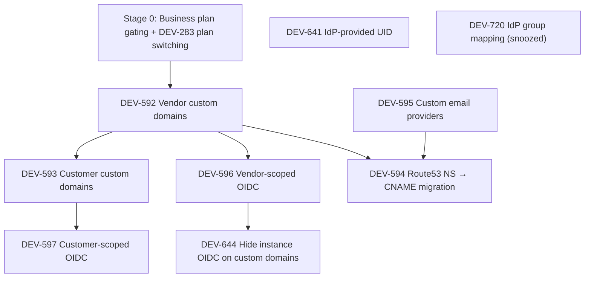

# Distr Enterprise: Full OIDC / SSO Support — Implementation Plan

Plan for the Linear project [Distr Enterprise full OIDC / SSO support](https://linear.app/glasskube/project/distr-enterprise-full-oidc-sso-support-12b063482aa2/issues).

This is a living document (v1, draft). Each issue gets a short summary and a detailed, PR-sized plan. Dependencies between issues follow the "blocks" relations in Linear.

## Current state (codebase)

- OIDC is **instance-scoped only**: providers (Google, GitHub, Microsoft, Generic) are configured via environment variables in `internal/env/env.go` and initialized once at startup in `internal/oidc/oidc.go` (`NewOIDCer`).
- Login flow: `internal/handlers/auth_oidc.go` — state + PKCE verifier stored in DB (`oidc_states` table), user matched **by email only**, auto-signup creates a new org.
- Frontend: `oidc-buttons.component.ts` renders provider buttons based on build config; login/register pages.
- Custom domains exist only as operator-managed columns: `organization_branding.app_domain` / `registry_domain`, resolved by `internal/customdomains` — no self-service, no automated TLS (existing setups use manually managed Route53 NS zones).
- Plans exist as `types.SubscriptionType` (community, starter, pro, enterprise, trial) with Stripe billing (`FeatureVendorBilling`), and org feature flags (`types.Feature`, `org.HasFeature(...)`, `ProFeatures`) are granted based on the subscription.
- A **jetski/HyprMCP reference for the custom domain implementation is included as an appendix at the end of this document** (Caddy ingress + on-demand TLS + ask endpoint), together with the Distr-side design (`CustomDomain` data model, catch-all ingress, open decisions).

## Dependency graph



## Proposed order of work

| Stage | Issue   | Title                                            | Why now                                                              |
| ----- | ------- | ------------------------------------------------ | -------------------------------------------------------------------- |
| 0     | DEV-283 | Business plan gating + subscription switching    | Prerequisite: defines how all enterprise features below are gated.  |
| 1     | DEV-641 | Improve handling of IdP-provided UID             | Independent, foundational for all later OIDC work; fixes real bugs. |
| 2     | DEV-592 | Automated custom domain configuration (vendors)  | Root of the dependency tree; unblocks everything domain-related.    |
| 3     | DEV-595 | Custom email provider configurations             | Independent of OIDC; needed before the Route53 migration.           |
| 4     | DEV-596 | Vendor-scoped OIDC configuration                 | First multi-tenant OIDC deliverable; needs DEV-592.                 |
| 5     | DEV-593 | Automated customer domain configuration          | Extends DEV-592 to customer orgs.                                   |
| 6     | DEV-594 | Migrate Route53 NS zones to CNAME setup          | Customer self-service migration; needs DEV-592 + DEV-595.           |
| 7     | DEV-597 | Customer-scoped OIDC configuration               | Needs DEV-593; reuses DEV-596 machinery.                            |
| 8     | DEV-644 | Hide instance-scoped OIDC on custom domains      | Breaking change; do last, after comms to affected users.            |
| —     | DEV-720 | User group mapping from IdP                      | Snoozed; only if the customer comes back. Not planned.              |

---

## Stage 0 — Business plan gating + DEV-283: Switch subscription type on subscription page

### Summary

Before shipping any of the enterprise features below, introduce the **business plan** as a first-class `SubscriptionType` with its own feature set, and let org admins switch their subscription type on the subscription page (DEV-283). All later stages then gate on "plan grants feature" instead of ad-hoc flags per org.

### Detailed plan

**PR 1 — business plan + feature mapping**

- Add `SubscriptionTypeBusiness` to `types.SubscriptionType`; define per-plan feature sets (extend the `ProFeatures` model to a `FeaturesForSubscriptionType(...)` mapping) including the new features from this project: `custom_domains`, `custom_email_provider`, `org_oidc`.
- Stripe product/price wiring for the business plan; make sure webhook-driven subscription updates set the correct features.
- Website/pricing docs already describe the business tier (`fe363550`), keep product + docs consistent.

**PR 2 — DEV-283: plan switching UI**

- Subscription page: allow switching between plans (up/downgrade) via Stripe (checkout or subscription update + proration), not just the billing portal.
- Handle downgrade consequences: features revoked → what happens to configured custom domains / OIDC configs / email providers (grace period vs. immediate disable; recommend: keep config stored, mark disabled).
- Related: DEV-270 (cancelled-subscription banner) shares UI surface.

### Open questions

- Exact feature matrix per plan (which of custom domains / org OIDC / email providers are business vs. enterprise)?
- Downgrade policy for already-configured enterprise features.

---

## Stage 1 — DEV-641: Improve handling of IdP-provided UID

### Summary

Today OIDC users are matched by email only. If a user changes their email at the IdP, a duplicate account is created; if they change it in Distr, a login via the IdP re-creates the old account. Store the IdP-provided UID (issuer + `sub` claim) on the user account so identity survives email changes.

### Detailed plan

**PR 1 — DB schema + identity linking on login**

- New table `user_account_oidc_identities` (`user_account_id`, `provider`, `issuer`, `subject`, unique on `(issuer, subject)`, timestamps). A separate table (instead of columns on `user_accounts`) supports multiple linked providers per user and later per-org providers.
- Extend `internal/oidc` extractors to return `issuer` + `subject` (and email) instead of just email. GitHub (plain OAuth2, no id_token) uses the numeric user ID as subject with a synthetic issuer.
- Callback handler lookup order:
  1. Find identity by `(issuer, subject)` → log that user in (even if email changed).
  2. Fallback: find user by email (current behavior) → create the identity record (backfill-on-login).
  3. Otherwise: auto-signup (unchanged) + create identity record.
- Email-change behavior (**decided**): when the identity matches by `(issuer, subject)` but the IdP reports a different email, **update the Distr account email** to the new one (the IdP is the source of truth for OIDC-managed accounts). Guard: only if the new email is verified by the IdP and not already taken by another account (in that conflict case, fail the login with a clear error instead of merging accounts). Log/audit every email change.

**PR 2 — cleanup + observability (optional, small)**

- Metrics/log fields for "matched by identity" vs "matched by email" vs "signed up", plus email-change audit events.
- Docs update in `website/.../self-hosting/oidc.mdx`.

### Open questions

- Do we need an admin UI to view/unlink connected identities (could be a follow-up issue)?
- Notify the user (old + new address) when their email is changed via IdP login?

---

## Stage 2 — DEV-592: Automated custom domain configuration for vendors

### Summary

Vendor organizations should self-service a custom domain for the platform UI/API and the registry (two different CNAME targets, served via caddy-ingress rather than the AWS ALB). The full jetski/HyprMCP reference implementation and its mapping onto Distr are documented in the **appendix** at the end of this document — this stage tracks the Distr-side deliverables.

### Detailed plan

Follows the "recommended shape" in appendix §5: a dedicated `CustomDomain` table (owned by the vendor org, optional customer/partner scoping, globally unique domains — appendix §5.3), one Caddy ingress with on-demand TLS + `ask` endpoint, static catch-all ingress routing (no CRD/metacontroller machinery from jetski; see the appendix open questions for the metacontroller discussion).

**PR 1 — data model + self-service API + validation (appendix §5.3–§5.5)**

- New `CustomDomain` table (schema in appendix §5.3); migrate the existing `organization_branding.app_domain` / `registry_domain` values into it (as unscoped org-wide domains, normalizing the scheme-prefixed `app_domain` values to bare lowercase hostnames) and drop the columns; `customdomains.AppDomainOrDefault` / `RegistryDomainOrDefault` resolve via the new table.
- Org-admin CRUD for app + registry domains: RFC-1123 hostname validation, global uniqueness via the `UNIQUE (domain)` constraint, rejection of platform-owned domains (`*.distr.sh`).
- Gated on the business plan feature from Stage 0 (`custom_domains`).
- Optional CNAME pre-verification (resolve domain → expected target) for better UX; the `ask` gate keeps it safe either way.

**PR 2 — Caddy on-demand TLS `ask` endpoint (appendix §3.3/§5.4, security-critical)**

- Internal-only `GET .../ask?domain=...` endpoint returning 200 iff the domain exists in `CustomDomain`; single indexed db lookup (runs during TLS handshakes).
- Served cluster-internally (separate listener/port like jetski's `:8085`), never internet-exposed.

**PR 3 — infrastructure (caddy-ingress) + CNAME targets (appendix §5.1/§5.2)**

- `caddyserver/ingress` helm chart with `onDemandTLS: true` + `onDemandAsk` → the ask endpoint; static catch-all Ingress to the Hub (both already available as disabled-by-default dependencies of the Distr Helm chart, see appendix §6).
- Two stable CNAME targets pointing at the Caddy LB, e.g. `custom-app.distr.sh` / `custom-registry.distr.sh` (region encoding to be decided, appendix §6); env vars `CUSTOM_DOMAIN_APP_CNAME_TARGET` / `CUSTOM_DOMAIN_REGISTRY_CNAME_TARGET` (+ configuration.mdx), feature off when unset.
- Resolve the app-vs-registry backend split (two Caddy installations vs. Hub-side host dispatch, appendix §5.2).
- E2E validation with a staging domain.

**PR 4 — frontend (appendix §5.6)**

- Org settings section "Custom domains" with app + registry domain fields, live validation, and explicit CNAME record instructions per field (targets from the env endpoint); verification status if PR 1 includes pre-verification.

### Open questions

- See the appendix §6 for the full list of open decisions (metacontroller vs. catch-all, region-encoded CNAME targets, shared-domain semantics).
- Does the Hub host-context middleware (needed by DEV-596) land here or in DEV-596 PR 1? (Registry already resolves orgs by host; the app side needs an equivalent.)

---

## Stage 3 — DEV-595: Custom email provider configurations

### Summary

After moving off AWS certificates/NS records, Distr can no longer send email from customers' custom domains via our SES account. Let organizations configure their own email provider. **Scope decision: exactly one configuration per (vendor) organization** — no per-customer/per-partner configs; customer- and partner-related mails (invites, portal notifications) are sent via the owning vendor's provider. Providers for v1 are what [go-mailx/mailx](https://github.com/go-mailx/mailx) already supports and Distr already uses instance-wide: **SMTP** and **AWS SES with access key / secret key**. Resend/Brevo may come later as new mailx adapters.

### Current state (code)

- One global `*mailx.Mailer` is created at startup in `internal/svc/mailer.go` from `MAILER_TYPE` (`smtp` | `ses` | unset → noop): `smtp.New(smtp.Config{Host, Port, Username, Password, ImplicitTLS, TLSPolicy})` or `ses.NewFromContext(ctx)` (ambient AWS credentials). It is injected into the request context (`internalctx.WithMailer` / `GetMailer`) and used by all senders in `internal/mailsending/`.
- A per-org **from address** override already exists: `organization_branding.email_from_address`, resolved via `customdomains.EmailFromAddressParsedOrDefault` and the `authOrgOverrideFromAddress` hook in the mailer's `FromAddressSrc` chain. DEV-595 only adds per-org **transport**; the from address stays on branding.
- `mailx-ses` also exposes `ses.New(aws.Config)`, so per-org static credentials are straightforward: build an `aws.Config` with `credentials.NewStaticCredentialsProvider(accessKeyID, secretAccessKey, "")` and the configured region.
- There is **no secrets-at-rest encryption today** (the existing `Secret` table for deployment secrets stores plaintext values; only JWT signing uses a key from env), so provider credentials need a new encryption helper.
- Notification sends go through `sendNotificationWithQuota` (`internal/mailsending/mail_quota.go`), an hourly per-address quota protecting our SES reputation.

### Detailed plan

**PR 1 — data model + secrets encryption**

- New encryption helper (e.g. `internal/crypto`): AES-256-GCM with a key from a new env var `SECRETS_ENCRYPTION_KEY` (base64, 32 bytes; required once any org email config exists). Update `website/src/content/docs/docs/self-hosting/configuration.mdx`.
- New table, one row per org (`UNIQUE (organization_id)` — deliberately *not* the `CustomDomain` owner/scope pattern, per the scope decision):

```sql
CREATE TABLE OrganizationEmailConfiguration (
  id UUID PRIMARY KEY DEFAULT gen_random_uuid(),
  created_at TIMESTAMP NOT NULL DEFAULT current_timestamp,
  updated_at TIMESTAMP NOT NULL DEFAULT current_timestamp,
  updated_by_user_account_id UUID REFERENCES UserAccount (id) ON DELETE SET NULL,
  organization_id UUID NOT NULL UNIQUE REFERENCES Organization (id) ON DELETE CASCADE,
  provider TEXT NOT NULL CHECK (provider IN ('smtp', 'ses')),
  enabled BOOLEAN NOT NULL DEFAULT TRUE,
  -- smtp
  smtp_host TEXT,
  smtp_port INT,
  smtp_username TEXT,
  smtp_password_encrypted BYTEA,
  smtp_implicit_tls BOOLEAN,
  -- ses (static credentials)
  ses_region TEXT,
  ses_access_key_id TEXT,
  ses_secret_access_key_encrypted BYTEA,
  CONSTRAINT OrganizationEmailConfiguration_provider_fields CHECK (
    (provider = 'smtp' AND smtp_host IS NOT NULL AND smtp_port IS NOT NULL)
    OR (provider = 'ses' AND ses_region IS NOT NULL AND ses_access_key_id IS NOT NULL
        AND ses_secret_access_key_encrypted IS NOT NULL)
  )
);
```

- `internal/db` CRUD + `internal/types.OrganizationEmailConfiguration` (secrets never serialized to JSON).

**PR 2 — per-org mailer resolution in the sending paths**

- New resolver (in `internal/svc` or a small `internal/mailer` package): `MailerForOrganization(ctx, orgID) *mailx.Mailer` — returns a mailer built from the org's enabled config, else the instance default from context. Adapter construction is cheap (SMTP dials per send; SES client is a struct), so build per call; add a small cache keyed on `(organization_id, updated_at)` only if profiling says so.
- Change `internal/mailsending/*` senders to resolve the mailer via the organization they already receive/resolve (e.g. `SendUserInviteMail` already gets `types.OrganizationWithBranding`; notification senders resolve the org from the deployment target). Customer/partner flows use the **vendor org's** config by definition of the scope decision.
- **No silent fallback**: if an org config is enabled but sending fails, the send fails (logged + Sentry) rather than falling back to instance SES — falling back would send from a domain our SES isn't authorized for (SPF/DKIM/DMARC failures) and mask misconfiguration. The instance default is only used when no org config is enabled.
- Exempt sends through a customer-provided transport from `sendNotificationWithQuota` (the quota protects *our* provider reputation; their provider is their responsibility) — keep the quota for the instance mailer path.

**PR 3 — admin API + test send**

- Org-admin endpoints under the existing settings router (`internal/routing/routing.go` → `handlers.SettingsRouter`), request structs in `api/`:
  - `GET /api/v1/settings/email-configuration` — config without secrets (return `smtpPasswordSet: true`-style flags),
  - `PUT /api/v1/settings/email-configuration` — create/update; omitted secret fields keep the stored value,
  - `DELETE /api/v1/settings/email-configuration`,
  - `POST /api/v1/settings/email-configuration/test` — send a test mail to the current user via the submitted (or stored) config and report the provider error verbatim.
- Feature gating: `custom_email_provider` feature (Stage 0 plan gating), consistent with DEV-592.

**PR 4 — frontend + docs**

- Org settings page "Email": provider select (SMTP / Amazon SES), provider-specific reactive form (secrets as write-only password fields with a "value is set" indicator), enable/disable toggle, "Send test email" button surfacing the provider response.
- Point out the interplay with the from address (`organization_branding.email_from_address`, edited in branding settings): the configured provider must be authorized to send for that domain.
- Docs page for vendors: SMTP and SES IAM setup (minimal `ses:SendEmail` policy), SPF/DKIM/DMARC guidance for the from-domain.

### Open questions

- Should the existing plaintext `Secret` table also move to the new `SECRETS_ENCRYPTION_KEY` encryption (separate follow-up), or stay as-is?
- SES: static keys only for v1, or also assume-role (external ID) for enterprise setups?
- Should disabling/downgrading the feature (Stage 0 downgrade policy) hard-delete the config or keep it stored but disabled (recommended: keep, disabled)?
- Do we validate the from-address domain against the provider (e.g. SES `GetIdentityVerificationAttributes`) or leave it to the test-send?

---

## Stage 4 — DEV-596: Vendor-scoped OIDC configuration

### Summary

An organization admin configures their own (generic) OIDC provider, tied to the custom domain they configured in DEV-592. Users visiting the vendor's domain log in via the vendor's IdP.

### Detailed plan

**PR 1 — data model + dynamic provider registry**

- New table `organization_oidc_configurations` (`organization_id`, `issuer`, `client_id`, encrypted `client_secret`, `scopes`, `pkce_enabled`, `sp_initiated`, `enabled`, timestamps). Start with exactly one generic provider per org.
- `sp_initiated` marks the config as **service-provider initiated**: visitors of the org's custom domain are automatically redirected to the IdP instead of seeing the login form (see PR 2).
- Refactor `internal/oidc.OIDCer` from a fixed startup map to a resolver that can lazily initialize + cache per-org providers (discovery document fetch, verifier). Instance-scoped env providers remain the default set.
- Extend `oidc_states` with the org/provider context so the callback knows which config to use (state is already server-side, so add columns rather than encoding in the URL).

**PR 2 — login flow on custom domains**

- `/api/v1/auth/oidc/{provider}` and callback resolve the org from the Host (host-context middleware, see DEV-592 open questions) and use the org's OIDC config; callback URL is on the vendor's domain.
- Per-host provider discovery via the existing **`GET /api/v1/portal`** endpoint (`internal/handlers/portal.go`, already resolves the org branding by CNAME/Host): extend `api.PortalResponse` with the OIDC providers available on this host, including the `sp_initiated` flag — replacing pure build-config for the login/register pages.
- **SP-initiated auto-redirect**: when the portal response marks the org's OIDC config as `sp_initiated`, the frontend immediately redirects unauthenticated visitors to `/api/v1/auth/oidc/{provider}` instead of rendering the login form. Escape hatch: a query param (e.g. `/login?manual=1`, also used after `oidc-failed` redirects) shows the regular login form to avoid redirect loops and admin lockout.
- Mind caching: the portal response is cached per Host (`Vary: Host`, `max-age=60`) — OIDC config changes may take up to the cache TTL to apply.
- Signup/first-login semantics (**decided**): a user signing in via a vendor-scoped IdP lands **in that vendor's org** (not a fresh personal org), with default role `read_write` (the regular user role). Invited users keep their invited role.
- **Org switching is disabled** for sessions established via an org-scoped OIDC provider: the login token is scoped to that org, the org switcher is hidden, and the switch endpoint rejects such tokens. (The user's identity/authorization only exists in the context of that org's IdP.)

**PR 3 — role / privilege mapping (foundation)**

- Add an optional role-mapping config to `organization_oidc_configurations`: a claim name (e.g. `groups` or `roles`) plus mapping rules claim-value → Distr role (`read_only` | `read_write` | `admin`), evaluated on every login (so demotions at the IdP take effect).
- Default when no mapping configured: `read_write` on first login, role never touched afterwards.
- Designed so DEV-720 (full IdP group sync) can build on it later.

**PR 4 — admin API + frontend**

- Org-admin CRUD endpoints for the OIDC config (+ "test connection" doing discovery).
- Org settings page "SSO / OIDC": form with issuer, client ID/secret, scopes, PKCE toggle, SP-initiated toggle (with a warning about the auto-redirect behavior), role-mapping rules; shows the exact callback URL to register at the IdP.
- Docs page for vendors.

### Open questions

- Vendor OIDC config as the **default** for all customer/partner organizations on the vendor's shared custom domain, inherited automatically by newly created customer/partner orgs; customer-scoped configs (DEV-597) override it on dedicated customer domains (see the appendix, "Shared custom domains" decision). Precedence + opt-out rules to be settled.
- Should auto-provisioning of unknown users be opt-in per org, or always on when org OIDC is enabled?
- Only "generic" per-org OIDC at first, or also branded Google/Microsoft per org?
- Role mapping: is claim-value → role sufficient for v1, or do we need expression-based rules?
- Should vendor-scoped OIDC also work on app.distr.sh (e.g. via email-domain discovery), or strictly custom-domain-only? (DEV-644 suggests strictly domain-scoped.)

---

## Stage 5 — DEV-593: Automated customer domain configuration for customers

### Summary

A vendor admin configures a custom domain for each of their customers, e.g. vendor on `distribution.vendor.com`, customer on `customer.distribution.vendor.com` or `vendor.customer.com` (no restrictions on shape).

### Detailed plan

**PR 1 — data model + API**

- The `CustomDomain` table already supports scoping a domain to a **customer organization** managed by the vendor (`customer_organization_id`, appendix §5.3) — wire up the API surface for it.
- Vendor-admin endpoints to create/verify/remove customer domains, reusing the DEV-592 verification machinery.
- Host-resolution middleware maps customer domains to the customer org context (login page branding, scoping).

**PR 2 — frontend**

- In the vendor's customer management UI: per-customer "Custom domain" section (add/verify/remove, CNAME instructions) — mirroring the org-level UI from DEV-592 PR 4.

### Open questions

- Do wildcard setups (`*.distribution.vendor.com`) need first-class support, or is per-customer explicit CNAME enough for v1?
- What exactly is scoped by a customer domain besides login/OIDC (branding, registry too?)?

---

## Stage 6 — DEV-594: Migrate existing Route53 NS zone setups to the new CNAME setup

### Summary

**Self-service migration, not an ops project**: we do not migrate customers ourselves. Existing Route53 NS zone customers migrate on their own via the DEV-592 self-service UI — they (on the business plan) add their domain in the custom domain settings, set the CNAME records at their registrar, and remove the old NS delegation. Our side is limited to enablement (docs, comms, plan gating) and eventual decommissioning of the legacy setup. Blocked by DEV-595 because email sending must no longer depend on SES + NS delegation.

### Detailed plan

**Preparation (enablement)**

- Inventory all existing Route53 NS zone customers; confirm each is (or gets moved) on the **business plan** so the `custom_domains` feature is available to them, and has an email provider configured (DEV-595) if they send email from their domain.
- Written self-service migration guide: add domain in the UI → create CNAMEs to the new targets → remove NS records; the DEV-592 CNAME pre-verification gives them immediate feedback.
- The old and new setup can coexist per domain during the transition (ALB serves the domain until the customer flips their DNS to the Caddy CNAME target; the `ask` endpoint authorizes the cert as soon as the domain exists in `CustomDomain`).

**Comms + monitoring**

- Direct communication with affected customers, with a migration deadline.
- Monitor which domains still resolve to the legacy setup (NS zones / ALB) vs. the Caddy LB; remind stragglers.

**Decommission (the only ops work)**

- After the deadline: remove the migrated/expired domains from the ALB ingress list and decommission the Route53 zones.

### Open questions

- Timeline + deadline policy for customers who never migrate (grace period, then domain stops working?).
- Are all existing NS zone customers on (or willing to move to) the business plan — or do they get the feature grandfathered?
- Any customers with non-CNAME-able apex domains (need ALIAS/ANAME guidance)?

---

## Stage 7 — DEV-597: Customer-scoped OIDC configuration

### Summary

A **customer admin** sets up OIDC for their own organization, on their customer-scoped custom domain (DEV-593). Same machinery as vendor-scoped OIDC (DEV-596), applied to customer orgs.

### Detailed plan

**PR 1 — backend**

- Allow `organization_oidc_configurations` for customer organizations; resolve config via the customer domain in the login flow.
- Permissions: customer admins manage their own config; decide whether vendor admins may manage it on the customer's behalf.
- Auto-provisioned users land in the customer org with default role `read_write`; the DEV-596 role/privilege mapping applies unchanged.
- Org switching is disabled for these sessions too (same org-scoped token mechanism as DEV-596 PR 2).
- SP-initiated auto-redirect works the same on customer domains: the `/api/v1/portal` response for the customer's CNAME carries the customer org's OIDC config.

**PR 2 — frontend + docs**

- Customer-side settings page (customer portal) for OIDC config, same form/component as DEV-596 PR 3, reused.
- Vendor-side visibility (read-only status of customer SSO?) — to be decided.
- Docs for customer admins.

### Open questions

- May vendors configure/override customer OIDC, or strictly customer-managed?
- Does the customer portal currently have a settings area where this fits naturally?

---

## Stage 8 — DEV-644: Hide instance-scoped OIDC config on custom domains

### Summary

On custom domains, only the domain-scoped (vendor/customer) OIDC providers should be offered — not the instance-scoped Google/GitHub/Microsoft/Generic ones. **Breaking change**: users who currently sign in via instance OIDC on a custom domain could be locked out, so it needs advance communication.

### Detailed plan

**PR 1 — behavior switch (possibly behind a transition flag)**

- The per-host provider listing endpoint (DEV-596 PR 2) returns only org-scoped providers for custom domains; instance providers only on the default host.
- Backend enforcement as well: reject instance-provider auth initiation on custom domains (not just hidden in UI).

**Pre-rollout tasks (before the PR is enabled)**

- Identify affected users (instance-OIDC logins with Host ≠ default from logs/metrics — add measurement early, ideally in DEV-596).
- Notify affected vendors: set up org-scoped OIDC or ensure users have passwords/use the default domain.
- Grace period with a warning banner on custom-domain logins using instance OIDC.

### Open questions

- Do we need a per-org opt-out/grace flag, or is a global cutoff date with comms enough?

---

## DEV-720: User group mapping from IdP side (snoozed)

### Summary

Request for mapping IdP groups to Distr users/roles. Currently not possible — users must be imported/synced via automation. Snoozed in triage; would be scoped and estimated as a custom feature only if the customer returns. No plan yet, but the DEV-641 identity table and DEV-596 per-org OIDC config are the natural foundation (group claims → role mapping rules per org).

---

## Cross-cutting notes

- **Feature gating** (decided): plan-based via Stage 0 — the business plan (and above) grants the new `Feature` flags (`custom_domains`, `custom_email_provider`, `org_oidc`); DEV-283 plan switching is the prerequisite deliverable.
- **Secret storage**: OIDC client secrets (DEV-596/597) and SMTP credentials (DEV-595) both need encryption at rest — pick one mechanism, build it in the first PR that needs it.
- **Host-context middleware** is the shared backbone for DEV-593, DEV-596, DEV-597 and DEV-644 — the registry already resolves orgs by host, the app side needs an equivalent; decide whether it lands in DEV-592 or DEV-596 (open question in Stage 2).
- **Org-scoped sessions**: logins via org-scoped OIDC providers produce org-scoped tokens without org switching (DEV-596 PR 2); the same mechanism serves customer-scoped OIDC (DEV-597).
- **Role/privilege mapping**: introduced in DEV-596 PR 3 (claim → role rules, default `read_write`), reused by DEV-597, and the foundation for DEV-720 if it gets picked up.
- **Docs**: every stage updates `website/src/content/docs/` (self-hosting configuration reference for new env vars, plus product docs for the new org settings).

---

## Appendix — Automated custom domain (CNAME) configuration: jetski/HyprMCP reference & Distr design

Reference document for [DEV-592: Automated custom domain configuration for vendors](https://linear.app/glasskube/issue/DEV-592/automated-custom-domain-configuration-for-vendors).

We already built self-service custom domains for HyprMCP in [hyprmcp/jetski](https://github.com/hyprmcp/jetski) (discontinued, we are the authors). This appendix (originally the standalone `cname.md`) extracts **all** relevant code and logic from that implementation, and maps it onto what Distr needs for DEV-592.

---

### 1. The issue (DEV-592)

> Organizations are currently not able to set up a custom domain themselves.
>
> An organization should be able to setup a customer domain for the platform and registry. (We provide different CNAME targets for the app and registry)
>
> These CNAME targets are different from app.distr.sh and registry.distr.sh as we want these to still be served directly via the AWS LoadBalancer.
>
> We actually already built this for HyprMCP utilizing caddy ingress.

Key requirements:

1. Self-service: an org admin enters a custom domain in the UI (one for the app, one for the registry).
2. Not only vendor organizations: custom domains must also serve **customer organizations** and **partner organizations** — and a single vendor-owned domain can be shared by many of them, since a user's org membership makes login unambiguous. Hence a dedicated `CustomDomain` table owned by the vendor organization with optional customer/partner scoping and global domain uniqueness (see section 5).
3. Automated TLS: no manual cert provisioning; the customer only creates a CNAME record.
4. Dedicated CNAME targets (e.g. `custom-app.distr.sh`, `custom-registry.distr.sh`) served by a Caddy ingress, while `app.distr.sh` / `registry.distr.sh` keep going through the AWS LoadBalancer.

---

### 2. How jetski solved it — architecture overview

```
Customer browser/client
        │  (DNS CNAME: mcp.customer.com → <org>.hyprmcp.cloud)
        ▼
Caddy ingress controller (caddyserver/ingress helm chart)
  - onDemandTLS: true
  - onDemandAsk: http://jetski-webhook:8085/ask   ← "may I issue a cert for this domain?"
        │
        ▼
Per-org gateway Ingress (host = custom domain OR <org>.hyprmcp.cloud)
        │
        ▼
Per-org gateway Service/Deployment (reconciled by metacontroller + jetski sync webhook)
```

The moving parts:

| Part | jetski location | Purpose |
|---|---|---|
| DB column | `internal/migrations/sql/4_organization_custom_domain.up.sql` | store custom domain per org |
| Settings API | `internal/handlers/organizations.go` (`putOrganizationHandler`) | self-service update + validation |
| TLS "ask" endpoint | `internal/handlers/webhook/tlsask/handler.go` | Caddy on-demand TLS authorization |
| CRD (`MCPGateway`) | `internal/kubernetes/api/v1alpha1/mcp_gateway.go` | desired state per org, incl. `customDomain` |
| CRD applier | `internal/kubernetes/apply/mcp-gateway.go` | Hub writes CRD on settings change |
| Metacontroller config | `internal/kubernetes/controller/install.go` | CompositeController wiring sync webhook |
| Sync webhook | `internal/handlers/webhook/kubernetes/types.go` | generates ConfigMap/Deployment/Service/**Ingress** children |
| Env config | `internal/env/env.go` | ingress class, annotations, host format, webhook URL |
| Frontend | `projects/ui/src/app/pages/organization-settings/organization-settings-general.component.ts` | form + CNAME instructions |

Important nuance: jetski needed **per-organization gateway deployments**, hence the CRD + metacontroller machinery. For Distr, the Hub itself already serves all organizations on any Host header, so the Kubernetes part shrinks dramatically (see section 5). The universally reusable parts are the **Caddy on-demand TLS setup**, the **ask endpoint**, the **DB/API/UI**, and the **DNS/CNAME model**.

---

### 3. All relevant jetski code

#### 3.1 Database: custom domain column

`internal/migrations/sql/4_organization_custom_domain.up.sql`:

```sql
ALTER TABLE Organization
  ADD COLUMN settings_custom_domain TEXT;

CREATE INDEX Organization_settings_custom_domain ON Organization (settings_custom_domain);
```

The index is load-bearing: the Caddy `ask` endpoint queries by domain on every first TLS handshake for an unknown SNI, so the lookup must be indexed.

Type (`internal/types/types.go`):

```go
type Organization struct {
	ID        uuid.UUID            `db:"id" json:"id"`
	CreatedAt time.Time            `db:"created_at" json:"createdAt"`
	Name      string               `db:"name" json:"name"`
	Settings  OrganizationSettings `json:"settings"`
}

type OrganizationSettings struct {
	CustomDomain  *string                           `json:"customDomain"`
	Authorization OrganizationAuthorizationSettings `json:"authorization"`
}
```

DB queries (`internal/db/organizations.go`):

```go
func UpdateOrganization(ctx context.Context, org *types.Organization) error {
	db := internalctx.GetDb(ctx)
	rows, err := db.Query(
		ctx,
		`UPDATE Organization AS o
			SET settings_custom_domain = @settings_custom_domain,
				settings_authorization_dcr_public_client = @settings_authorization_dcr_public_client
		WHERE id = @id
		RETURNING `+organizationOutputExpr,
		pgx.NamedArgs{
			"id":                     org.ID,
			"settings_custom_domain": org.Settings.CustomDomain,
			"settings_authorization_dcr_public_client": org.Settings.Authorization.DCRPublicClient,
		},
	)
	// ... CollectExactlyOneRow ...
}

func ExistsOrganizationWithName(ctx context.Context, name string) (bool, error) {
	db := internalctx.GetDb(ctx)
	rows, err := db.Query(ctx, "SELECT true FROM Organization WHERE name = @name", pgx.NamedArgs{"name": name})
	if err != nil {
		return false, err
	}
	exists, err := pgx.CollectExactlyOneRow(rows, pgx.RowTo[bool])
	if errors.Is(err, pgx.ErrNoRows) {
		err = nil
	}
	return exists, err
}

func ExistsOrganizationWithCustomDomain(ctx context.Context, domain string) (bool, error) {
	db := internalctx.GetDb(ctx)
	rows, err := db.Query(
		ctx,
		"SELECT true FROM Organization WHERE settings_custom_domain = @settings_custom_domain",
		pgx.NamedArgs{"settings_custom_domain": domain},
	)
	if err != nil {
		return false, err
	}
	exists, err := pgx.CollectExactlyOneRow(rows, pgx.RowTo[bool])
	if errors.Is(err, pgx.ErrNoRows) {
		err = nil
	}
	return exists, err
}
```

#### 3.2 Self-service settings API + validation

`internal/handlers/organizations.go` — `PUT /api/v1/organizations/{organizationId}` accepts the custom domain, validates it, persists it, and immediately re-applies the Kubernetes desired state:

```go
func putOrganizationHandler(k8sClient client.Client) http.HandlerFunc {
	gatewayApplier := apply.MCPGateway(k8sClient)

	return func(w http.ResponseWriter, r *http.Request) {
		ctx := r.Context()
		log := internalctx.GetLogger(ctx)

		org := getOrganizationIfAllowed(w, r, pathParam)
		if org == nil {
			return
		}

		var request struct {
			Settings struct {
				CustomDomain  *string
				Authorization *types.OrganizationAuthorizationSettings
			}
		}
		if err := json.NewDecoder(r.Body).Decode(&request); err != nil {
			Handle4XXError(w, http.StatusBadRequest)
			return
		}

		updateNeeded := false

		if request.Settings.CustomDomain != nil {
			updateNeeded = true
			if *request.Settings.CustomDomain != "" {
				if ok := validate(w, validateDomainName(*request.Settings.CustomDomain)); !ok {
					return
				}
				org.Settings.CustomDomain = request.Settings.CustomDomain
			} else {
				org.Settings.CustomDomain = nil // empty string clears the domain
			}
		}

		// ...

		if updateNeeded {
			if err := db.UpdateOrganization(ctx, org); err != nil {
				HandleInternalServerError(w, r, err, "error updating organization")
				return
			}
		}

		// re-sync the Kubernetes desired state (ingress host etc.) right away
		if err := gatewayApplier.Apply(ctx, *org); err != nil {
			log.Error("failed to create MCPGateway resource", zap.Error(err))
		}

		RespondJSON(w, org)
	}
}
```

Domain validation (`internal/handlers/validation.go`):

```go
func validateDomainName(domain string) validationFunc {
	return func() error {
		if matched, _ := regexp.MatchString(`^([a-z0-9]+\.)+[a-z0-9]+$`, domain); !matched {
			return errors.New("domain is invalid")
		}
		return nil
	}
}
```

(Note: this regex is intentionally simple; it doesn't allow hyphens inside labels — for Distr we should use a more complete RFC-1123 hostname validation and additionally reject our own platform domains.)

#### 3.3 The Caddy on-demand TLS "ask" endpoint (the security-critical piece)

Caddy's [On-Demand TLS](https://caddyserver.com/docs/automatic-https#on-demand-tls) obtains a certificate during the **first TLS handshake** for an unknown SNI, instead of at config time. To prevent abuse (anyone pointing a domain at your LB and getting certs issued, burning ACME rate limits), Caddy requires an `ask` endpoint: before issuing, it does `GET <ask-url>?domain=<sni>` and only proceeds on HTTP 200.

jetski implements this at `GET /ask` on a separate internal webhook server (port 8085, not internet-exposed). `internal/handlers/webhook/tlsask/handler.go`:

```go
func NewHandler() http.HandlerFunc {
	getOrgName := getOrgName(env.GatewayHostFormat()) // e.g. "%v.hyprmcp.cloud"

	return func(w http.ResponseWriter, r *http.Request) {
		domain := r.FormValue("domain")
		if domain == "" {
			http.Error(w, "parameter domain is required", http.StatusBadRequest)
			return
		}

		var exists bool
		var err error
		if orgName := getOrgName(domain); orgName != nil {
			// domain matches the wildcard platform pattern, e.g. myorg.hyprmcp.cloud
			exists, err = db.ExistsOrganizationWithName(r.Context(), *orgName)
		} else {
			// otherwise it must be a registered custom domain
			exists, err = db.ExistsOrganizationWithCustomDomain(r.Context(), domain)
		}

		if err != nil {
			sentry.GetHubFromContext(r.Context()).CaptureException(err)
			w.WriteHeader(http.StatusInternalServerError)
		} else if !exists {
			w.WriteHeader(http.StatusNotFound) // Caddy will NOT issue a cert
		} else {
			w.WriteHeader(http.StatusOK) // Caddy issues/renews the cert
		}
	}
}

// getOrgName builds a matcher from a host format like "%v.foo.bar" and extracts
// the org name from a concrete host, or returns nil if the host doesn't match.
func getOrgName(want string) func(have string) (found *string) {
	w := strings.Split(want, ".")

	return func(have string) (found *string) {
		h := strings.Split(have, ".")

		if len(w) == 0 || len(w) != len(h) {
			return nil
		}

		for i := len(w) - 1; i >= 0; i-- {
			wp := w[i]
			hp := h[i]
			if wp == "%v" || wp == "%s" {
				found = &hp
			} else if wp != hp {
				return nil
			}
		}

		return
	}
}
```

Behavior (from `handler_test.go`): `getOrgName("%v.foo.bar")("test.foo.bar") == "test"`, non-matching hosts return `nil` and fall through to the custom-domain lookup.

Webhook router (`internal/handlers/webhook/router.go`) — separate chi mux, served on its own port:

```go
func NewRouter(logger *zap.Logger, db queryable.Queryable, mailer mail.Mailer) http.Handler {
	r := chi.NewMux()
	r.Use(
		chimiddleware.Recoverer,
		chimiddleware.RequestID,
		middleware.Sentry,
		middleware.LoggerCtxMiddleware(logger),
		middleware.ContextInjectorMiddleware(db, mailer),
	)
	r.Post("/sync", kubernetes.NewHandler()) // metacontroller sync hook
	r.Get("/ask", tlsask.NewHandler())       // caddy on-demand TLS ask hook
	return r
}
```

Second server bootstrap (`internal/cmd/serve.go`):

```go
go func() { util.Must(server.Start(":8080")) }()        // main API + frontend
go func() { util.Must(webhookServer.Start(":8085")) }() // internal: /sync + /ask
```

#### 3.4 Caddy ingress controller deployment (infra side, not in the repo)

The Caddy side lives in infrastructure config, not in the jetski repo. It uses the official [`caddyserver/ingress`](https://github.com/caddyserver/ingress) helm chart with on-demand TLS enabled and the ask endpoint pointed at the jetski webhook service:

```bash
helm install caddy-ingress caddy-ingress-controller \
  --repo https://caddyserver.github.io/ingress \
  --namespace caddy-system --create-namespace \
  --set ingressController.config.email=ops@example.com \
  --set ingressController.config.onDemandTLS=true \
  --set ingressController.config.onDemandAsk=http://jetski-webhook.jetski.svc.cluster.local:8085/ask \
  --set loadBalancer.externalTrafficPolicy=Local
```

This creates a `Service` of type `LoadBalancer` for Caddy — its hostname/IP is what the **CNAME target** DNS record points to:

- `*.hyprmcp.cloud` → Caddy LB (wildcard for per-org subdomains)
- customer creates `mcp.customer.com CNAME <org>.hyprmcp.cloud` (which resolves to the Caddy LB)

Equivalent raw Caddyfile semantics (what the ingress controller generates):

```
{
	on_demand_tls {
		ask http://jetski-webhook:8085/ask
	}
}

https:// {
	tls {
		on_demand
	}
	# routes generated from Ingress resources...
}
```

#### 3.5 The `MCPGateway` CRD — desired state per organization

jetski runs one gateway (proxy) deployment per organization, so it models the desired state as a namespaced CRD. `internal/kubernetes/api/v1alpha1/mcp_gateway.go`:

```go
// MCPGatewaySpec defines the desired state of MCPGateway
type MCPGatewaySpec struct {
	OrganizationID   string            `json:"organizationId"`
	OrganizationName string            `json:"organizationName"`
	CustomDomain     *string           `json:"customDomain,omitempty"`
	Authorization    AuthorizationSpec `json:"authorization,omitempty,omitzero"`
	Projects         []ProjectSpec     `json:"projects,omitempty"`
}

//+kubebuilder:object:root=true
//+kubebuilder:subresource:status
//+kubebuilder:resource:path=mcpgateways,scope=Namespaced,shortName=mcpg

type MCPGateway struct {
	metav1.TypeMeta   `json:",inline"`
	metav1.ObjectMeta `json:"metadata"`
	Spec   MCPGatewaySpec   `json:"spec,omitempty"`
	Status MCPGatewayStatus `json:"status,omitempty"`
}
```

The CRD yaml is generated with controller-gen and embedded in the binary (`internal/kubernetes/fs/embedded/jetski.sh_mcpgateways.yaml`, group `jetski.sh`, kind `MCPGateway`, shortname `mcpg`), and installed at startup with `serve --install-controller`.

#### 3.6 Hub → CRD applier (server-side apply)

When org settings change (or projects change), the Hub applies the CRD via controller-runtime server-side apply. `internal/kubernetes/apply/mcp-gateway.go`:

```go
func (a *mcpGatewayApplier) Apply(ctx context.Context, org types.Organization) error {
	// ... collect project specs; if org has no projects, delete the gateway ...

	spec := applyconfig.MCPGatewaySpec().
		WithOrganizationID(org.ID.String()).
		WithOrganizationName(org.Name).
		// ... authorization ...
		WithProjects(gatewayProjects...)

	if org.Settings.CustomDomain != nil {
		spec.WithCustomDomain(*org.Settings.CustomDomain)
	}

	err := a.client.Apply(
		ctx,
		applyconfig.MCPGateway(org.Name, env.GatewayNamespace()).WithSpec(spec),
		&client.ApplyOptions{Force: util.PtrTo(true), FieldManager: "jetski"},
	)
	if err != nil {
		return fmt.Errorf("MCPGateway apply failed: %w", err)
	}
	return nil
}
```

K8s client creation (`internal/svc/k8s_client.go`) — plain controller-runtime client from kubeconfig / in-cluster config:

```go
func createK8SClient() (ctrlclient.Client, error) {
	configFlags := genericclioptions.NewConfigFlags(true)
	scheme := runtime.NewScheme()
	if err := v1alpha1.AddToScheme(scheme); err != nil {
		return nil, err
	} else if err := metactrl.AddToScheme(scheme); err != nil {
		return nil, err
	} else if cfg, err := configFlags.ToRESTConfig(); err != nil {
		return nil, err
	} else {
		return ctrlclient.New(cfg, ctrlclient.Options{Scheme: scheme})
	}
}
```

#### 3.7 The controller: metacontroller CompositeController + sync webhook

Instead of writing a full controller-runtime operator, jetski uses [metacontroller](https://metacontroller.github.io/metacontroller/): a generic controller that watches the parent CRD and calls a **sync webhook** (implemented inside the jetski server itself) to compute the desired children.

Controller registration, installed by the server at startup (`internal/kubernetes/controller/install.go`):

```go
func ControllerConfig() *metactrl.CompositeController {
	return &metactrl.CompositeController{
		TypeMeta: metav1.TypeMeta{
			APIVersion: "metacontroller.k8s.io/v1alpha1",
			Kind:       "CompositeController",
		},
		ObjectMeta: metav1.ObjectMeta{Name: "mcpgateway-controller"},
		Spec: metactrl.CompositeControllerSpec{
			GenerateSelector: util.PtrTo(true),
			ParentResource: metactrl.CompositeControllerParentResourceRule{
				ResourceRule: metactrl.ResourceRule{APIVersion: v1alpha1.GroupVersion.String(), Resource: "mcpgateways"},
			},
			ChildResources: []metactrl.CompositeControllerChildResourceRule{
				{ResourceRule: metactrl.ResourceRule{APIVersion: "v1", Resource: "configmaps"},
					UpdateStrategy: &metactrl.CompositeControllerChildUpdateStrategy{Method: metactrl.ChildUpdateInPlace}},
				{ResourceRule: metactrl.ResourceRule{APIVersion: "apps/v1", Resource: "deployments"},
					UpdateStrategy: &metactrl.CompositeControllerChildUpdateStrategy{Method: metactrl.ChildUpdateInPlace}},
				{ResourceRule: metactrl.ResourceRule{APIVersion: "v1", Resource: "services"},
					UpdateStrategy: &metactrl.CompositeControllerChildUpdateStrategy{Method: metactrl.ChildUpdateInPlace}},
				{ResourceRule: metactrl.ResourceRule{APIVersion: "networking.k8s.io/v1", Resource: "ingresses"},
					UpdateStrategy: &metactrl.CompositeControllerChildUpdateStrategy{Method: metactrl.ChildUpdateInPlace}},
			},
			Hooks: &metactrl.CompositeControllerHooks{
				Sync: &metactrl.Hook{
					Webhook: &metactrl.Webhook{URL: util.PtrTo(env.GatewayWebhookURL())}, // e.g. http://jetski-webhook:8085/sync
				},
			},
		},
	}
}
```

Sync webhook handler (`internal/handlers/webhook/kubernetes/handler.go`) — pure function: parent in, children out:

```go
func NewHandler() http.HandlerFunc {
	return func(w http.ResponseWriter, r *http.Request) {
		var req request
		if err := json.NewDecoder(r.Body).Decode(&req); err != nil {
			http.Error(w, err.Error(), http.StatusBadRequest)
			return
		}
		resp := response{Status: req.GetStatus()}
		if desired, err := req.GetDesiredChildren(); err != nil {
			http.Error(w, err.Error(), http.StatusInternalServerError)
			return
		} else {
			resp.Children = desired
		}
		_ = json.NewEncoder(w).Encode(resp)
	}
}
```

The child generation, **including the Ingress with the effective host** (`internal/handlers/webhook/kubernetes/types.go`, abbreviated to the domain-relevant parts):

```go
type request struct {
	Parent   v1alpha1.MCPGateway       `json:"parent"`
	Children map[string]map[string]any `json:"children"`
}

// This is where the custom domain becomes the ingress host:
func (req *request) GetEffectiveGatewayHost() string {
	if req.Parent.Spec.CustomDomain != nil {
		return *req.Parent.Spec.CustomDomain
	} else {
		return fmt.Sprintf(env.GatewayHostFormat(), req.Parent.Spec.OrganizationName) // "%v.hyprmcp.cloud"
	}
}

func (req *request) GetDesiredChildren() ([]client.Object, error) {
	// ... ConfigMap (gateway config, host = GetEffectiveGatewayHost()),
	//     Deployment (config hash annotation for rollout on change),
	//     Service (port 9000) ...

	ingress := &networkingv1.Ingress{
		TypeMeta: metav1.TypeMeta{APIVersion: "networking.k8s.io/v1", Kind: "Ingress"},
		ObjectMeta: metav1.ObjectMeta{
			Name:        req.Parent.Name,
			Namespace:   req.Parent.Namespace,
			Annotations: env.GatewayIngressAnnotations(), // configurable, e.g. caddy-specific annotations
		},
		Spec: networkingv1.IngressSpec{
			Rules: []networkingv1.IngressRule{{
				Host: req.GetEffectiveGatewayHost(), // ← custom domain or <org>.hyprmcp.cloud
				IngressRuleValue: networkingv1.IngressRuleValue{
					HTTP: &networkingv1.HTTPIngressRuleValue{
						Paths: []networkingv1.HTTPIngressPath{{
							Path:     "/",
							PathType: util.PtrTo(networkingv1.PathTypePrefix),
							Backend: networkingv1.IngressBackend{
								Service: &networkingv1.IngressServiceBackend{
									Name: gatewayName,
									Port: networkingv1.ServiceBackendPort{Number: 9000},
								},
							},
						}},
					},
				},
			}},
		},
	}

	if ingressClass := env.GatewayIngressClass(); ingressClass != "" {
		ingress.Spec.IngressClassName = &ingressClass // "caddy" in production
	}

	result = append(result, ingress)
	return result, nil
}
```

Notes:

- **No `tls:` section on the Ingress.** TLS is handled entirely by Caddy on-demand TLS; the Ingress only declares routing (host → service). That is what makes the whole thing "zero-touch" for certificates.
- Metacontroller owns the children lifecycle (create/update in place/garbage-collect when the parent changes or is deleted).
- Because the Hub re-applies the CRD in the settings handler, an org saving a custom domain converges to a new Ingress host within seconds; the cert is then issued lazily on the first TLS handshake (gated by `/ask`).

#### 3.8 Environment configuration

`internal/env/env.go` (gateway-related parts):

```go
var (
	gatewayContainerImageTag  string
	gatewayWebhookURL         string
	gatewayNamespace          string
	gatewayIngressClass       string
	gatewayIngressAnnotations map[string]string
	gatewayHostFormat         string = "%v.hyprmcp.cloud"
	gatewayPathFormat         string = "/%v/mcp"
	gatewayHostScheme         string = "https"
)

func Initialize() {
	// ...
	gatewayWebhookURL = envutil.GetEnvOrDefault("GATEWAY_WEBHOOK_URL", "http://host.minikube.internal:8085/sync")
	gatewayNamespace = envutil.GetEnvOrDefault("GATEWAY_NAMESPACE", "default")
	gatewayIngressClass = envutil.GetEnv("GATEWAY_INGRESS_CLASS")
	gatewayIngressAnnotations = envutil.GetEnvParsedOrDefault("GATEWAY_INGRESS_ANNOTATIONS", parseYAMLMap, map[string]string{})
	gatewayHostFormat = envutil.GetEnvOrDefault("GATEWAY_HOST_FORMAT", gatewayHostFormat)
	gatewayPathFormat = envutil.GetEnvOrDefault("GATEWAY_PATH_FORMAT", gatewayPathFormat)
	gatewayHostScheme = envutil.GetEnvOrDefault("GATEWAY_HOST_SCHEME", gatewayHostScheme)
}
```

| Env var | Purpose |
|---|---|
| `GATEWAY_HOST_FORMAT` | default per-org host pattern (`%v.hyprmcp.cloud`); also used by `/ask` to distinguish platform subdomains from custom domains |
| `GATEWAY_INGRESS_CLASS` | ingress class of the generated Ingress (`caddy`) |
| `GATEWAY_INGRESS_ANNOTATIONS` | YAML map of extra annotations for the generated Ingress |
| `GATEWAY_WEBHOOK_URL` | URL metacontroller calls for `/sync` |
| `GATEWAY_NAMESPACE` | namespace for the per-org children |

#### 3.9 Effective URL computation (used in API responses / UI)

`internal/types/summaries.go`:

```go
func (ps *ProjectSummary) GetMCPURL() string {
	u := url.URL{
		Scheme: env.GatewayHostScheme(),
		Host:   fmt.Sprintf(env.GatewayHostFormat(), ps.Organization.Name),
		Path:   fmt.Sprintf(env.GatewayPathFormat(), ps.Name),
	}
	if customDomain := ps.Organization.Settings.CustomDomain; customDomain != nil {
		u.Host = *customDomain
	}
	return u.String()
}
```

#### 3.10 Frontend: settings form with CNAME instructions

`projects/ui/src/app/pages/organization-settings/organization-settings-general.component.ts` (Angular). Key elements:

- Reactive form with a `customDomain` control validated by `Validators.pattern(/^([a-z0-9]+\.)+[a-z0-9]+$/)`.
- Live preview of the effective URL.
- **Explicit CNAME instruction** shown once the form is valid:

```html
@if (form.valid && form.value.customDomain) {
  <p class="text-sm font-semibold">
    Please remember to create a CNAME DNS record at your domain registrar
    that resolves {{ form.value.customDomain }} to {{ defaultDomain() }}!
  </p>
}
```

```ts
protected readonly defaultDomain = computed(
  () => `${this.contextService.selectedOrg()?.name}.hyprmcp.cloud`,
);
private readonly effectiveDomain = computed(() => {
  const formValue = this.formValueSignal();
  return (
    (this.form.controls.customDomain.valid && formValue?.customDomain) ||
    this.defaultDomain()
  );
});
```

Saving goes through `PUT /api/v1/organizations/{id}` with `{settings: {customDomain}}`; sending an empty string clears the domain (handler maps `""` → `NULL`).

#### 3.11 End-to-end flow recap (jetski)

1. Org admin enters `mcp.customer.com` in org settings, UI tells them to create `mcp.customer.com CNAME <org>.hyprmcp.cloud`.
2. `PUT /organizations/{id}` validates + stores `settings_custom_domain`, then server-side-applies the `MCPGateway` CRD with `spec.customDomain`.
3. Metacontroller notices the parent change, calls jetski's `/sync` webhook, which returns children incl. an `Ingress` whose `host` is now the custom domain (class `caddy`, no TLS block).
4. Caddy ingress controller picks up the Ingress and routes `Host: mcp.customer.com` to the org's gateway service.
5. First TLS handshake for `mcp.customer.com` hits Caddy → Caddy calls `GET /ask?domain=mcp.customer.com` → jetski checks `Organization.settings_custom_domain` → 200 → Caddy obtains a Let's Encrypt cert via ACME (works because the customer's CNAME already points at the Caddy LB) and completes the handshake. Certs are cached and auto-renewed while traffic keeps coming.

---

### 4. What Distr already has

- `organization_branding` already has `app_domain` and `registry_domain` columns (`internal/types/organization.go`, `OrganizationBranding`), currently only settable by platform operators — there is no self-service, no automated TLS, and no CNAME target infrastructure.
- `internal/customdomains/customdomains.go` already resolves the effective domains:

```go
func AppDomainOrDefault(b *types.OrganizationBranding) string {
	if b != nil && b.AppDomain != nil {
		// prefixes scheme if missing, falls back to env.Host()
	}
	// ...
}

func RegistryDomainOrDefault(b *types.OrganizationBranding) string {
	if b != nil && b.RegistryDomain != nil {
		return *b.RegistryDomain
	}
	return env.RegistryHost()
}
```

- The Hub already serves both app and registry traffic for any Host header from a single deployment (registry routing already resolves orgs by host for custom registry domains), so **no per-org child deployments are needed** — the biggest chunk of jetski's machinery (CRD, metacontroller, sync webhook generating Deployments) is unnecessary for Distr.

### 5. Mapping onto DEV-592 — recommended shape for Distr

The jetski pattern reduces to this for Distr:

1. **Two CNAME targets, one Caddy ingress deployment.**
   Deploy the `caddyserver/ingress` helm chart with `onDemandTLS: true` and `onDemandAsk` pointing at a new internal Distr Hub endpoint. Create two stable DNS names pointing at the Caddy LoadBalancer, e.g.:
   - `custom-app.distr.sh` → Caddy LB (CNAME target for vendor app domains)
   - `custom-registry.distr.sh` → Caddy LB (CNAME target for vendor registry domains)

   `app.distr.sh` and `registry.distr.sh` remain on the existing AWS LoadBalancer, untouched.

2. **Static catch-all Ingresses instead of per-org Ingresses.**
   Because the Hub answers any Host, we don't need metacontroller or a CRD at all. Host-less (catch-all) Ingress rules with `ingressClassName: caddy` route everything arriving at the Caddy LoadBalancer to the Hub. On-demand TLS handles certificates per SNI, so no per-domain Ingress objects are required. (This is the documented caddy ingress pattern: an ingress rule *without* a host + `onDemandTLS` + `onDemandAsk`.)

   **Is a catch-all safe in a cluster that also runs internal workloads? Yes**, because isolation happens on two independent layers:
   - *Ingress class*: the catch-all Ingress carries `ingressClassName: caddy`, so only the Caddy controller acts on it. Internal workloads keep their existing ingress class (ALB/nginx/…) and their Ingresses are invisible to Caddy — the catch-all cannot "swallow" their routes because each controller only serves traffic arriving at **its own** LoadBalancer. Just never mark the caddy IngressClass as the cluster default (`ingressclass.kubernetes.io/is-default-class`), otherwise class-less internal Ingresses would land on Caddy.
   - *DNS*: the Caddy LB has its own address, and only the CNAME targets (`custom-app.distr.sh`, `custom-registry.distr.sh`) and thus the vendors' custom domains resolve to it. Internal workload domains keep pointing at the other LB, so their traffic never reaches the catch-all in the first place.
   - Someone pointing an unregistered domain at the Caddy LB gets nothing: the `ask` endpoint rejects cert issuance (TLS handshake fails), and plain-HTTP requests hit the Hub which doesn't resolve the unknown Host (404).

   **Caveat — app vs. registry need different backends:** Distr serves the app on `:8080` and the registry on a separate server on `:8585` (`cmd/hub/cmd/serve.go`), and a single host-less catch-all can only point to one backend port. Two clean solutions, both compatible with the two-CNAME-target model:
   - *Two Caddy installations* (two ingress classes, e.g. `caddy-app` and `caddy-registry`, two LoadBalancers): `custom-app.distr.sh` CNAMEs to the app LB whose catch-all targets port 8080, `custom-registry.distr.sh` to the registry LB whose catch-all targets port 8585. Bonus hardening: each installation's `onDemandAsk` URL can carry the type (`/ask?type=app`), so an app domain can't get a certificate on the registry LB and vice versa.
   - *One Caddy + Hub-side dispatch*: a single catch-all to port 8080, and the Hub routes requests whose Host is a registry domain (`CustomDomain.domain_type = 'registry'`) to the registry handler internally. Fewer moving parts in the cluster, but requires Hub changes and makes the registry share the app server's port/timeouts.

   - Alternative, closer to jetski: have the Hub create/update one Ingress per custom domain via a k8s client when the domain is saved (host rule picks the correct backend port, solving the app/registry split naturally). This gives per-domain routing objects and observability, at the cost of giving the Hub k8s API access. For a first iteration the static catch-all is simpler and sufficient.

3. **Data model: a dedicated `CustomDomain` table, always owned by the vendor organization.**
   Custom domains must be usable not only by (vendor) organizations, but also by **customer organizations** and **partner organizations**. Crucially, a single custom domain can serve *multiple* customers/partners of a vendor at once: a user account joins a vendor organization exactly once, and that membership carries the optional `customer_organization_id` / `partner_organization_id` (see `types.UserAccountWithUserRole`) — an email can't be a customer and vendor user of the same org at the same time, so login on a shared domain is always unambiguous. Per-customer/per-partner domains are therefore an *optional narrowing* (branding, customer-scoped OIDC per DEV-597), not a requirement for login.

   Consequently the owning reference sits on the **organization side**: `organization_id` is always set (the vendor owns, administers, and pays for all domains — matching DEV-593 where the vendor admin configures customer domains), and the customer/partner references are an optional scope:

```sql
CREATE TABLE CustomDomain (
  id UUID PRIMARY KEY DEFAULT gen_random_uuid(),
  created_at TIMESTAMP NOT NULL DEFAULT current_timestamp,
  -- bare lowercase hostname, no scheme
  domain TEXT NOT NULL,
  -- which endpoint this domain fronts: 'app' or 'registry'
  domain_type TEXT NOT NULL CHECK (domain_type IN ('app', 'registry')),
  -- the vendor organization always owns and administers the domain
  organization_id UUID NOT NULL REFERENCES Organization (id) ON DELETE CASCADE,
  -- optional narrower scope: when set, the domain is dedicated to one customer or
  -- partner organization (branding, customer-scoped OIDC). When both are NULL, the
  -- domain is the org-wide domain shared by the vendor and all of its customers
  -- and partners.
  customer_organization_id UUID REFERENCES CustomerOrganization (id) ON DELETE CASCADE,
  partner_organization_id UUID REFERENCES PartnerOrganization (id) ON DELETE CASCADE,
  CONSTRAINT CustomDomain_at_most_one_scope
    CHECK (num_nonnulls(customer_organization_id, partner_organization_id) <= 1),
  -- a domain may exist only once, globally
  CONSTRAINT CustomDomain_domain_unique UNIQUE (domain)
);

-- at most one org-wide (unscoped) domain per org and type,
-- and at most one domain per customer/partner scope and type
CREATE UNIQUE INDEX CustomDomain_organization_type
  ON CustomDomain (organization_id, domain_type)
  WHERE customer_organization_id IS NULL AND partner_organization_id IS NULL;
CREATE UNIQUE INDEX CustomDomain_customer_organization_type
  ON CustomDomain (customer_organization_id, domain_type) WHERE customer_organization_id IS NOT NULL;
CREATE UNIQUE INDEX CustomDomain_partner_organization_type
  ON CustomDomain (partner_organization_id, domain_type) WHERE partner_organization_id IS NOT NULL;
```

   Notes:
   - The `UNIQUE (domain)` constraint (backed by an index) is what the TLS `ask` lookup runs against, and it structurally prevents the double-configuration problem jetski never enforced.
   - Host-based resolution: a request's Host header resolves to exactly one row → vendor org context, plus optionally a customer/partner org context for branding and scoped OIDC. On a shared (unscoped) domain, the customer/partner context is only known after the user is identified (email/IdP callback) — which is fine because the membership model makes that unambiguous.
   - The existing `organization_branding.app_domain` / `registry_domain` columns should be migrated into this table (as unscoped org-wide domains) and then dropped; `customdomains.AppDomainOrDefault` / `RegistryDomainOrDefault` switch to resolving via `CustomDomain`.
   - Concurrent inserts of the same domain fail cleanly on the unique constraint → map to `apierrors.ErrAlreadyExists`.

4. **The `ask` endpoint (new, internal).**
   Port of `tlsask.NewHandler`: `GET /internal/webhook/tls/ask?domain=...` (on an internal listener or protected route, never internet-exposed) that returns 200 iff the domain exists in `CustomDomain`, regardless of owner type:

```go
// pseudocode for internal/handlers/... in distr
domain := r.FormValue("domain")
exists, err := db.ExistsCustomDomain(ctx, domain) // single indexed lookup on CustomDomain.domain
```

   Input normalization: store and query bare lowercase hostnames (note `app_domain` today may contain a scheme, see `AppDomainOrDefault`; self-service input should be a bare hostname).

5. **Self-service API + validation.**
   CRUD endpoints for custom domains, all administered by the vendor org — org settings for the org-wide (shared) domains, and the customer/partner organization management endpoints for optionally adding dedicated per-customer/per-partner domains. Validation:
   - RFC-1123 hostname validation (improve on jetski's `^([a-z0-9]+\.)+[a-z0-9]+$` to allow hyphens),
   - global uniqueness enforced by the `UNIQUE (domain)` constraint (surfaced as a friendly "domain already in use" error),
   - rejection of platform-owned domains (`*.distr.sh`),
   - optionally a CNAME verification step before enabling (resolve the domain and check it CNAMEs to the correct target) — jetski skipped this; the `ask` gate makes it safe but pre-validation gives better UX.

6. **Frontend.**
   Settings sections with two fields each (app domain, registry domain) — in org settings for the vendor, and in the customer/partner organization detail views for their domains — with live validation and the CNAME instructions per field, following the jetski component:
   - "Create a CNAME record: `app.customer.com` → `custom-app.distr.sh`"
   - "Create a CNAME record: `registry.customer.com` → `custom-registry.distr.sh`"
   The CNAME target hostnames should come from env (e.g. `CUSTOM_DOMAIN_APP_CNAME_TARGET`, `CUSTOM_DOMAIN_REGISTRY_CNAME_TARGET`) and be exposed via the frontend env endpoint (`internal/handlers/internal.go` pattern), with the whole feature gated on these being set.

7. **Env additions** (all optional; feature off when unset), documented in `website/src/content/docs/docs/self-hosting/configuration.mdx`:
   - `CUSTOM_DOMAIN_APP_CNAME_TARGET`
   - `CUSTOM_DOMAIN_REGISTRY_CNAME_TARGET`

8. **What we deliberately do NOT need from jetski:** the `MCPGateway` CRD, controller-gen/applyconfiguration code, metacontroller, the `/sync` webhook, per-org Deployments/Services/ConfigMaps — all of that existed because HyprMCP ran one gateway pod per org. Distr's Hub is already multi-tenant per request.

#### Security checklist carried over from jetski

- `ask` endpoint must be reachable by Caddy only (cluster-internal service, separate port like jetski's `:8085`, or auth-protected).
- `ask` must return 404 for unknown domains — this is the only thing preventing arbitrary cert issuance on our ACME account.
- The domain lookup must be indexed (it runs during TLS handshakes).
- Return 200 for our own wildcard/platform hosts too if they are served via Caddy (jetski's `getOrgName(GatewayHostFormat)` branch); for Distr this is likely unnecessary since platform hosts stay on the AWS LB with ACM certs.
- Deleting/changing a domain removes DB row match → Caddy stops renewing and eventually drops the cert automatically.

### 6. Open questions / decisions to discuss

#### Should we use metacontroller if the only thing we reconcile is the Ingress?

jetski used metacontroller because it had to reconcile four child resource types per organization (ConfigMap, Deployment, Service, Ingress) with rollout coordination between them. For Distr, the Hub already serves every org, so the only per-domain Kubernetes resource that could need reconciliation is an **Ingress** — and with Caddy on-demand TLS possibly not even that (a host-less catch-all Ingress routes everything, certificates are issued per SNI, and authorization happens in the `ask` endpoint).

Options, simplest first:

1. **No reconciliation at all (static catch-all Ingress).** Host-less Ingress rules with `ingressClassName: caddy`, shipped with the Helm chart. Custom domains never touch the Kubernetes API; adding/removing a domain is purely a DB change picked up by `/ask` and by the Hub's host-based org resolution. No CRD, no controller, no k8s RBAC for the Hub. Safe next to internal workloads in the same cluster (ingress class + DNS isolation, see section 5 item 2), but the app/registry backend split needs either two Caddy installations or Hub-side host dispatch. Downside: no per-domain object to inspect (`kubectl get ingress` won't show vendor domains), and per-domain routing tweaks are impossible.
2. **Hub applies one Ingress per domain via server-side apply.** Like jetski's applier but writing the Ingress directly instead of a CRD. Needs a k8s client + RBAC in the Hub and cleanup logic on domain change/removal (label-based garbage collection), but no metacontroller. Drift is only corrected when settings are saved again.
3. **Metacontroller + CRD (full jetski pattern).** Declarative desired state, drift repair through periodic resync, and automatic garbage collection of children — but we would run an extra cluster-wide controller deployment and maintain a CRD, applyconfiguration codegen, and a sync webhook just to manage a single Ingress per domain.

**Assessment: metacontroller is overkill if the Ingress is the only child.** Its value (child lifecycle orchestration, GC across multiple resource types, decoupling the reconcile loop from the Hub) doesn't pay off for one resource type; option 1 needs no reconciliation at all and option 2 covers the per-domain-object requirement with far less machinery. Metacontroller only becomes attractive again if we later need per-org/per-domain workloads (dedicated proxies, isolated registries) like HyprMCP had.

**Status: to be discussed.** To keep both paths open, the Distr Helm chart now bundles both as optional, disabled-by-default dependencies (`deploy/charts/distr/Chart.yaml`):

- `metacontroller` (alias for `metacontroller-helm`, `oci://ghcr.io/metacontroller`, `4.16.x`) — enable with `metacontroller.enabled=true`
- `caddy-ingress-controller` (`https://caddyserver.github.io/ingress`, `1.3.x`) — enable with `caddy-ingress-controller.enabled=true`; values pre-wire `ingressController.config.onDemandTLS=true` and document the `onDemandAsk` endpoint pointing at the Distr Hub

The Caddy ingress is required for the feature in any of the three options; metacontroller only for option 3.

#### Shared custom domains for multiple customers/partners + OIDC config as the default for new orgs

**Decision (tentative): yes, a custom domain can serve multiple customers/partners of an organization, so the owning reference sits on the vendor organization side** (see the `CustomDomain` schema in section 5: `organization_id NOT NULL`, customer/partner references are an optional scope).

Why this works: an email address can't belong to a customer and a vendor user of the same organization at the same time — the org membership row (`UserAccountWithUserRole`) carries at most one `customer_organization_id` / `partner_organization_id`. So on a shared domain like `distribution.vendor.com`, the login flow is always unambiguous: the Host resolves the vendor org context, and once the user is identified (email entry or OIDC callback), their membership determines whether they land in the vendor UI, a customer portal, or a partner view. Dedicated per-customer domains (DEV-593 style, e.g. `customer.distribution.vendor.com`) remain possible as an optional narrowing for branding and customer-scoped OIDC (DEV-597), but they are not required for login to work.

Follow-up consequence for OIDC (DEV-596/597): **the vendor's OIDC config should act as the default** on the vendor's shared domain(s) — applying to all customer and partner organizations under that vendor, including **newly created ones, which inherit it automatically** without per-customer setup. A customer-scoped OIDC config (DEV-597) on a dedicated customer domain then overrides the vendor default for that customer only. Points to settle:

- Precedence rules: instance OIDC (app.distr.sh) vs. vendor default (shared custom domain) vs. customer-scoped config (dedicated customer domain).
- Whether the vendor default is opt-out per customer org (a customer with their own IdP but no dedicated domain).
- Whether partner organizations get the same inherit-by-default behavior as customer organizations.

#### Should the region (eu) be encoded into the CNAME target domains?

To prepare for a future US hosting location, the CNAME targets could carry the region from day one, e.g.:

- `custom-app.eu.distr.sh` / `custom-registry.eu.distr.sh` (later: `custom-app.us.distr.sh` / `custom-registry.us.distr.sh`)

instead of the region-less `custom-app.distr.sh` / `custom-registry.distr.sh`.

Arguments for encoding the region now:

- CNAME targets are effectively permanent: once vendors have created DNS records pointing at them, renaming requires coordinating DNS changes with every customer. Choosing region-scoped names now avoids that migration entirely.
- Each region will have its own cluster, Caddy LoadBalancer, and ACME-issued certs; a region-less target would need to route to the correct region per domain (GeoDNS or a lookup layer), which conflicts with the simple "CNAME target = Caddy LB of the org's region" model.
- The `ask` endpoint is backed by the regional database, so cert issuance authorization naturally lives in the same region as the org.

Arguments against / open points:

- Slightly longer, less pretty DNS names in the vendor-facing instructions.
- If the region is encoded, the CNAME target must come from region-specific env config anyway (`CUSTOM_DOMAIN_APP_CNAME_TARGET`), so the code is identical either way — this is purely a naming/infra decision.
- Decide whether existing region-less names should additionally exist as aliases for the EU region, or whether we start clean with region-scoped names only.
