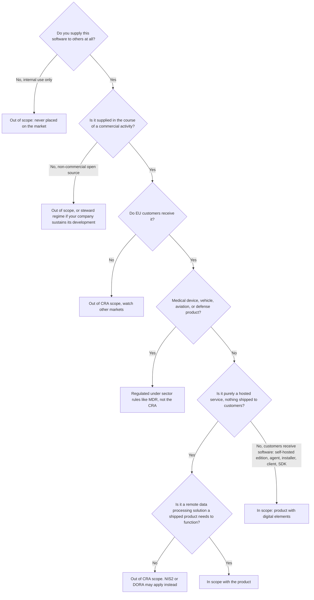

import CraCta from '~/components/cta/CraCta.astro';

_Last verified: July 2026. Based on Regulation (EU) 2024/2847 and the European
Commission's March 2026 draft guidance. The draft guidance can still change._

Most CRA scoping questions come down to one distinction the regulation makes
and most summaries blur: the CRA regulates products, not companies. Your
company is not "in scope" or "out of scope." Each artifact you supply is. A
SaaS company can be entirely out of scope for its hosted service and fully in
scope for the agent it asks customers to install. Work through the tree per
artifact and the answer usually stops being controversial.

## The decision tree

<CraCta
  title="In scope means you still owe updates to every customer"
  body="A self-hosted edition, an on-prem agent, or an installer customers run themselves usually puts you on the CRA side of the line — and you need to know who’s on which version when a patch ships."
/>

Two clarifications on the branches people get wrong.

**The commercial activity test is about monetization, not the license.**
Selling licenses, selling support, dual licensing, or a paid hosted version
all count. Developing in public does not, and neither do donations accepted
without profit intent. Open-core
companies land in a split position: full manufacturer obligations for the
paid edition, a light steward regime for the community edition, which the
March 2026 draft Commission guidance (¶49-50) treats as a separate product.
That guidance is a draft and can change. Details in our post on
[open-source companies](/cyber-resilience-act/open-source/).

**Pure SaaS is out, but "pure" is doing real work in that sentence.** The
moment you ship anything for the customer to run, that thing is a product.
And the exception cuts the other way too: Article 3(1)-(2) pulls a hosted
service into scope as a "remote data processing solution" when a shipped
product needs it to perform a function. An agent that is useless without
your cloud backend drags the relevant backend functionality in with it.

## Worked examples

| Company                                                   | CRA status                                                                                              |
| --------------------------------------------------------- | ------------------------------------------------------------------------------------------------------- |
| Pure SaaS CRM, browser only, nothing installed            | Out of scope. NIS2 or DORA may apply instead                                                            |
| SaaS monitoring vendor with an on-prem collector agent    | The SaaS is out, the agent is a product in scope, and backend functions the agent requires come with it |
| Self-hosted database vendor, customers run it themselves  | In scope, full manufacturer obligations                                                                 |
| US devtools company selling licenses to EU customers      | In scope. Manufacturer location is irrelevant, placing on the EU market is the trigger                  |
| Internal platform team building tools for its own company | Out of scope, nothing is placed on the market                                                           |
| Open-core vendor with free and paid editions              | Split: manufacturer for the paid edition, likely open-source software steward for the community edition |
| Software that is part of a medical device                 | Out of the CRA, regulated under MDR/IVDR instead                                                        |

## If you are in scope: which class?

Being in scope is question one. Question two is the classification, because it
decides your conformity assessment route.

The default category covers most business software and self-assesses under
Module A. No notified body, no certification, just a technical file that holds
up.

"Important" products in Annex III Class I include identity and access
management systems, privileged access management, password managers, browsers,
anti-malware, VPNs, network management systems, SIEM, boot managers, PKI
software, operating systems, and routers. Class I products can self-assess
only if they fully apply harmonised standards, common specifications, or an EU
cybersecurity certification scheme at assurance level "substantial" (Article
32(2)). The harmonised standards are still being finalized, so until they
land, Class I practically means involving a notified body.

Class II covers hypervisors, container runtimes, firewalls, intrusion
detection and prevention systems, and tamper-resistant microprocessors.
Third-party assessment, no self-assessment option. Critical products in Annex
IV, such as hardware security modules and smart meter gateways, may face
mandatory EU certification.

Read Annex III against what your product does, not what your marketing calls
it. A "developer platform" that manages credentials and access is an identity
product for classification purposes.

## Can you avoid the CRA?

Three routes come up in every scoping discussion. Two are real options with a
price attached, one is not an option at all.

Staying SaaS-only avoids the manufacturer obligations, because nothing is
placed on the market. It does not remove EU security regulation from your
life: your regulated customers carry NIS2 supply chain duties and pass them
down through vendor questionnaires and contract clauses. You trade one clear
product standard for many inconsistent contractual ones.

Dropping the self-hosted edition also works, and it costs you the customers
who need self-hosting: banks, public sector, healthcare, anyone with data
residency requirements or air-gapped networks, which are usually the largest
contracts on the price list. If you consider this route, price it as lost
enterprise revenue against a one-time compliance effort, not as a free
simplification.

Relabeling the product does not work. A "beta," "preview," or "community
build" that customers pay for, or that delivers a paid service, is made
available in the course of a commercial activity and is on the market. Labels
do not move the line.

<CraCta
  title="See who’s affected, notify, document delivery"
  body="Distr shows which customers run which version, helps you reach them when an update is available, and keeps pull and delivery records so you can prove the fix reached them."
/>
