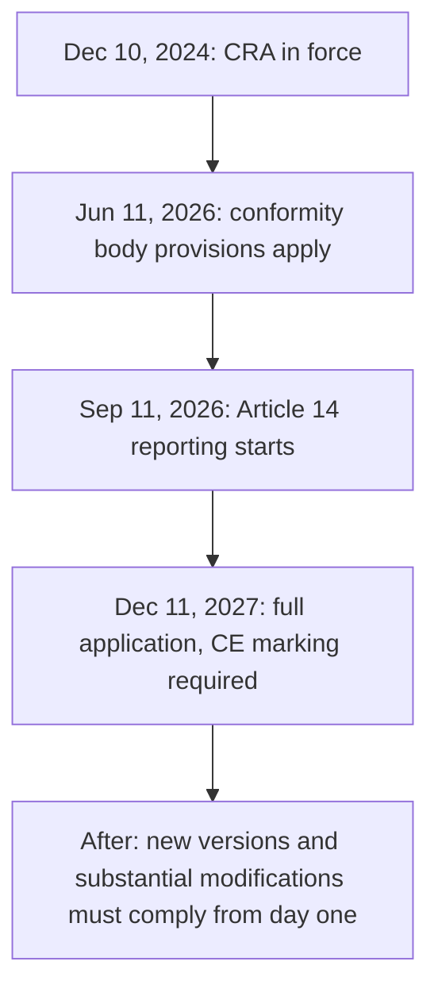

import CraCta from '~/components/cta/CraCta.astro';

*Last verified: July 2026. Based on Regulation (EU) 2024/2847 and the European
Commission's March 2026 draft guidance. The draft guidance can still change.*

If your customers run your software themselves, the Cyber Resilience Act
applies to you. Not to the hyperscalers, not primarily to IoT gadget makers:
to anyone who places software on the EU market and then has to keep it secure
in environments they don't control. The regulation entered into force on
December 10, 2024. The first hard obligations start on September 11, 2026, and
the full regime applies from December 11, 2027. That sounds far away. It is
not, because the hardest requirements are engineering work, not paperwork.

This post is the overview: who is in scope, what the deadlines are, what a
manufacturer actually has to do, and in what order to do it.

## Who is affected

The CRA applies to "products with digital elements" made available on the EU
market in the course of a commercial activity. Where your company is
headquartered does not matter. A US or UK vendor selling into the EU is covered
exactly like a vendor in Berlin.

"Product with digital elements" is broad. It covers standalone software, so a
self-hosted edition of your product is in scope. So is the on-prem agent you
ship alongside your SaaS, the installer, the desktop client, and the SDK you
give customers to integrate against.

Who is out:

- **Pure SaaS.** Software provided only as a service is not placed on the
  market as a product. Depending on your sector and size, NIS2 or DORA may
  apply to the service instead, but neither does so automatically. There is
  one catch: a "remote data processing solution" that a product needs to
  perform one of its functions is pulled into scope with the product
  (Article 3(1)-(2)). A cloud backend that your shipped agent cannot work
  without is that case.
- **Internal software.** Anything you build and run for yourself and never
  supply to others is not placed on the market. Bespoke software supplied
  commercially to a customer is in scope, though.
- **Non-commercial open source.** Open-source software supplied outside a
  commercial activity is out. Open-core companies sit in a split position:
  full obligations for the paid edition, a light "steward" regime for the
  community edition. The details are in our post on
  [what the CRA means for open-source companies](/cyber-resilience-act/open-source/).
- **Excluded sectors.** Medical device software (regulated under MDR/IVDR),
  vehicles, aviation, and products built for defense or national security
  follow their own rules.

If you are unsure which side of the line you are on, work through our
[decision tree post](/cyber-resilience-act/does-the-cra-apply/). For most B2B software vendors
with a self-hosted offering, the answer is simply yes.

<CraCta
  title="Know who’s still on the vulnerable version"
  body="When the Article 14 clock starts, you need to know which customers run which version — so you can see who’s affected before you file the early warning."
/>

## The three deadlines

| Date | What starts |
|---|---|
| June 11, 2026 | Provisions on conformity assessment bodies apply (already in effect) |
| September 11, 2026 | Article 14 reporting: 24-hour early warning to your CSIRT and ENISA for actively exploited vulnerabilities, fuller notification within 72 hours, final report 14 days after a patch is available |
| December 11, 2027 | Full application: essential requirements, technical documentation, conformity assessment, CE marking |

One transitional rule matters a lot for existing products. Products placed on
the market before December 11, 2027 only need full compliance after a
substantial modification. But Article 14 reporting applies to them anyway from
September 2026. You cannot grandfather your way out of the 24-hour clock.

## What a manufacturer has to do

The duties split cleanly into what must be true before you place a product on
the market and what you owe for as long as you support it.

### Before market

| Duty | Where |
|---|---|
| Cybersecurity risk assessment, documented and kept current | Article 13 |
| Secure-by-design essential requirements | Annex I Part I |
| No known exploitable vulnerabilities at release | Annex I Part I |
| Machine-readable SBOM covering at least top-level dependencies | Annex I Part II (1) |
| Conformity assessment appropriate to the product class | Articles 27, 32 |
| Technical documentation, including a description of your secure update distribution | Annex VII |
| EU declaration of conformity and CE marking | Articles 28, 30 |

The conformity route depends on classification. The default category, which
covers most business software, self-assesses under Module A. "Important"
products in Annex III Class I (identity and access management, password
managers, VPNs, network management systems, SIEM, operating systems, and
similar) can self-assess only if they fully apply harmonised standards, common
specifications, or an EU cybersecurity certification scheme at assurance level
"substantial" (Article 32(2)); the harmonised standards are still being
finalized, so in practice a notified body often gets involved. Class II
(hypervisors, container runtimes, firewalls, intrusion detection and
prevention systems) requires third-party assessment. Critical products in
Annex IV, such as smart meter gateways, smartcards and secure elements, and
hardware devices with security boxes, may face mandatory EU certification.

### Ongoing, for the whole support period

| Duty | Where |
|---|---|
| Vulnerability handling, including a coordinated vulnerability disclosure policy and a contact address | Annex I Part II (4), (5), (6) |
| Remediate vulnerabilities without delay; ship security updates separately from feature updates where technically feasible | Annex I Part II (2) |
| Secure mechanism to distribute updates | Annex I Part II (7) |
| Disseminate security updates without delay, free of charge (unless agreed otherwise with a business user for a tailor-made product), with advisory messages | Annex I Part II (8) |
| Support period of at least 5 years | Article 13(8) |
| Keep each security update available for at least 10 years | Article 13(9) |
| Report actively exploited vulnerabilities and severe incidents | Article 14 |

For a SaaS company the ongoing list is mostly a deploy pipeline. For a vendor
with self-hosted customers it is a distribution problem, and for customers
without internet access it is a hard one. We cover that in detail in
[security updates for on-prem and air-gapped customers](/cyber-resilience-act/security-updates-air-gapped/).

## The order of operations for a vendor starting now

1. **Write the scope memo.** One document that lists every artifact you
   supply commercially (editions, agents, installers, SDKs), says which are
   products under the CRA, and names the manufacturer entity. Every later
   decision references this memo.
2. **Classify each product.** Default, Class I, Class II, or critical.
   This decides whether you can self-assess and therefore how much lead time
   you need. Most B2B software lands in the default category, but check
   Annex III honestly: "network management" and "identity management" catch
   more products than vendors expect.
3. **Stand up the SBOM and the CVD policy.** The SBOM must be machine-readable
   and generated per release, not once. The CVD policy needs a published
   contact and an internal process behind it. Both are prerequisites for
   everything downstream.
4. **Fix update distribution.** An authenticated channel, signed artifacts,
   security releases separated from feature releases, an advisory process,
   and an offline path if you have air-gapped customers. This is the item
   with the longest engineering tail, so start it early.
5. **Get reporting-ready before September 11, 2026.** A runbook that gets you
   from "we learned of active exploitation" to a submitted early warning in
   under 24 hours, including who is on call and how you identify affected
   customers.
6. **Assemble the technical file and CE marking before December 11, 2027.**
   Annex VII documentation, the declaration of conformity, and the marking
   itself. If steps 1 through 5 are done, this step is mostly writing down
   what already exists.

## Penalties

Non-compliance with the essential requirements or the core manufacturer
obligations can cost up to EUR 15 million or 2.5% of worldwide annual
turnover, whichever is higher. Other obligations top out at EUR 10 million or
2%, and supplying misleading information to authorities at EUR 5 million or
1%. Market surveillance authorities can also order corrective action, restrict
availability, or force a withdrawal or recall. For most vendors the recall
power is the scarier one: fines are negotiable, a product pulled from the EU
market is not.

<CraCta
  title="Notify, then prove the patch landed"
  body="Distr helps you reach customers when a security update is available, and records who pulled or applied it — so update distribution and delivery evidence aren’t a spreadsheet exercise."
/>
