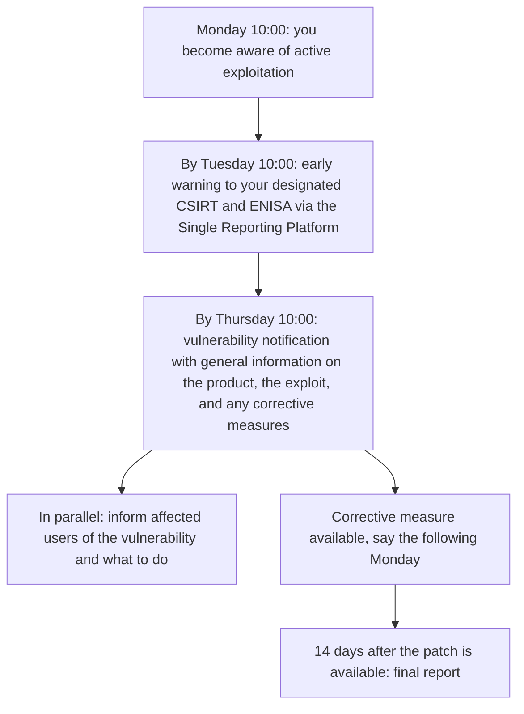

import CraCta from '~/components/cta/CraCta.astro';

_Last verified: July 2026. Based on Regulation (EU) 2024/2847. The Article 14
reporting obligations apply from September 11, 2026, including for products
placed on the market before December 2027._

Every CRA summary tells you to "monitor vulnerabilities." Almost none of them
say what that means on a Tuesday. [Annex I Part II][anx-I] makes vulnerability
handling
a continuous duty for the whole support period, which is at least five years
([Article 13(8)][art-13-8]). [Article 14][art-14] then puts a clock on the
worst case: if you become
aware that a vulnerability in your product is being actively exploited, the
first report is due in 24 hours.

In practice this breaks down into four separate monitoring jobs. They use
different data sources, they alert different people, and only one of them is
what most vendors already do.

## The clocks, with a worked example

Say a proof-of-concept exploit for a vulnerability in your product drops on a
Monday at 09:00 and you learn about it an hour later, together with reports
that it is being used in the wild. Here is your week:

The same 24h/72h cascade applies to severe incidents affecting the security of
your product, with the final report due within one month of the incident
notification, rather than 14 days after the fix.

Two things about the trigger matter more than the deadlines. First, the clock
starts at **awareness of active exploitation**, not at CVE publication and not
at patch availability. If exploitation was public on Monday and you found out
on Thursday, you spent your response budget not knowing. Second, the
obligation applies to products already in the field. There is no grandfather
clause for the version you shipped in 2024.

<CraCta
  title="The clock starts. Who's affected?"
  body="Scanners find the CVE; they don't tell you which customers still run the vulnerable version when the 24-hour early-warning window opens."
/>

## Job 1: monitor your own dependencies

New CVEs land against old releases every day. A scan at release time tells you
what was known at release time, which is worth little three months later. The
[Annex I Part II][anx-I] duties to identify and document components (including
a machine-readable SBOM covering at least top-level dependencies) and to
remediate vulnerabilities without delay only work if scanning is continuous.

The workable setup: generate an SBOM per release, keep SBOMs for every
supported release, and rescan all of them on a schedule, daily is normal.
Tools like osv-scanner, Trivy, and Grype are free and run fine in CI or a
nightly job. The part that is not free is the decision process behind the
scan: who triages a new finding, who decides whether your product is actually
affected, and who kicks off a patch release. Remember that the CRA expects
security updates separate from feature updates where feasible, so "it is fixed
on main" does not close the finding for customers on last year's version.

One more duty hides here. Under [Article 13(5) and (6)][art-13-5], if you find
a vulnerability in a component you integrate, including an open-source
component, you must report it upstream to the maintainer, and if you develop a
fix, you share the code. Your dependency monitoring feeds that obligation too.

## Job 2: monitor exploitation signals

This is the job most vendors skip, and it is the one wired directly to the
24-hour clock. Knowing a CVE exists in your dependency tree is job 1. Knowing
that someone is exploiting a vulnerability in **your product** in the wild is
what triggers [Article 14][art-14].

Realistic sources: CISA KEV for confirmed exploited CVEs, ENISA's EUVD, NVD,
OSV.dev, GitHub security advisories, distro security trackers, and the PSIRT
feeds of the vendors whose components you embed. None of these will name your
product for you. The monitoring task is cross-referencing: when a CVE gets
flagged as exploited, does it map to a component in any supported release of
your product? That mapping is exactly what your stored SBOMs are for.

Assign this to a person or rotation, not a Slack channel nobody reads. The
early warning itself is short. Getting a human to notice within hours, on a
weekend too, is the hard part.

## Job 3: monitor which customers run which version

[Article 14][art-14]'s final report and the duty to inform users of
vulnerabilities and
corrective measures both assume you can answer one question: who is affected?
For SaaS that is a query against your own infrastructure. For self-hosted and
on-prem products it depends entirely on whether your distribution channel
tracks versions per customer.

If customers pull from an authenticated registry or package repo, the pull
logs tell you what each customer last fetched. If you run agents in customer
environments, they can report what is currently deployed, which is better,
because "downloaded 2.4.1" and "running 2.4.1" are different claims. If you
ship zip files by email, you have a spreadsheet and a guess.

A vendor with 30 on-prem customers needs this question answered before the
clock starts, not during hour six of a 24-hour window. Advisory messages under
[Annex I Part II point (8)][anx-I] also land better when they go to the
customers on affected versions instead of everyone.

## Job 4: monitor your CVD inbox

[Annex I Part II][anx-I] requires a coordinated vulnerability disclosure
policy and a
published contact address for reporting. Both are pointless if nobody reads
the mailbox. External researchers are a top source of the exact reports that
start clocks, so treat security@ like a pager, with an acknowledgment SLA
measured in hours and a named owner. A security.txt file pointing at it costs
ten minutes.

## The monitoring table

| What to monitor                                                | Why                                                                                        | Example tooling                                                                           |
| -------------------------------------------------------------- | ------------------------------------------------------------------------------------------ | ----------------------------------------------------------------------------------------- |
| Your dependencies, continuously, across all supported releases | New CVEs hit old releases; remediation "without delay" ([Annex I Part II][anx-I])          | osv-scanner, Trivy, Grype against stored SBOMs in CI or nightly jobs                      |
| Exploitation signals                                           | The 24h clock starts at awareness of active exploitation ([Article 14][art-14])            | CISA KEV, EUVD, NVD, OSV.dev, GitHub advisories, upstream PSIRT feeds                     |
| Deployed versions per customer                                 | Final report, user notification, and targeted advisories need to know who is affected      | Registry pull logs, deployment agents, license or telemetry data where it exists          |
| Your CVD intake                                                | Researcher reports trigger the same duties; a CVD policy and contact address are mandatory | security.txt, a monitored security@ mailbox, a disclosure platform if volume justifies it |

An honest note on all of this: most of it is process, not tooling. The
scanners are free and take an afternoon to wire up. What passes or fails an
Article 14 test is whether a specific person sees the KEV entry on Saturday,
whether the affected-customer list exists before the incident, and whether the
draft early-warning template is written before you need it. Buy tools last.

<CraCta
  title="From 'who is affected' to 'who got the fix'"
  body="Distr shows which customers run which version, helps you notify them when a patch is available, and keeps pull records so your Article 14 response isn't rebuilt from support tickets."
/>

[art-13-5]: https://eur-lex.europa.eu/legal-content/EN/TXT/HTML/?uri=OJ:L_202402847#013.005
[art-13-8]: https://eur-lex.europa.eu/legal-content/EN/TXT/HTML/?uri=OJ:L_202402847#013.008
[art-14]: https://eur-lex.europa.eu/legal-content/EN/TXT/HTML/?uri=OJ:L_202402847#art_14
[anx-I]: https://eur-lex.europa.eu/legal-content/EN/TXT/HTML/?uri=OJ:L_202402847#anx_I
