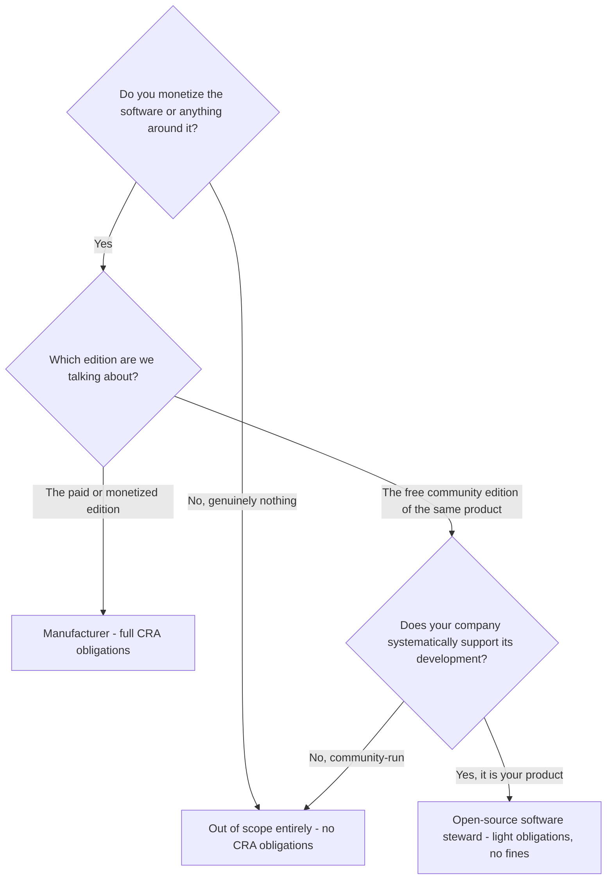

import CraCta from '~/components/cta/CraCta.astro';

_Last verified: July 2026. Based on Regulation (EU) 2024/2847, the European
Commission's March 2026 draft guidance (¶48-65), and the ORC Working Group FAQ.
The draft guidance is not final and can change._

In 2023, while the CRA was still a draft, twelve open-source organizations
including the Eclipse Foundation, the Open Source Initiative, and Linux
Foundation Europe signed an open letter warning that the regulation would have
"a chilling effect on open source software development." Headlines asked
whether the CRA would kill open source in Europe. The final text answered most
of those concerns with explicit carve-outs, and since then the pendulum has
swung the other way: open-core companies now often assume their community
edition is simply exempt, so there is nothing to do. That assumption is closer
to the truth than the 2023 panic, but it is not quite right either. If you run
a company with a free edition and a paid edition, the details decide your
obligations.

## The test is commercial activity, not the license

The CRA does not regulate open-source software as a category. It regulates
products "made available on the market," which means supplied "in the course of
a commercial activity" (Recital 18). Open-source software supplied outside a
commercial activity is out of scope entirely. Developing in public or having
your hosting costs covered does not make a project commercial, and how
development is financed is explicitly not the test (Recital 18). Donations are
fine too, with a qualifier: Recital 15 protects donations accepted "without the
intention of making a profit," while donations that exceed your costs, or
donation-gated access to binaries and updates, start to look like commercial
supply.

Monetization is the test. Selling licenses, selling support or consulting around
the software, dual licensing, or offering a paid hosted version are commercial
activity. So the individual maintainer publishing a library is out. The company
selling anything connected to the software is in, at least for what it sells.

<CraCta
  title="The enterprise edition still needs fleet visibility"
  body="Manufacturer duties land on the paid edition — including knowing which customers run which version when a vulnerability hits."
/>

## The three tiers

**Tier 1: out of scope.** Individual developers and genuinely non-commercial
projects. No obligations. The CRA also explicitly protects contributors: people
who contribute code to a project they are not responsible for are not covered
(Recital 18).

**Tier 2: manufacturer.** Your monetized edition makes you a manufacturer under
Article 3(13) for that product, with the full program: secure development
(Annex I Part I), vulnerability handling including SBOM and coordinated
disclosure (Annex I Part II), 24-hour reporting of actively exploited
vulnerabilities from September 11, 2026 (Article 14), technical documentation,
conformity assessment and CE marking from December 11, 2027.

**Tier 3: open-source software steward.** This is the category most open-core
companies miss, and it applies to the free edition they thought was exempt.

## The open-core case, precisely

The Commission's March 2026 draft guidance (¶49-50) answers the question
directly: a monetized edition and a free community edition of the same software
are treated as **different products**. The paid edition is placed on the market.
The free edition is not placed on the market just because the paid one exists.

That kills the scariest reading, in which the community edition drags full
manufacturer duties with it. But it does not make the community edition
obligation-free, because of the steward category. Article 3(14) defines an
**open-source software steward** as a legal person, other than a manufacturer,
that systematically provides sustained support for the development of specific
open-source products intended for commercial activities, and that ensures the
viability of those products. An open-core company supporting its own community
edition fits that description almost by definition: it steers development,
hosts the code, and keeps the product alive.

A steward's obligations (Article 24) are deliberately light:

- Put in place and document a cybersecurity policy for the product, covering
  secure development and vulnerability handling
- Cooperate with market surveillance authorities on request
- Notify actively exploited vulnerabilities in the product, to the extent the
  steward is involved in its development; notify severe incidents only when
  they hit the infrastructure the steward provides for developing the product,
  like its build or hosting systems

No CE marking, no conformity assessment, no technical file. And under Article
64(10)(b), stewards are exempt from administrative fines altogether. The regime
is real but mild: write the policy, keep a security contact, report what you
learn about active exploitation.

So the honest one-liner for an open-core company is: **full obligations for the
enterprise edition, steward obligations for the community edition, fines only on
the enterprise side.**

## The traps

Three situations move a "free" edition closer to full scope, and the draft
guidance does not settle all of them:

**Paid support around the free edition.** Charging for support, hosting, or
services built around the community edition is commercial activity connected to
that edition. If the free edition is effectively how you deliver a paid
offering, the separate-products logic weakens. This is the most common exposure
in the COSS business model.

**Free edition plus paid SaaS of the same product.** Whether the hosted revenue
makes the downloadable free edition commercially supplied is genuinely
unresolved. If your SaaS is the monetization and the self-hosted community
edition is the funnel, plan for the conservative reading and revisit when the
guidance is final.

**The enterprise edition ships the community core.** Your commercial product
contains the open-source component, so Article 13(5)-(6) applies to you as its
manufacturer: you carry the security responsibility for the component inside
your paid product, you must report vulnerabilities you find in it upstream, and
if you develop a fix, you are expected to share the code with the project. Your
own community project does not get a pass just because you also maintain it.

## What to actually do, in order

1. Decide, in writing, which of your editions is placed on the market and which
   entity is the manufacturer. This scope memo is the document everything else
   hangs on.
2. For the commercial edition: run the manufacturer checklist (risk assessment,
   SBOM, CVD policy, secure update distribution, reporting readiness before
   September 11, 2026, technical file and CE marking before December 11, 2027).
3. For the community edition: write the steward cybersecurity policy. Most of it
   falls out of the work in step 2 if the codebases share a core.
4. Check your website and contracts for wording that undermines the separation,
   like selling "community edition support plans."
5. Watch for the final version of the Commission guidance and re-check the two
   ambiguous cases above against it.

<CraCta
  title="Notify commercial customers and prove they got the patch"
  body="Distr distributes your enterprise edition with per-customer entitlements, helps you notify them when a security update is ready, and records who pulled it — Annex I Part II update duties with delivery evidence."
/>
