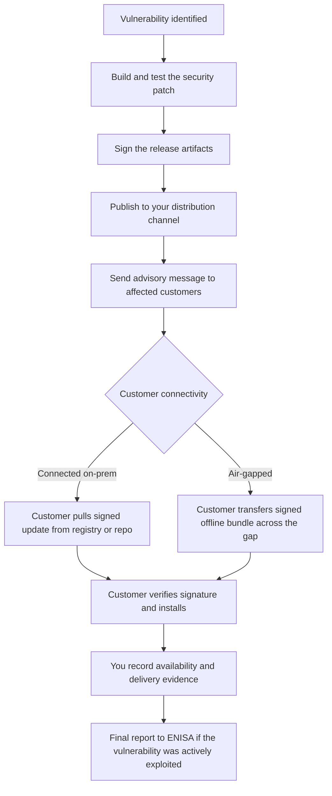

import CraCta from '~/components/cta/CraCta.astro';

_Last verified: July 2026. Based on Regulation (EU) 2024/2847 and the European
Commission's March 2026 draft guidance. The draft guidance can still change._

The Cyber Resilience Act has a requirement that gets almost no attention next to
SBOMs and CE marking, and it happens to be the hardest one for vendors with
self-hosted customers. [Annex I, Part II, point (7)][anx-I] requires
manufacturers to
"provide for mechanisms to securely distribute updates for products with digital
elements to ensure that vulnerabilities are fixed or mitigated in a timely manner
and, where applicable for security updates, in an automatic manner." Point (8)
adds that security updates must be disseminated "without delay" and, unless
agreed otherwise with a business user for a tailor-made product, free of charge,
"accompanied by advisory messages providing users with the relevant information."

If all your customers run your SaaS, this is a deploy pipeline. If your customers
run your software themselves, behind their firewalls, sometimes with no internet
access at all, this is a distribution problem. And you have to describe your
solution in writing: [Annex VII][anx-VII] requires the technical documentation
to include
"a description of the technical solutions chosen for the secure distribution of
updates."

## What the CRA actually requires (and what it doesn't)

Four obligations shape the update pipeline for a self-hosted product:

| Obligation                                     | Where                        | What it means in practice                                                                                      |
| ---------------------------------------------- | ---------------------------- | -------------------------------------------------------------------------------------------------------------- |
| Secure distribution mechanism                  | [Annex I Part II (7)][anx-I] | An authenticated, integrity-protected way for every customer to get updates                                    |
| Dissemination without delay, with advisories   | [Annex I Part II (8)][anx-I] | You notify customers when a security update exists and tell them what to do                                    |
| Security updates separate from feature updates | [Annex I Part II (2)][anx-I] | Customers can take the patch without taking the new features, where technically feasible                       |
| Updates stay available for 10 years            | [Article 13(9)][art-13-9]    | Every security update remains downloadable for 10 years or the rest of the support period, whichever is longer |

Just as important is what the CRA does not require. It does not mandate that your
product phones home. It does not require automatic updates for B2B software:
the automatic-update default in [Annex I Part I][anx-I] is aimed at consumer
products, and
[Recital 56][rct-56] explicitly carves out products intended for professional ICT and
industrial environments, where operators control change windows. And it does not
prescribe a technical architecture. A signed tarball on an authenticated download
portal can be compliant. The bar is that the mechanism is secure, documented, and
actually reaches every customer during the support period of at least five years
([Article 13(8)][art-13-8]).

That last part is where air-gapped customers come in. "Our updater needs internet
access" is not an answer the CRA accepts, because the obligation is yours, not
your customer's.

<CraCta
  title="Know which air-gapped customer still needs the patch"
  body="Offline bundles only work as a CRA channel if you also know who last took which release across the gap, so you can see who's still exposed when a security update ships."
/>

## The patch flow, end to end

Two boxes in that chart do most of the compliance work and most vendors have
neither: the advisory message and the delivery evidence.

## Pattern 1: connected on-prem customers

Customers with outbound internet access are the easy case. The workable pattern:

- **Distribute through an authenticated artifact channel.** A private OCI registry,
  a package repository, or a download portal with per-customer credentials. Public
  "latest.zip" links fail the secure-distribution test and give you no idea who
  received what.
- **Sign your artifacts and publish the verification path.** Cosign signatures on
  container images, GPG on packages, or a TUF-style metadata layer.
  [Annex VII][anx-VII]
  makes you describe this anyway; it is easier to describe something real.
- **Tag security releases as security releases.** The separation requirement in
  [Annex I Part II (2)][anx-I] means a customer on 2.3 should be able to get 2.3.1 with
  the fix without being forced onto 3.0. Practically, that means maintaining
  patch branches for supported versions, which is why the support-period decision
  (5 years minimum) belongs in engineering planning, not just legal review.
- **Consider deployment agents for managed rollouts.** A lightweight agent in
  the customer environment that pulls the desired version, applies it inside the
  customer's change window, and reports the deployed version back closes the
  loop that a registry alone leaves open: you know not just who downloaded the
  patch but who is running it. For B2B this stays customer-controlled, which is
  exactly what [Recital 56][rct-56] expects for professional environments.
- **Keep pull records.** When a market surveillance authority, or more likely a
  NIS2-regulated customer's auditor, asks whether the patch reached your
  customers, "here is the download log per customer, per version, with
  timestamps" ends the conversation. A registry that keeps pull audit logs gives
  you this as a byproduct of normal distribution.

## The advisory message: the duty everyone forgets

[Annex I Part II (8)][anx-I] does not just say ship the patch. It says security updates
come "accompanied by advisory messages providing users with the relevant
information, including on potential action to be taken." That is a notification
duty, and it needs to work for every customer, not just the ones who read your
changelog. A pattern that satisfies it without heroics:

1. **A structured advisory per security release**: affected versions, severity,
   the fixed version, and what the operator should do. Attach it to the release
   itself so it travels with the artifact, and publish it on a page or feed a
   security team can subscribe to.
2. **A push channel for the customers you can reach**: automated email to the
   registered security contact per customer, or a notice in the portal your
   customers already use for downloads. Manual bcc-emails from support break
   down at exactly the moment they matter, during an incident.
3. **A pull channel for everyone else**: a security advisories page or RSS feed
   with stable URLs, because air-gapped operators and procurement auditors will
   both ask for it.
4. **Precision about versions.** "Please update to the latest version" is not
   an advisory. "CVE-X affects 2.1.0 through 2.3.4, fixed in 2.3.5 and 3.1.2"
   lets an operator act in minutes and is the wording
   [Annex I Part II (4)][anx-I] expects for public disclosure anyway.

## Pattern 2: air-gapped customers

For environments with no internet access, the mechanism changes but the
obligations don't. The pattern that holds up:

1. **Build an offline bundle per release**: all images, charts, packages, and
   dependencies a customer needs, so nothing has to be resolved online inside
   the gap.
2. **Sign the bundle and ship detached verification material.** The customer
   must be able to verify authenticity on their side of the gap with keys or
   certificates they received through a separate, earlier channel. A checksum
   alone detects corruption, not tampering.
3. **Document the transfer workflow** the customer uses: approved media,
   scanning on both sides, an internal registry or mirror inside the gap that
   their deployments pull from. You don't control this part, but your
   [Annex VII][anx-VII]
   documentation should describe the handoff point and the verification steps.
4. **Deliver the advisory out of band.** The air-gapped system won't tell its
   operators a patch exists. Your advisory email, customer portal notice, or
   RSS/security feed is the mechanism, so it needs to name the affected versions
   precisely enough that an operator can check theirs.
5. **Record what you made available and when.** Inside the gap you cannot prove
   installation. You can prove availability, notification, and handover. Under
   [Annex I Part II][anx-I] your duty is to distribute and disseminate; if a business
   customer contractually controls installation windows, document that split of
   responsibility and you have done your part.

## The uncomfortable question: who is still running the vulnerable version?

The reporting obligations that start on September 11, 2026 put a clock on all
of this. An actively exploited vulnerability means an early warning to your CSIRT
and ENISA within 24 hours, a fuller notification within 72, and a final report 14
days after the patch is available ([Article 14][art-14]). Somewhere in that
window, someone will ask which customers are affected.

For SaaS that's a database query. For a self-hosted product it depends entirely
on whether your distribution setup tracks versions per customer: what each
customer last pulled, what each connected deployment currently runs, which
air-gapped customer received which bundle. Vendors that ship through an
authenticated registry with pull tracking, or run agents that report deployed
versions, can answer in minutes. Vendors that ship zip files by email answer with
a spreadsheet and a guess.

Play the timeline through once and the difference stops being theoretical. At
hour zero you learn CVE-X in your product is being exploited. By hour 24 your
early warning is filed. By hour 72 your notification should describe corrective
measures, and in parallel you must inform affected users. If per-customer
version data exists, "affected users" is a filtered list and the advisory goes
out the same day, to the right customers, naming their versions. If it doesn't,
you either notify everyone (and train customers to ignore your advisories) or
notify nobody until support has phoned through the install base, while the
14-day final report deadline runs. The final report also asks what corrective
measures were taken and how users were informed, which is hard to write
truthfully if the honest answer is "we don't know who got the patch."

The version question also decides what your patch costs. Knowing that 80% of
customers already run the fixed line and exactly six deployments sit on the
vulnerable 2.1 branch turns a fleet-wide fire drill into six phone calls.
Neither the CRA nor anyone else audits the guess today; your customers'
security teams will, and from December 2027 the technical file has to describe
the mechanism either way.

<CraCta
  title="Notify, ship the bundle, document the download"
  body="Distr helps you reach customers when a new update is available, ship signed offline bundles through a private registry with per-customer access, and record who downloaded which version: delivery evidence for connected and air-gapped fleets."
/>

[rct-56]: https://eur-lex.europa.eu/legal-content/EN/TXT/HTML/?uri=OJ:L_202402847#rct_56
[art-13-8]: https://eur-lex.europa.eu/legal-content/EN/TXT/HTML/?uri=OJ:L_202402847#013.008
[art-13-9]: https://eur-lex.europa.eu/legal-content/EN/TXT/HTML/?uri=OJ:L_202402847#013.009
[art-14]: https://eur-lex.europa.eu/legal-content/EN/TXT/HTML/?uri=OJ:L_202402847#art_14
[anx-I]: https://eur-lex.europa.eu/legal-content/EN/TXT/HTML/?uri=OJ:L_202402847#anx_I
[anx-VII]: https://eur-lex.europa.eu/legal-content/EN/TXT/HTML/?uri=OJ:L_202402847#anx_VII
