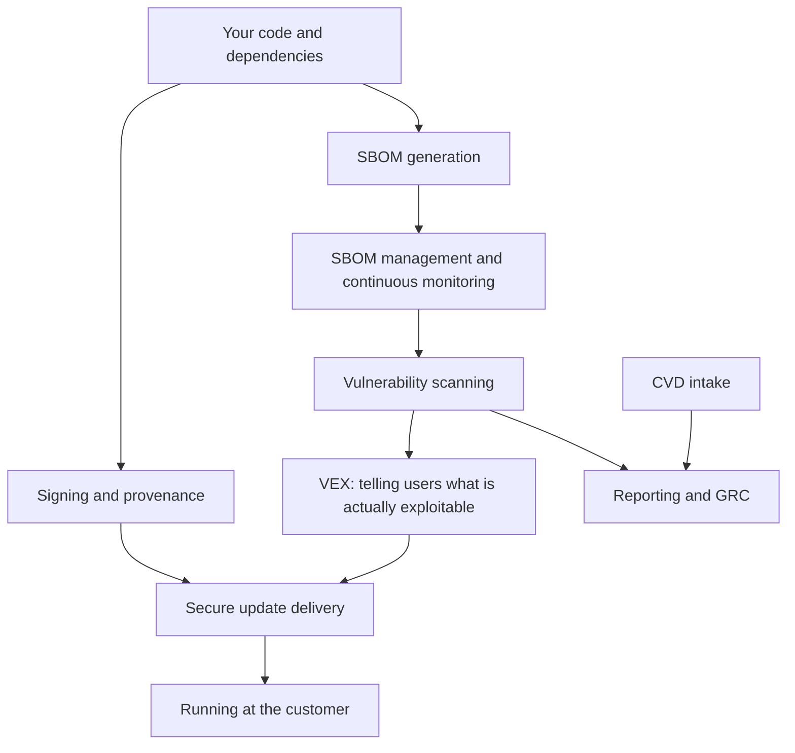

import CraCta from '~/components/cta/CraCta.astro';

*Last verified: July 2026. Based on Regulation (EU) 2024/2847. Tool
capabilities change fast; treat the vendor names as examples, not
endorsements.*

There is no single CRA compliance tool. Anyone claiming otherwise is selling.
The regulation spans secure development, SBOMs, continuous vulnerability
handling, 24-hour reporting, coordinated disclosure, secure update
distribution, and a technical file that describes all of it (Annex VII). No
product covers that span, and the ones that claim to usually cover the
paperwork layer while leaving the engineering layers to you.

What exists is a stack. Each layer has decent tooling, much of it open
source. The failure mode is not missing tools. It is buying a scanner,
calling it compliance, and discovering during your first Article 14 incident
that a scanner does not file reports, notify customers, or get a patch
running in an air-gapped data center.

## The stack, from code to customer

Notice where the arrows end. Most compliance conversations stop at the
reporting box. The regulation does not: Annex I Part II points (7) and (8)
require a secure distribution mechanism and dissemination of security updates
without delay, free, with advisory messages. That is the bottom of the chart,
and it is the least served layer in the market.

<CraCta
  title="Scanning isn’t the same as reaching the fleet"
  body="SBOM and vuln tools tell you what’s broken. They don’t show which customer is affected, notify them a patch is ready, or prove they took it."
/>

## The map

| Layer | What the CRA asks for | Tools and standards | Honest caveat |
|---|---|---|---|
| SBOM generation | Machine-readable SBOM, at least top-level dependencies (Annex I Part II (1)) | Syft, Trivy, cdxgen | Generating one is trivial. Generating a correct one per release, for every supported release, and keeping them is the actual work. |
| SBOM management and continuous monitoring | Components identified and documented for the whole support period | Dependency-Track, Interlynk, and a growing field of commercial platforms | The value is rescanning old SBOMs when new CVEs land. A folder of JSON files does not do that. |
| Vulnerability scanning | Remediate without delay; regular testing and review (Annex I Part II (2)-(3)) | Grype, Trivy, osv-scanner, Snyk | A scanner finds problems. It does not triage them, patch them, or meet the 24h clock. Scanners without a process fail Article 14. |
| VEX | Users informed of vulnerabilities; fixed vulnerabilities disclosed once the update is available | OpenVEX, CSAF | Only worth it once customers scan your SBOMs and drown you in "are you affected by X" tickets. Then it pays for itself. |
| Signing and provenance | Secure distribution mechanism; integrity of updates (Annex I Part II (7)) | Sigstore/cosign, in-toto, SLSA, TUF | Signing is cheap now. Key management and documenting the verification path in your Annex VII file are the parts people skip. |
| CVD intake | CVD policy and a contact address for reporting (Annex I Part II (5)-(6)) | security.txt, HackerOne, a plain monitored mailbox | A mailbox someone actually reads beats a bounty platform nobody triages. Start with security.txt and an SLA. |
| Reporting and GRC | Article 14 reports via the Single Reporting Platform; evidence for the technical file | CRA-specific platforms (CRA Evidence, Kunnus); generic GRC (Vanta, Drata) | Generic GRC platforms were built for SOC 2 and ISO 27001. They are not CRA-specific and will not draft your 24-hour early warning. Templates and a rehearsed process might. |
| Secure update delivery | Distribute updates securely, disseminate without delay, free, with advisories (Annex I Part II (7)-(8)) | Package repos and private OCI registries; TUF as a framework; Mender for embedded devices; Distr (open-source, registry + agents + customer portal for self-hosted software distribution) | The most overlooked layer, see below. |
| Evidence and audit trails | Annex VII technical documentation must describe the vulnerability handling process including the secure update distribution solution | Registry pull logs, agent-reported deployment state, ticket history, signed release records | Nobody sells "evidence" as a product. It falls out of the layers above if they log, and does not exist if they don't. |

## The layer everyone skips

The update-delivery row is the most overlooked because compliance vendors stop
at "you have a vulnerability" and never touch "the patch is now running at
your customer." Their pipeline ends where your obligation gets hard.

For a SaaS vendor the gap barely exists: the deploy pipeline is the delivery
mechanism. For a vendor whose customers run the software themselves, the CRA
turns delivery into a named requirement with a paper trail. You need an
authenticated channel every customer can pull from, including the air-gapped
ones via offline bundles. You need advisory messages that reach the affected
customers. And when the Article 14 final report asks about corrective
measures, you need to know which customers are still on the vulnerable
version, which means per-customer version tracking, not a mailing list.

None of the scanning or GRC layers touch any of that. Check whether your
delivery mechanism gives you three things: authenticated distribution, version
visibility per customer, and delivery records you could hand to an auditor.
If it is a public download link, it gives you none.

## How to spend, in order

1. Wire up the free layer first: Syft or Trivy for SBOMs, Grype or osv-scanner
   in CI and nightly against all supported releases, cosign on artifacts,
   security.txt with a monitored mailbox. This covers a surprising share of
   Annex I Part II for close to zero license cost.
2. Fix delivery before buying GRC. A compliance dashboard that says "patch
   available" while customers have no secure way to get it documents your gap
   instead of closing it.
3. Write the process documents the tools cannot: triage ownership, the
   on-call rotation for exploitation signals, the pre-drafted early warning,
   the advisory template. Article 14 is won or lost here.
4. Buy CRA-specific reporting help only if the volume justifies it. A vendor
   with one product and a handful of releases can run Article 14 readiness
   from templates and a checklist.

<CraCta
  title="The delivery layer: visibility, notify, evidence"
  body="Distr sits where most stacks stop — know who runs what, reach customers when an update is available, and document that the update was pulled or applied."
/>
