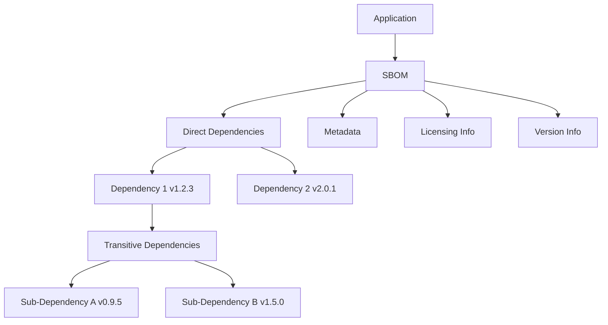

## What is an SBOM?

A Software Bill of Materials (SBOM) is a detailed, machine-readable list of all software components and dependencies within an application. Much like an ingredient list on food packaging, an SBOM provides transparency into the software's composition, including open source libraries, frameworks, and other dependencies, along with their version and licensing information.



The diagram above illustrates how an SBOM provides a comprehensive inventory of all software components, including direct and transitive dependencies, along with essential metadata.

## Why do SBOMs Matter?

The clearest illustration is the [Log4Shell](https://en.wikipedia.org/wiki/Log4Shell) vulnerability in 2021. Organizations with SBOMs could search their inventories and know within hours which applications contained the vulnerable Log4j library. Organizations without them spent weeks manually auditing software.

Beyond incident response, SBOMs matter for:

- **Security.** A clear view of all components and dependencies lets you act quickly when a new vulnerability in any of them is disclosed.
- **Compliance.** Regulators increasingly require component transparency. In the US, [Executive Order 14028](https://www.cisa.gov/sbom) pushed SBOM requirements for software sold to the federal government. In the EU, the [Cyber Resilience Act](https://digital-strategy.ec.europa.eu/en/policies/cyber-resilience-act) requires manufacturers of products with digital elements to maintain SBOMs.
- **Risk management.** Knowing what components are in use makes it possible to assess the risk of third-party software before adopting it.
- **License audits.** SBOMs record license information for each component, which matters when open source licenses impose obligations on distribution.

## Where are SBOMs stored and how are they used?

SBOMs are typically stored in:

- **Version Control Systems:** Integrated with source code repositories to ensure they are updated alongside the software.
- **Artifact Repositories:** Can be attached to an image in an [OCI-compliant registry](/glossary/oci-container-artifact-registry/) and distributed alongside it.

By maintaining SBOMs in these locations, organizations ensure they are readily accessible for security assessments, audits, and compliance checks.

## Common SBOM Formats

Three widely adopted SBOM formats include:

- **[SPDX (Software Package Data Exchange)](https://spdx.dev/):** An ISO standard maintained by the Linux Foundation
- **[CycloneDX](https://cyclonedx.org/):** A lightweight format focused on security, maintained by OWASP
- **[SWID (Software Identification Tags)](https://csrc.nist.gov/projects/Software-Identification-SWID):** An ISO standard for software identification and management

## How to generate an SBOM

SBOMs can be generated using various tools and methods. Here are some commonly used tools:

- **[Syft](https://github.com/anchore/syft):** A popular tool for generating SBOMs from container images and filesystems. It supports various formats like SPDX, CycloneDX, and its own format.
- **[Trivy](https://github.com/aquasecurity/trivy):** A security scanner that also generates SBOMs from container images, filesystems, and repositories in SPDX and CycloneDX formats.
- **[The SBOM Tool](https://github.com/microsoft/sbom-tool):** Developed by Microsoft, generates SBOMs in SPDX format and supports various package managers.
- **[CycloneDX Generator (cdxgen)](https://github.com/CycloneDX/cdxgen):** The official OWASP SBOM tool, supporting a wide range of programming languages. It outputs SBOMs in CycloneDX format.
- **[SPDX SBOM Generator](https://github.com/opensbom-generator/spdx-sbom-generator):** Supports multiple package managers and outputs SBOMs in SPDX format.
- **[Distr](/docs/registry/):** Once the feature is enabled, SBOMs are automatically generated upon pushing an artifact to the registry.

Here are some examples of how to generate SBOMs using these tools:

```shell
# Using Syft for container images and filesystems
syft alpine:latest -o cyclonedx-json > alpine-sbom.json

# Using CycloneDX tools for Maven projects
mvn org.cyclonedx:cyclonedx-maven-plugin:makeAggregateBom

# Using SPDX tools for Node.js projects
npm install -g @spdx/spdx-sbom-generator
spdx-sbom-generator -p ./

# Push a sample image to the Distr registry using ORAS (https://oras.land/)
# and automatically generate an SBOM
oras push registry.distr.sh/my-organization/my-application:1.0.0 \
    ./sample-image.tar:application/vnd.oci.image.layer.v1.tar
```

## Best Practices for Implementing SBOMs

To maximize the effectiveness of SBOMs:

- Automate SBOM generation in your CI/CD pipeline.
- Keep SBOMs updated with each release.
- Securely store SBOMs while ensuring accessibility for security teams.
- Integrate SBOMs into your [vulnerability management](/glossary/vulnerability-scanning/) processes.
- Include both direct and transitive dependencies.
- Use automated tools to validate SBOM completeness.

An SBOM that sits unused in a repository does not improve security. The value comes from wiring it into vulnerability management, so that when the next Log4Shell happens, you can answer "are we affected?" in minutes.

## Key Terms Recap

- **SBOM:** A comprehensive inventory of software components
- **Software Supply Chain Security:** Securing all components and processes in software development and deployment
- **Dependencies:** External software packages your application relies on
- **Transitive Dependencies:** Dependencies of your dependencies
- **Vulnerability Management:** Identifying, classifying, remediating, and mitigating software vulnerabilities
